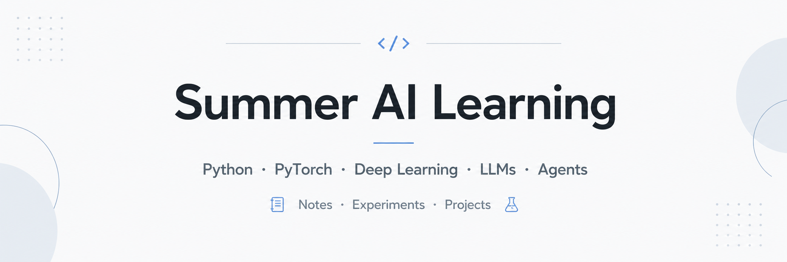

<p align="center">
  
</p>

# AI-Learning（7.1—9.1）

## 第 1 周：7.1—7.7  

### 主题：Python 复习与科研编程环境搭建

### 学习目标

快速恢复 Python 编程手感，重点复习后续深度学习和科研代码中常用的 Python 内容，同时完成开发环境和项目仓库搭建。

### 学习内容

| 模块        | 具体内容                                         | 推荐资源                     | 本周产出              |
| ----------- | ------------------------------------------------ | ---------------------------- | --------------------- |
| Python 复习 | 函数、类、装饰器、文件读写、异常处理、常用标准库 | 廖雪峰 Python 教程           | 3 个 Python 小脚本    |
| 科学计算    | NumPy、Pandas、Matplotlib 基础                   | 《利用 Python 进行数据分析》 | 1 个数据分析 notebook |
| 环境配置    | Conda、Jupyter、VS Code/PyCharm、Git、CUDA 检查  | PyTorch 官方安装文档         | 完成深度学习环境搭建  |
| 工程习惯    | GitHub 建仓库、README、requirements.txt          | 自主实践                     | 建立暑假学习仓库      |

### 重点复习内容

- Python 函数、类、继承
- 列表推导式、lambda 表达式
- `with` 文件操作
- `argparse`、`logging`、`pathlib`
- NumPy 张量操作
- Pandas 数据读取与清洗
- Matplotlib 可视化
- Git 基础操作

### 本周产出

```text
summer_ai_learning/
├── week1_python_review/
│   ├── numpy_practice.ipynb
│   ├── pandas_practice.ipynb
│   └── matplotlib_practice.ipynb
└── README.md
```

---

## 第 2 周：7.8—7.14  

### 主题：PyTorch 基础入门

### 学习目标

掌握 PyTorch 的基本使用方式，能够独立完成一个从数据读取到模型训练、验证和保存的完整流程。

### 学习内容

| 模块        | 具体内容                                | 推荐资源                    | 本周产出                    |
| ----------- | --------------------------------------- | --------------------------- | --------------------------- |
| Tensor 基础 | tensor 创建、索引、广播、GPU 转移       | PyTorch 官方教程中文版      | Tensor 操作练习             |
| 自动求导    | autograd、loss.backward、optimizer.step | PyTorch 官方教程            | 手写线性回归                |
| 数据加载    | Dataset、DataLoader、transform          | PyTorch 官方教程            | 自定义数据集                |
| 训练流程    | train/eval、loss、optimizer、保存模型   | B站 PyTorch 视频 + 官方教程 | MNIST/FashionMNIST 分类模型 |

### 核心理解

本周需要重点理解 PyTorch 的完整训练流程：

```text
数据集 → DataLoader → 模型定义 → 前向传播 → 计算损失 → 反向传播 → 参数更新 → 验证 → 保存模型
```

### 本周实践任务

完成一个 MNIST 或 FashionMNIST 分类任务，要求包括：

- 自定义模型类
- 使用 Dataset 和 DataLoader
- 编写训练函数和验证函数
- 保存模型参数
- 绘制 loss 和 accuracy 曲线
- 编写 README 说明运行方式

### 建议代码结构

```text
week2_pytorch_basic/
├── data/
├── models/
│   └── mlp.py
├── train.py
├── evaluate.py
├── utils.py
└── README.md
```

---

## 第 3 周：7.15—7.21  

### 主题：机器学习基础与深度学习前置知识

### 学习目标

补充机器学习基础概念，为后续深度学习模型、论文阅读和实验分析打基础。

### 学习内容

| 模块         | 具体内容                                  | 推荐资源               | 本周产出         |
| ------------ | ----------------------------------------- | ---------------------- | ---------------- |
| 机器学习基础 | 监督学习、无监督学习、分类、回归、过拟合  | 吴恩达机器学习         | 机器学习基础笔记 |
| 常见模型     | 线性回归、逻辑回归、SVM、决策树、随机森林 | 周志华《机器学习》选读 | sklearn 对比实验 |
| 评估指标     | Accuracy、Precision、Recall、F1、AUC      | 《百面机器学习》       | 指标总结文档     |
| 训练问题     | 过拟合、欠拟合、正则化、交叉验证          | 吴恩达 + 百面机器学习  | 常见问题总结     |

### 重点问题

本周需要能够回答以下问题：

1. 什么是训练集、验证集和测试集？
2. 为什么训练集效果好但测试集效果差？
3. Accuracy、Precision、Recall、F1 分别适合什么场景？
4. 什么是过拟合和欠拟合？
5. L1、L2、Dropout、Early Stopping 分别有什么作用？
6. 机器学习模型和深度学习模型的区别是什么？

### 本周实践任务

使用 sklearn 完成一个二分类任务，并对比以下模型：

- Logistic Regression
- SVM
- Random Forest
- MLP

要求记录不同模型的 Accuracy、Precision、Recall、F1，并写一份简短实验分析。

---

## 第 4 周：7.22—7.28  

### 主题：深度学习核心模型：MLP、CNN 与训练技巧

### 学习目标

系统学习深度学习核心模型，重点掌握 MLP、CNN 以及常见训练技巧，并通过图像分类任务进行实践。

### 学习内容

| 模块     | 具体内容                                | 推荐资源               | 本周产出      |
| -------- | --------------------------------------- | ---------------------- | ------------- |
| MLP      | 多层感知机、激活函数、反向传播          | 李沐《动手学深度学习》 | 手写 MLP      |
| CNN      | 卷积、池化、LeNet、AlexNet、VGG、ResNet | 李沐 + 邱锡鹏          | CIFAR-10 分类 |
| 训练技巧 | BatchNorm、Dropout、学习率、优化器      | 《神经网络与深度学习》 | 训练技巧笔记  |
| 实验记录 | loss 曲线、accuracy 曲线、参数对比      | 自主实践               | 实验报告      |

### 本周实践任务

使用 PyTorch 完成 CIFAR-10 图像分类实验，至少完成 3 组对比：

| 实验编号 | 实验内容                 |
| -------- | ------------------------ |
| 实验 1   | 普通 CNN                 |
| 实验 2   | CNN + BatchNorm          |
| 实验 3   | CNN + Dropout + 数据增强 |

### 本周需要理解的内容

```text
卷积层用于提取局部特征；
池化层用于降低空间尺寸和计算量；
BatchNorm 可以稳定训练过程；
Dropout 可以缓解过拟合；
ResNet 通过残差连接缓解深层网络退化问题。
```

---

## 第 5 周：7.29—8.4  

### 主题：NLP 基础、RNN/LSTM 与 Attention

### 学习目标

从图像任务过渡到自然语言处理任务，掌握文本表示、序列建模和 Attention 机制，为后续 Transformer 和大模型学习打基础。

### 学习内容

| 模块      | 具体内容                         | 推荐资源                 | 本周产出       |
| --------- | -------------------------------- | ------------------------ | -------------- |
| NLP 基础  | 分词、词向量、文本分类、序列建模 | 何晗《自然语言处理入门》 | NLP 基础笔记   |
| 词向量    | One-hot、Word2Vec、Embedding     | 贪心 NLP                 | Embedding 实验 |
| RNN/LSTM  | 序列输入、隐藏状态、门控机制     | 李沐/邱锡鹏              | LSTM 文本分类  |
| Attention | Query、Key、Value、注意力权重    | 李沐《动手学深度学习》   | 手写 Attention |

### 本周实践任务

使用 PyTorch 完成一个文本情感分类任务。建议分成三个版本：

```text
版本 1：Embedding + 平均池化 + Linear
版本 2：Embedding + LSTM + Linear
版本 3：Embedding + Attention + Linear
```

### Attention 理解重点

```text
Q 表示当前 token 想要寻找什么信息；
K 表示每个 token 可以提供什么线索；
V 表示真正被加权汇总的信息；
Attention 本质上是在计算不同 token 之间的相关性。
```

---

## 第 6 周：8.5—8.11  

### 主题：Transformer 与大模型基础

### 学习目标

理解 Transformer 的基本结构，掌握 Hugging Face Transformers 的基本使用方式，初步接触预训练模型调用和微调。

### 学习内容

| 模块            | 具体内容                                                | 推荐资源                           | 本周产出             |
| --------------- | ------------------------------------------------------- | ---------------------------------- | -------------------- |
| Transformer     | Self-Attention、Multi-Head Attention、Position Encoding | 李沐论文精读 + Hugging Face Course | Transformer 结构笔记 |
| 预训练模型      | BERT、GPT、Encoder/Decoder 区别                         | Hugging Face LLM Course            | 模型对比笔记         |
| Transformers 库 | AutoTokenizer、AutoModel、pipeline                      | Hugging Face 文档                  | 文本分类/生成实验    |
| 微调入门        | Dataset、Trainer、评估指标                              | Hugging Face Course                | 微调一个小模型       |

### 本周实践任务

使用 Hugging Face Transformers 完成一个文本分类或文本生成小实验：

1. 使用 `pipeline` 调用一个开源模型；
2. 使用 `AutoTokenizer` 和 `AutoModelForSequenceClassification`；
3. 加载一个小型文本数据集；
4. 完成一次简单 fine-tuning；
5. 保存模型和实验结果。

### 本周理解重点

```text
大模型学习不等于从零训练大模型；
研究生阶段更常见的是使用、微调、评估、改进、组合和应用大模型。
```

---

## 第 7 周：8.12—8.18  

### 主题：大模型应用：Prompt、Embedding、RAG 与向量数据库

### 学习目标

学习大模型应用开发的基本流程，重点掌握 RAG 的核心思想和实现方式。

### 学习内容

| 模块      | 具体内容                             | 推荐资源                | 本周产出       |
| --------- | ------------------------------------ | ----------------------- | -------------- |
| Prompt    | zero-shot、few-shot、CoT、结构化输出 | Hugging Face / 自主实践 | Prompt 模板库  |
| Embedding | 文本向量、相似度检索、余弦相似度     | Hugging Face            | 文档向量化代码 |
| RAG       | 文档切分、召回、重排、生成           | LangChain / LlamaIndex  | RAG Demo       |
| 向量库    | FAISS、Chroma、Milvus 了解           | 官方文档/教程           | 本地知识库问答 |

### 本周实践任务

完成一个简化版 **论文/PDF 问答系统**。

基本功能包括：

```text
输入 PDF 或 txt 文档；
自动切分文本；
转成 embedding；
存入向量库；
用户提问；
检索相关片段；
调用大模型生成回答；
返回引用片段。
```

### 本周目标

本周项目不追求复杂界面，重点是完成后端逻辑，保证流程完整可运行。

---

## 第 8 周：8.19—8.25  

### 主题：Agent 入门：工具调用、记忆、规划与多步任务

### 学习目标

理解 Agent 的基本概念，掌握工具调用、任务规划和多步推理的基本实现方式，并将上一周的 RAG 系统升级为 RAG Agent。

### 学习内容

| 模块       | 具体内容                         | 推荐资源                   | 本周产出          |
| ---------- | -------------------------------- | -------------------------- | ----------------- |
| Agent 基础 | Agent、Tool、Memory、Planning    | Hugging Face Agents Course | Agent 概念笔记    |
| 工具调用   | 搜索、计算器、文件读取、代码执行 | LangChain / HF Agents      | 自定义 Tool       |
| 多步推理   | ReAct、Plan-and-Execute          | 论文精读/教程              | ReAct 流程图      |
| 项目整合   | RAG + Agent                      | 自主实践                   | 文档问答 Agent v1 |

### 本周实践任务

将第 7 周的 RAG 系统升级为 **RAG Agent**，使其能够根据用户问题自动选择处理方式。

示例功能：

```text
用户问论文内容 → Agent 检索文档；
用户问术语解释 → Agent 调用本地知识库；
用户问实验指标 → Agent 从文档中查找表格或结果；
用户要求总结 → Agent 自动生成结构化摘要；
用户要求列计划 → Agent 根据文档内容生成学习计划或阅读计划。
```

### Agent 理解重点

```text
普通 LLM：输入问题 → 输出答案；
RAG：输入问题 → 检索资料 → 输出答案；
Agent：输入任务 → 判断步骤 → 调用工具 → 观察结果 → 继续行动 → 输出结果。
```

---

## 第 9 周：8.26—9.1  

### 主题：总复盘、项目整理

### 学习目标

停止开新内容，集中整理两个月的学习成果，形成可展示的代码、文档。

### 学习内容

| 模块     | 具体内容                                           | 本周产出        |
| -------- | -------------------------------------------------- | --------------- |
| 知识复盘 | Python、PyTorch、深度学习、Transformer、RAG、Agent | 暑假学习总结    |
| 代码整理 | 清理代码、补 README、补 requirements.txt           | GitHub 项目仓库 |
| 项目完善 | 优化 RAG Agent，修复 bug，补充示例                 | 可运行 demo     |
|          |                                                    |                 |

### 最终项目结构建议

```text
summer_ai_learning/
├── README.md
├── week1_python_review/
├── week2_pytorch_basic/
├── week3_machine_learning/
├── week4_cnn_cifar10/
├── week5_nlp_attention/
├── week6_transformer_huggingface/
├── week7_rag_demo/
├── week8_rag_agent/
└── summary_report.md
```

---

## 四、每周论文阅读安排

李沐 AI 论文精读，可作为论文入门材料。建议每周阅读或精听一篇经典论文，不追求数量，重点是理解问题、方法和实验。

| 周次    | 论文/主题                 | 阅读目的                     |
| ------- | ------------------------- | ---------------------------- |
| 第 1 周 | 如何读论文                | 学习论文阅读方法             |
| 第 2 周 | LeNet / AlexNet / ResNet  | 理解 CNN 发展脉络            |
| 第 3 周 | Attention Is All You Need | 理解 Transformer 基础        |
| 第 4 周 | BERT                      | 理解 Encoder-only 预训练模型 |
| 第 5 周 | GPT 系列综述              | 理解 Decoder-only 生成模型   |
| 第 6 周 | LoRA                      | 理解参数高效微调             |
| 第 7 周 | RAG                       | 理解检索增强生成             |
| 第 8 周 | ReAct                     | 理解 Agent 的推理与行动机制  |
| 第 9 周 | 任选一篇课题组相关论文    | 为开学后进入研究方向做准备   |

### 论文阅读固定模板

每读一篇论文，建议回答以下 5 个问题：

```text
1. 这篇论文解决什么问题？
2. 以前的方法有什么不足？
3. 这篇论文的核心方法是什么？
4. 实验如何证明方法有效？
5. 这篇论文对自己后续研究有什么启发？
```

