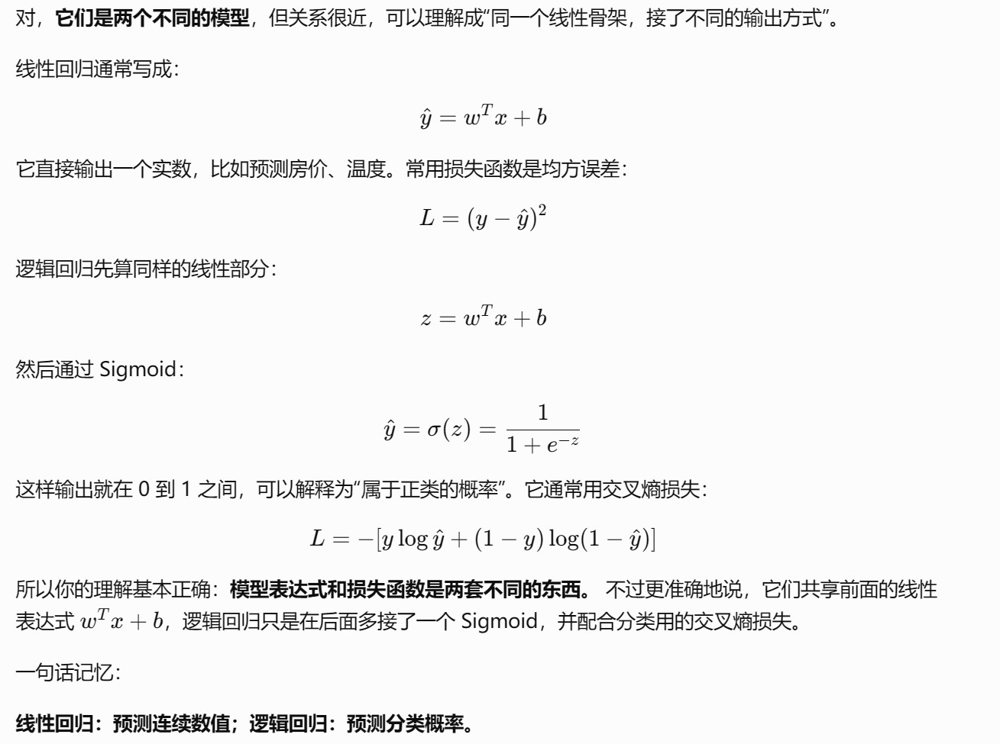
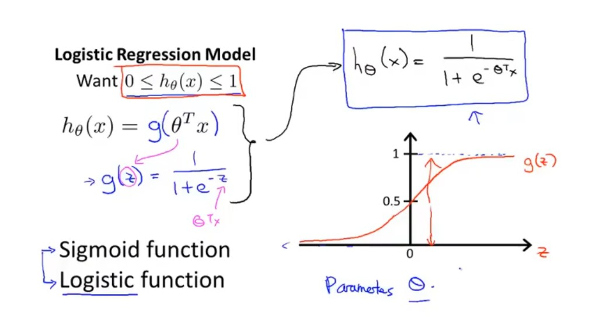
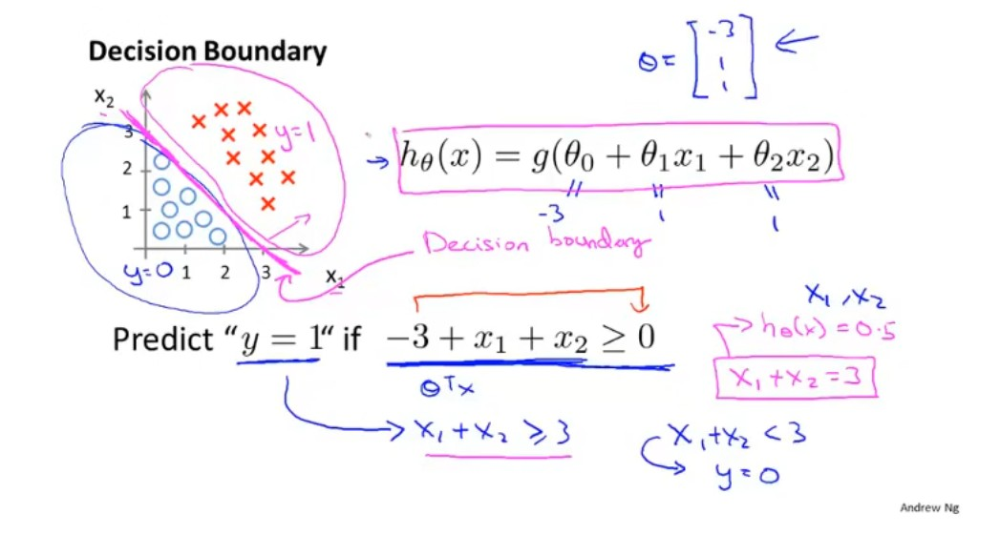
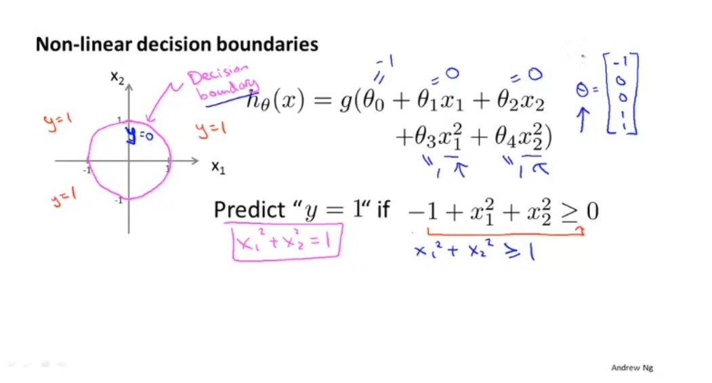
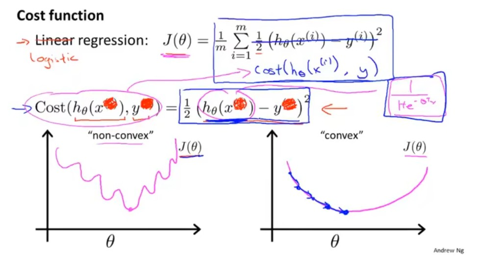
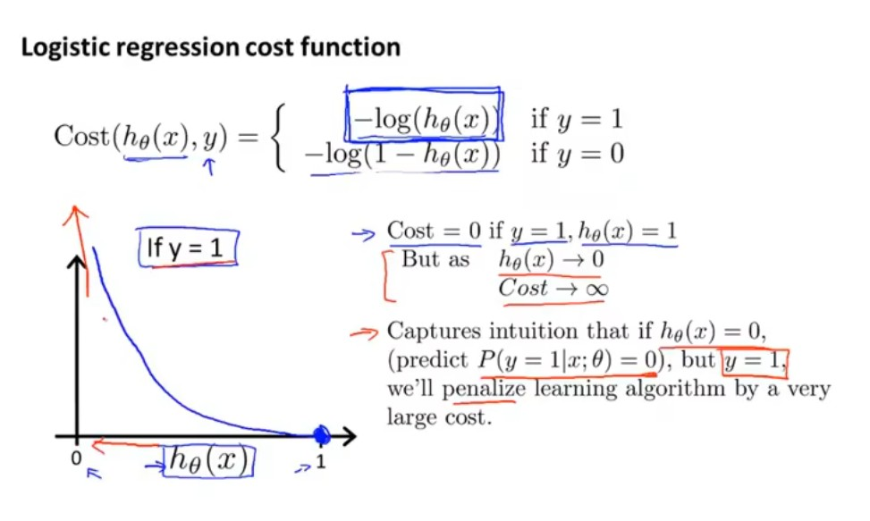
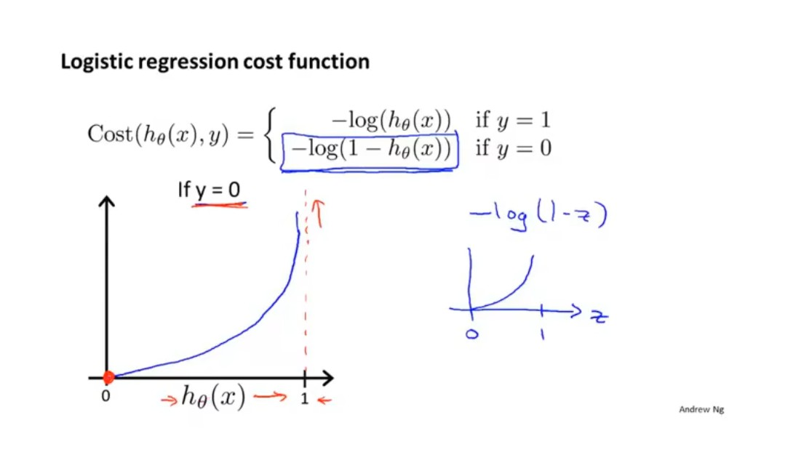

# 逻辑回归

> 新版课程对应：26～31（逻辑回归、决策边界、损失与梯度下降）以及 32～36（过拟合与正则化）。

---

## 1. 逻辑回归解决什么问题

逻辑回归主要用于分类，最常见的是二分类：

```text
y ∈ {0, 1}
```

例如：

```text
0 = benign（良性）
1 = malignant（恶性）
```

模型的目标不是直接预测任意实数，而是估计：

```text
给定输入 x 时，样本属于正类 y=1 的概率。
```

数学上常写成：

```text
f_{w,b}(x) = P(y=1 | x; w,b)
```

---

## 2. 为什么不用线性回归

线性回归的输出为：

```text
z = wᵀx + b
```

它可能得到任意实数：

```text
-5.3、0.2、1.7、12.4
```

而概率应满足：

```text
0 ≤ P ≤ 1
```

所以逻辑回归先计算线性组合，再使用 Sigmoid 将结果压缩到 0～1：

```text
z = wᵀx + b
f_{w,b}(x) = g(z)
```



需要注意：

```text
逻辑回归虽然名字中有“回归”，但通常用于分类。
```

---

## 3. Sigmoid 函数

Sigmoid 定义为：

```text
g(z) = 1 / (1 + e^{-z})
```

重要性质：

- `z → +∞` 时，`g(z) → 1`；
- `z → -∞` 时，`g(z) → 0`；
- `z = 0` 时，`g(z) = 0.5`；
- 输出始终位于 `(0,1)`。

因此逻辑回归模型为：

```text
f_{w,b}(x) = g(wᵀx + b)
```



### 3.1 如何解释输出

假设：

```text
f_{w,b}(x) = 0.82
```

可以理解为：

```text
模型估计该样本属于正类 y=1 的概率约为 82%。
```

这不是“真实世界客观概率”的保证，而是当前模型在其训练方式和数据条件下给出的概率估计。

---

## 4. 分类阈值

模型输出概率后，还需要阈值把概率转换为类别。

默认阈值常为 `0.5`：

```text
若 f_{w,b}(x) ≥ 0.5，预测为 1；
若 f_{w,b}(x) < 0.5，预测为 0。
```

由于 `g(0)=0.5`，这又等价于：

```text
wᵀx + b ≥ 0 → 预测 1
wᵀx + b < 0 → 预测 0
```

### 4.1 阈值不是固定真理

阈值可以根据任务代价调整：

- 降低阈值：更容易预测为正类，通常提高 Recall，但可能降低 Precision；
- 提高阈值：更谨慎地预测为正类，通常提高 Precision，但可能降低 Recall。

阈值必须在训练集或验证集上选择，不能根据测试集表现反复调整。

---

## 5. 决策边界

决策边界是模型从预测类别 0 切换到类别 1 的位置。

默认阈值为 0.5 时，边界满足：

```text
wᵀx + b = 0
```

### 5.1 线性决策边界

两个特征时：

```text
w₁x₁ + w₂x₂ + b = 0
```

在二维平面中是一条直线。



### 5.2 非线性决策边界与特征工程

如果构造多项式特征：

```text
x₁²、x₂²、x₁x₂
```

模型可以写成：

```text
w₁x₁ + w₂x₂ + w₃x₁² + w₄x₂² + b
```

它对扩展后的特征仍是线性组合，但映射回原始空间时可以形成曲线边界。



特征工程增强了表达能力，但也可能导致模型复杂度过高，从而过拟合。

---

## 6. 逻辑回归的损失函数

如果把 Sigmoid 输出直接代入平方误差：

```text
1/2 × (f_{w,b}(x) - y)²
```

整体代价相对于参数可能出现不理想的非凸形状，使梯度优化更困难。



逻辑回归使用二元交叉熵，也称 Log Loss。

---

### 6.1  二元交叉熵损失

单个样本的损失为：

```text
L(f(x), y) = -[ y log(f(x)) + (1-y) log(1-f(x))]
```

为了简化书写，下文记：

```text
p = f_{w,b}(x)
```

#### 6.1.1 当真实标签 y=1

损失变成：

```text
L = -log(p)
```

- `p → 1`，损失趋近 0；
- `p → 0`，损失快速增大。



#### 6.1.2 当真实标签 y=0

损失变成：

```text
L = -log(1-p)
```

- `p → 0`，损失趋近 0；
- `p → 1`，损失快速增大。



#### 6.1.3 直觉

交叉熵会强烈惩罚：

```text
非常自信但完全错误的预测。
```

例如真实标签为 1，模型却只给正类概率 `0.001`，损失会非常大。

> 对 `m` 个训练样本取平均：
>
> ```text
> J(w,b) = 1/m × Σ L(f_{w,b}(x^(i)), y^(i))
> ```
>
> 训练目标是寻找 `w、b`，使 `J(w,b)` 尽可能小。
>
> 不要混淆：
>
> - 单样本损失：`L`；
> - 整个训练集平均代价：`J`；
> - 最终业务指标：Accuracy、Recall、F1 等。
>
> 损失函数负责训练，评估指标负责从任务角度判断模型是否好用，二者不必完全相同。

---

## 9. 梯度下降

逻辑回归的参数更新仍遵循：

```text
w_j := w_j - α × ∂J(w,b)/∂w_j
b   := b   - α × ∂J(w,b)/∂b
```

其中：

- `α`：学习率；
- 梯度：代价函数对参数的偏导数；
- 负梯度方向：局部下降最快的方向。

逻辑回归的梯度形式与线性回归看起来相似，但二者的预测函数不同：

```text
线性回归：f(x)=wᵀx+b
逻辑回归：f(x)=sigmoid(wᵀx+b)
```

在 scikit-learn 中：

```python
model.fit(X_train, y_train)
```

优化过程已经封装在 `fit()` 内部。

---

## 11. 为什么逻辑回归通常需要标准化

本项目的 30 个特征数值范围差异较大。

对于依赖数值优化的模型，标准化通常可以：

- 改善优化条件；
- 加快收敛；
- 避免大尺度特征仅因单位较大而主导梯度；
- 让正则化更公平地约束不同特征权重。

本项目使用：

```python
Pipeline(
    [
        ("scaler", StandardScaler()),
        ("model", LogisticRegression(...)),
    ]
)
```

这样 `StandardScaler` 只会在训练数据上 `fit`，避免数据泄漏。

---

## 12. 逻辑回归的优点

- 训练速度快；
- 可作为强基线；
- 能输出概率；
- 参数相对容易解释；
- 对中小型结构化数据很实用；
- 配合正则化后通常比较稳定。

---

## 13. 逻辑回归的局限

- 原始形式只能学习线性决策边界；
- 非线性关系需要特征工程；
- 对异常值和强共线性可能敏感；
- 复杂图像、语音和文本通常需要更强的表示学习模型；
- 默认概率不一定天然校准良好，需要单独检查。

---

## 14. 二分类与多分类

### 14.1 One-vs-Rest

老版课程常介绍 One-vs-All / One-vs-Rest：

```text
对每个类别分别训练一个“该类 vs 其他类”的二分类器。
```

### 14.2 Softmax

新版 60～63 集系统讲 Softmax：

```text
一个模型同时输出所有类别的概率分布，概率和为 1。
```

这部分更适合在第四周结合神经网络和 `CrossEntropyLoss` 学习。

---

## 16. 本节自测

1. 逻辑回归为什么不是线性回归加一个阈值那么简单？

2. Sigmoid 的输入和输出分别是什么？

3. 为什么默认阈值 0.5 对应 `wᵀx+b=0`？

4. 决策边界由什么决定？

   > 决策边界由以下三部分共同决定：
   >
   > 1. 模型参数 www；
   > 2. 偏置 bbb；
   > 3. 分类阈值。
   >
   > 当默认阈值为 0.5 时，决策边界为：
   >
   > ​									wTx+b=0
   >
   > 其中：
   >
   > - www 决定边界的方向；
   > - bbb 决定边界的位置；
   > - 分类阈值改变时，边界位置也会改变。
   >
   > 如果模型只使用原始特征，逻辑回归通常得到线性决策边界；如果加入 x2x^2x2、x1x2x_1x_2x1x2 等非线性特征，也可以形成曲线决策边界。
   >
   > > 决策边界本质上是模型对两个类别“恰好无法确定”的位置。

5. 为什么逻辑回归使用交叉熵而不是平方误差？

   > 因为逻辑回归预测的是类别概率，而交叉熵正是用于衡量**预测概率分布与真实类别之间差异**的损失函数。
   >
   > 二分类交叉熵为：

6. 当 `y=1` 而模型预测概率接近 0 时，损失为什么很大？

7. `λ` 过大可能造成什么问题？

8. scikit-learn 中 `C` 与正则化强度是什么关系？

9. 为什么标准化通常有利于逻辑回归？

10. 分类阈值应在哪个数据集上选择？

    > 分类阈值应该在**验证集**上选择，而不是训练集或测试集。
    >
    > 正确流程是：
    >
    > 1. 在训练集上训练模型；
    > 2. 在验证集上尝试不同阈值；
    > 3. 根据业务目标选择最佳阈值；
    > 4. 最后只在测试集上进行一次最终评估。
    >
    > 例如：
    >
    > - 重视查全率时，可以降低阈值；
    > - 重视精确率时，可以提高阈值；
    > - 需要平衡精确率和召回率时，可以根据 F1 分数选择；
    > - 不同错误代价不同时，可以根据实际成本选择。
    >
    > 不能在测试集上挑选阈值，因为这样相当于利用了测试集信息，会造成数据泄漏，最终测试结果将不再客观。
