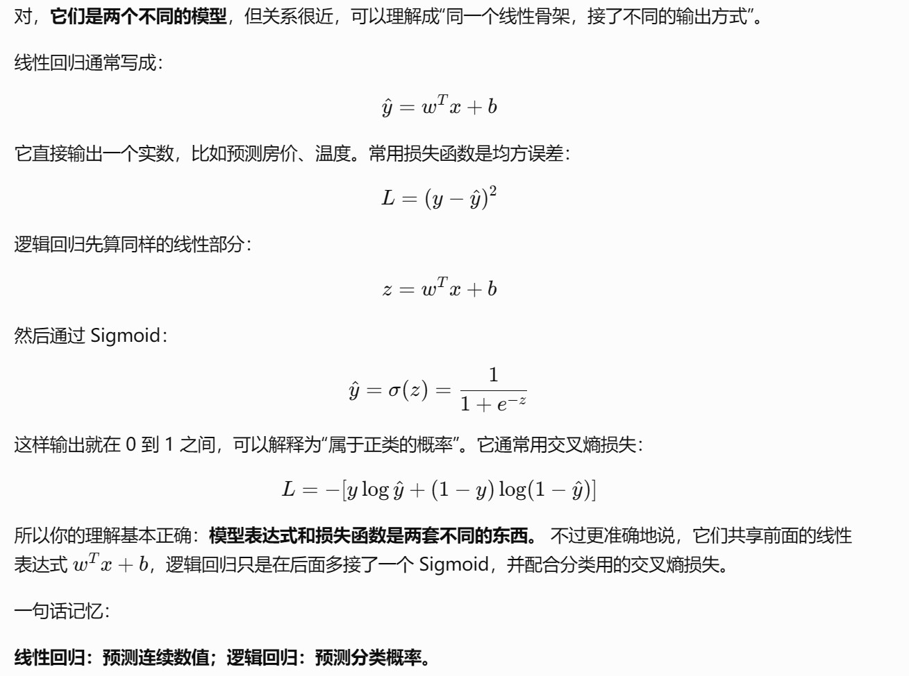
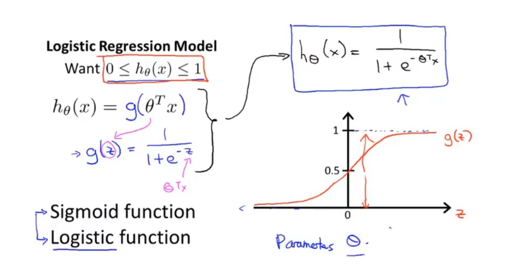
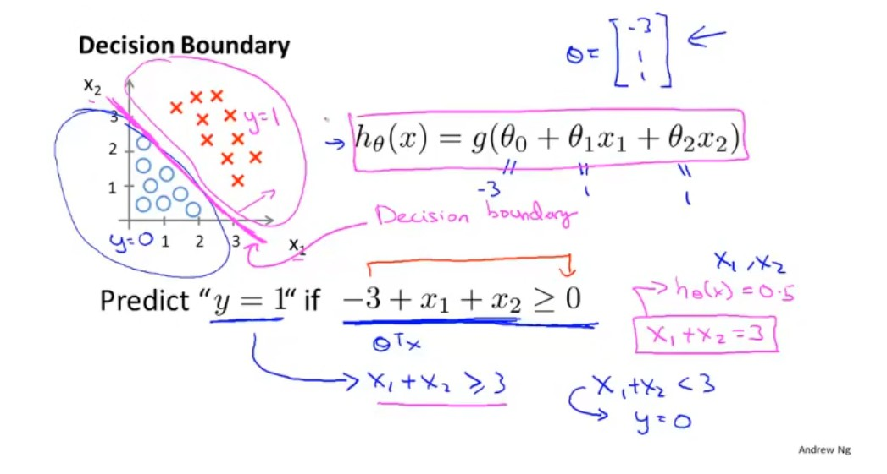
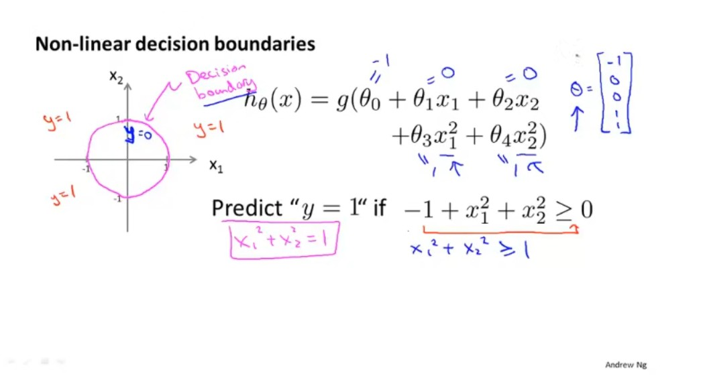
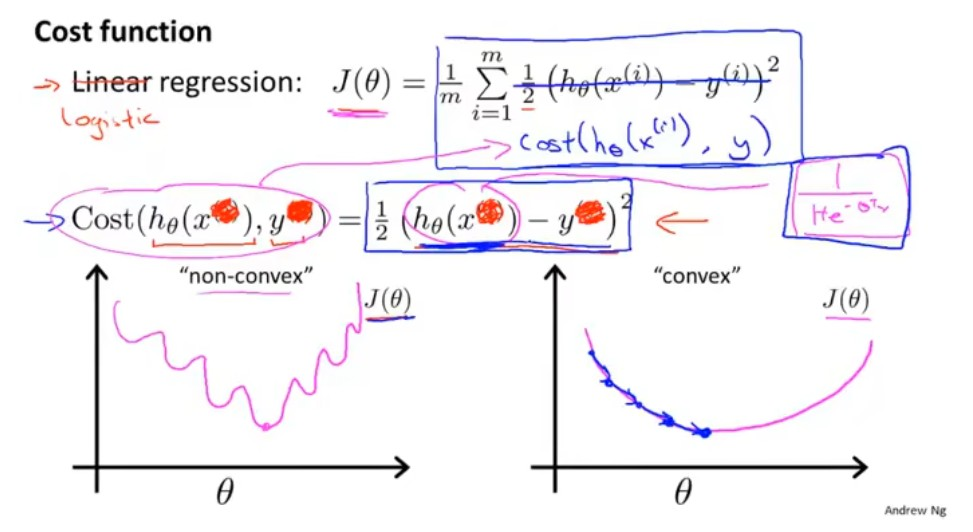
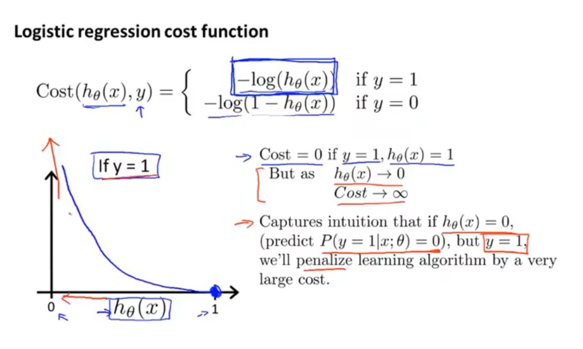
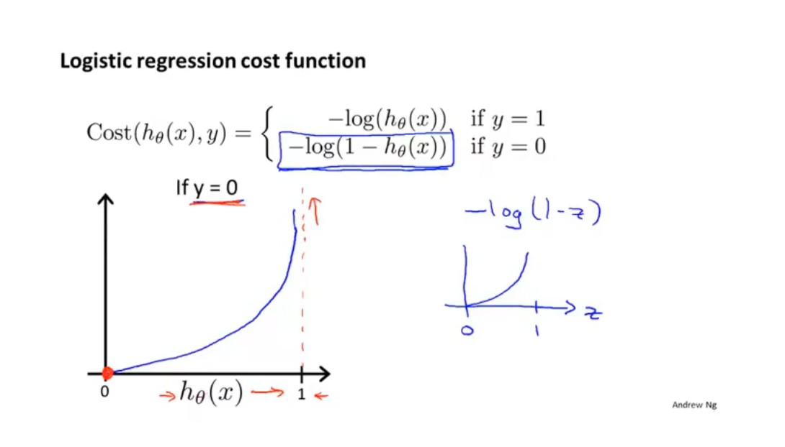

# 吴恩达新版《机器学习专项课程》完整复习笔记

---

## 0. 使用方法

### 0.1 第一次系统复习

按顺序阅读：

```text
机器学习基本框架
→ 线性回归
→ 逻辑回归
→ 过拟合与正则化
→ 神经网络
→ 模型评估与机器学习工程
→ 决策树与集成学习
→ 聚类与异常检测
→ 推荐系统
→ PCA
→ 强化学习
```

### 0.2 临时查知识点

建议使用编辑器搜索：

| 想查什么 | 搜索词 |
|---|---|
| 梯度下降为什么有效 | `梯度下降直觉` |
| 学习率怎么选 | `学习率诊断` |
| 逻辑回归损失 | `二元交叉熵` |
| 正则化作用 | `正则化本质` |
| Precision / Recall | `类别不均衡` |
| 训练集、验证集、测试集 | `数据集划分` |
| 偏差与方差 | `Bias-Variance` |
| 决策树如何分裂 | `信息增益` |
| 随机森林与 XGBoost | `集成学习` |
| K-means | `K-means` |
| 异常检测 | `高斯密度估计` |
| 推荐系统 | `协同过滤` |
| PCA | `主成分分析` |
| 强化学习 | `Bellman`、`DQN` |

### 0.3 记号约定

| 符号 | 含义 |
|---|---|
| <var>m</var> | 训练样本数量 |
| <var>n</var> | 每个样本的特征数量 |
| <var>x<sup>(i)</sup></var> | 第 <var>i</var> 个样本的输入特征 |
| <var>x<sub>j</sub><sup>(i)</sup></var> | 第 <var>i</var> 个样本的第 <var>j</var> 个特征 |
| <var>y<sup>(i)</sup></var> | 第 <var>i</var> 个样本的真实标签 |
| <var>ŷ<sup>(i)</sup></var> | 模型对第 <var>i</var> 个样本的预测 |
| <var>w</var>、<var>b</var> | 模型参数：权重与偏置 |
| <var>α</var> | 学习率 |
| <var>J(w, b)</var> | 整个训练集上的代价函数 |
| <var>L(ŷ, y)</var> | 单个样本的损失 |
| <var>λ</var> | 正则化强度 |

> 数学公式常从 1 开始编号；Python、NumPy 的下标从 0 开始。

---

# 第一部分　课程全景

## 1. 新版课程由哪三门课组成

### 课程一：监督学习——回归与分类

核心内容：

- 机器学习基本概念；
- 一元与多元线性回归；
- 代价函数；
- 梯度下降；
- 向量化；
- 特征缩放与特征工程；
- 逻辑回归；
- 过拟合与正则化。

### 课程二：高级学习算法

核心内容：

- 人工神经网络；
- TensorFlow 中的前向传播与训练；
- 多分类与 Softmax；
- 模型评估、选择和调试；
- 偏差—方差分析；
- 机器学习项目完整周期；
- 类别不均衡与 Precision、Recall、F1；
- 决策树、随机森林与 XGBoost。

### 课程三：无监督学习、推荐系统与强化学习

核心内容：

- K-means 聚类；
- 异常检测；
- 协同过滤推荐；
- 基于内容的推荐；
- PCA 降维；
- 强化学习基本概念；
- Bellman 方程；
- Q-learning 与 Deep Q-Network。

## 2. 整门课程真正建立的知识主线

```text
数据与任务
   ↓
定义模型 f(x)
   ↓
定义损失/代价 J
   ↓
选择优化算法
   ↓
在训练集拟合参数
   ↓
在验证集选择模型和超参数
   ↓
在测试集做最终评估
   ↓
误差分析与数据改进
   ↓
部署后持续监控
```

机器学习的本质不是背模型，而是掌握四个问题：

1. **模型表示什么函数？**
2. **怎样衡量模型错了多少？**
3. **怎样找到更好的参数？**
4. **怎样确认模型能泛化到新数据？**

## 3. 机器学习任务分类

课程里常用两种经典定义帮助理解“学习”：

- **Arthur Samuel**：让计算机在没有被逐条明确编程的情况下获得学习能力；
- **Tom Mitchell**：如果程序在任务 <var>T</var> 上的表现 <var>P</var> 随经验 <var>E</var> 增加而提高，就称程序从经验中学习。

以垃圾邮件识别为例：

```text
T：判断邮件是否为垃圾邮件
E：带标签的历史邮件
P：Precision、Recall、F1 等评价指标
```

这个定义提醒我们：建立机器学习问题时，必须同时明确任务、经验数据和评价标准。

### 3.1 监督学习

训练数据同时包含输入 <var>x</var> 和正确答案 <var>y</var>：

$$
(x^{(1)},y^{(1)}),\ldots,(x^{(m)},y^{(m)})
$$

模型学习映射：

$$
f:x\rightarrow y
$$

常见任务：

- **回归**：输出连续数值，如房价、温度、销量；
- **分类**：输出离散类别，如良性/恶性、猫/狗、垃圾邮件/正常邮件。

### 3.2 无监督学习

只有输入 <var>x</var>，没有人工提供的标准答案 <var>y</var>。模型寻找数据自身的结构：

- 聚类；
- 异常检测；
- 降维；
- 表示学习。

### 3.3 半监督学习与自监督学习

- **半监督学习**：同时使用少量有标签数据和大量无标签数据，适合标注成本高的场景；
- **自监督学习**：从原始数据本身构造训练目标，例如语言模型通过预测下一个 token 学习语言规律。

自监督学习仍然使用“输入—目标”训练信号，只是目标不是人工逐条标注，而是由数据自动构造。

### 3.4 强化学习

智能体与环境交互：

```text
状态 s
→ 选择动作 a
→ 环境返回奖励 r 和新状态 s'
→ 学习长期收益最大的策略
```

监督学习告诉模型“正确答案是什么”；强化学习通常只告诉模型“这个动作带来的结果好不好”。

> 深度学习和强化学习并不是同一个分类维度：深度学习描述模型结构，强化学习描述学习信号和交互方式。二者可以结合成深度强化学习。

---

# 第二部分　监督学习基础

## 4. 线性回归

### 4.1 任务

线性回归用于预测连续值。

一元线性回归：

$$
f_{w,b}(x)=wx+b
$$

多元线性回归：

$$
f_{\mathbf w,b}(\mathbf x)=\mathbf w^T\mathbf x+b
=\sum_{j=1}^{n}w_jx_j+b
$$

### 4.2 参数与超参数

**参数**由训练过程自动学习：

- 权重 <var>w</var>；
- 偏置 <var>b</var>；
- 神经网络各层参数。

**超参数**由开发者设置或搜索：

- 学习率 <var>α</var>；
- 正则化强度 <var>λ</var>；
- 树的深度；
- 神经网络层数和宽度；
- 训练轮数；
- K-means 的 <var>K</var>。

### 4.3 均方误差代价函数

单个样本误差：

$$
e^{(i)}=f_{w,b}(x^{(i)})-y^{(i)}
$$

课程采用：

$$
J(w,b)=\frac{1}{2m}\sum_{i=1}^{m}
\left(f_{w,b}(x^{(i)})-y^{(i)}\right)^2
$$

前面的 <var>½</var> 只为求导后抵消平方产生的 2，不影响最优参数的位置。

### 4.4 为什么平方误差适合线性回归

- 正负误差不会互相抵消；
- 大误差会受到更重惩罚；
- 连续、可导，便于梯度下降；
- 在线性回归中，其代价函数是凸函数，只有一个全局最小值。

### 4.5 模型、损失、指标的区别

| 概念 | 回答的问题 | 示例 |
|---|---|---|
| 模型 | 如何从输入得到预测 | <var>wx + b</var> |
| 损失函数 | 单个样本错多少 | 平方误差 |
| 代价函数 | 整个训练集平均错多少 | MSE |
| 优化器 | 如何修改参数降低代价 | 梯度下降 |
| 评估指标 | 模型实际表现如何 | MAE、RMSE、<var>R<sup>2</sup></var> |

## 5. 梯度下降

### 5.1 更新公式

$$
w:=w-\alpha\frac{\partial J}{\partial w}
$$

$$
b:=b-\alpha\frac{\partial J}{\partial b}
$$

多参数情形：

$$
w_j:=w_j-\alpha\frac{\partial J}{\partial w_j}
\quad(j=1,\ldots,n)
$$

所有参数必须使用**更新前的同一组参数同步更新**。

### 5.2 梯度下降直觉

- 梯度指向函数上升最快的方向；
- 负梯度指向局部下降最快的方向；
- 学习率决定每一步走多远。

深层理解：

> 梯度下降不是“直接算出正确参数”，而是根据当前参数对损失的局部影响，不断进行小幅修正。

### 5.3 线性回归梯度

$$
\frac{\partial J}{\partial w_j}
=\frac{1}{m}\sum_{i=1}^{m}
\left(f_{\mathbf w,b}(\mathbf x^{(i)})-y^{(i)}\right)x_j^{(i)}
$$

$$
\frac{\partial J}{\partial b}
=\frac{1}{m}\sum_{i=1}^{m}
\left(f_{\mathbf w,b}(\mathbf x^{(i)})-y^{(i)}\right)
$$

解释：

- 预测偏大，误差为正，参数通常会向减小预测的方向移动；
- 预测偏小，误差为负，参数通常会向增大预测的方向移动；
- 特征 <var>x<sub>j</sub></var> 决定参数 <var>w<sub>j</sub></var> 对该样本预测的影响程度。

### 5.4 学习率诊断

| 现象 | 常见原因 | 处理 |
|---|---|---|
| <var>J</var> 缓慢下降 | 学习率过小 | 适当增大 <var>α</var> |
| <var>J</var> 上下震荡 | 学习率偏大 | 减小 <var>α</var> |
| <var>J</var> 越来越大或出现 NaN | 学习率过大、数据尺度异常、代码错误 | 缩放特征并检查实现 |
| <var>J</var> 几乎不变 | 梯度为零、参数未更新、学习率太小 | 检查梯度和更新代码 |

常用试探序列：

```text
0.0001 → 0.001 → 0.01 → 0.1 → 1
```

每次扩大约 10 倍，先找到发散区间，再在稳定区间细调。

### 5.5 检查是否收敛

方法一：画学习曲线。

```text
横轴：迭代次数
纵轴：J(w,b)
```

正常情况：代价总体下降并逐渐变平。

方法二：自动收敛判据。

若：

$$
|J_{t}-J_{t-1}|<\varepsilon
$$

持续若干轮，可以停止训练。

> 不建议只检查 <var>J &lt; ε</var>，因为不同任务的损失尺度不同。

## 6. 向量化

### 6.1 为什么要向量化

循环写法：

```python
prediction = 0.0
for j in range(n):
    prediction += w[j] * x[j]
prediction += b
```

向量化写法：

```python
prediction = np.dot(w, x) + b
```

优点：

- 代码更短；
- 减少下标错误；
- 底层调用高效线性代数库；
- 可使用 CPU SIMD、GPU 等并行硬件。

### 6.2 批量矩阵表示

若：

- <var>X ∈ ℝ<sup>m × n</sup></var>；
- <var>w ∈ ℝ<sup>n</sup></var>；
- <var>b</var> 为标量；

则：

$$
\hat{\mathbf y}=X\mathbf w+b
$$

形状：

```text
X:      [m, n]
w:      [n]
X @ w:  [m]
b:      scalar，可广播
```

## 7. 多特征、特征缩放与特征工程

### 7.1 为什么要缩放特征

例如：

```text
房屋面积：500～3000
卧室数量：1～5
```

若不缩放，不同参数方向上的代价曲率差异很大，梯度下降会在狭长等高线中来回震荡，收敛缓慢。

### 7.2 常用方法

#### 最大值缩放

$$
x'=\frac{x}{x_{\max}}
$$

#### 均值归一化

$$
x'=\frac{x-\mu}{x_{\max}-x_{\min}}
$$

#### Z-score 标准化

$$
x'=\frac{x-\mu}{\sigma}
$$

其中 <var>μ</var> 为均值，<var>σ</var> 为标准差。

### 7.3 防止数据泄漏

正确流程：

```python
scaler.fit(X_train)
X_train_scaled = scaler.transform(X_train)
X_val_scaled = scaler.transform(X_val)
X_test_scaled = scaler.transform(X_test)
```

错误流程：

```python
scaler.fit(np.concatenate([X_train, X_test]))
```

原因：测试集信息提前参与了训练阶段的数据处理。

### 7.4 特征工程

特征工程是利用领域知识构造更有表达力的输入：

```text
原始：长、宽
新增：面积 = 长 × 宽
```

常见方式：

- 乘积、比值、差值；
- 对数变换；
- 时间拆分：小时、星期、月份；
- 类别组合；
- 统计聚合；
- 多项式项。

### 7.5 多项式回归

$$
f(x)=w_1x+w_2x^2+w_3x^3+b
$$

它仍是“对参数线性”的线性模型，只是输入特征变成：

$$
[x,x^2,x^3]
$$

注意：高次特征数值增长很快，通常必须缩放，并配合正则化防止过拟合。

---

# 第三部分　逻辑回归与分类

## 8. 逻辑回归

### 8.1 为什么不能简单用线性回归分类

分类标签常为 0/1，但线性回归输出范围为 <var>(−∞, +∞)</var>：

- 不能直接解释为概率；
- 极端样本会明显改变拟合直线；
- 平方误差与 Sigmoid 组合会产生不理想的优化形状。

**课程截图：线性回归与逻辑回归的核心区别**



### 8.2 Sigmoid 函数

$$
g(z)=\frac{1}{1+e^{-z}}
$$

性质：

- 输出范围 <var>(0, 1)</var>；
- <var>z = 0</var> 时输出 <var>0.5</var>；
- <var>z → +∞</var> 时接近 1；
- <var>z → −∞</var> 时接近 0。

逻辑回归：

$$
z=\mathbf w^T\mathbf x+b
$$

$$
f_{\mathbf w,b}(\mathbf x)=g(z)
$$

通常解释为：

$$
f(\mathbf x)=P(y=1\mid \mathbf x)
$$

**课程截图：Sigmoid 与逻辑回归模型**



### 8.3 logits 是什么

逻辑回归中：

$$
z=\mathbf w^T\mathbf x+b
$$

这个尚未经过 Sigmoid 的原始分数称为 **logit**。

```text
logit z：任意实数
Sigmoid(z)：0～1 的概率
阈值判断：最终类别
```

### 8.4 决策边界

默认阈值为 0.5：

$$
g(z)\ge 0.5 \Longleftrightarrow z\ge 0
$$

因此决策边界满足：

$$
\mathbf w^T\mathbf x+b=0
$$

**课程截图：线性决策边界**



线性特征产生线性边界；加入多项式特征后可产生曲线边界。

**课程截图：加入多项式特征后的非线性决策边界**



> 决策边界由模型参数和特征表达决定，不由某一个训练样本单独决定。

### 8.5 逻辑回归的适用边界

逻辑回归的优势：

- 训练快，适合作为中小型结构化数据的强基线；
- 能输出概率，参数方向相对容易解释；
- 配合标准化和正则化后通常比较稳定。

局限：

- 原始形式只能学习线性决策边界；
- 非线性关系需要多项式特征、交互特征或更强模型；
- 对异常值、强共线性和特征尺度差异可能敏感；
- 复杂图像、语音和文本通常需要更强的表示学习模型；
- 输出分数不一定天然具有良好概率校准，需要单独检查。

标准化不会改变逻辑回归的线性本质，但通常能改善优化条件，并让正则化更公平地约束不同尺度的特征。

## 9. 二元交叉熵

如果把 Sigmoid 输出直接代入平方误差，关于参数的代价函数可能出现不理想的非凸形状；二元交叉熵能形成更适合逻辑回归优化的目标。



### 9.1 单样本损失

$$
L(\hat y,y)
=-y\log(\hat y)-(1-y)\log(1-\hat y)
$$

分情况：

当 <var>y = 1</var>：

$$
L=-\log(\hat y)
$$



当 <var>y = 0</var>：

$$
L=-\log(1-\hat y)
$$



### 9.2 直觉

- 真实为 1，预测越接近 1，损失越小；
- 真实为 1，预测接近 0，损失趋近无穷；
- 真实为 0，预测越接近 0，损失越小；
- 对“非常自信但错误”的预测给予巨大惩罚。

### 9.3 训练集代价

$$
J(\mathbf w,b)=\frac1m\sum_{i=1}^{m}
L(f(\mathbf x^{(i)}),y^{(i)})
$$

逻辑回归使用该损失后，关于参数的代价函数是凸的，便于找到全局最优解。

### 9.4 数值稳定性

工程中优先直接把 logits 交给稳定实现：

```python
# PyTorch：输入 logits，不先手动 sigmoid
loss_fn = torch.nn.BCEWithLogitsLoss()
loss = loss_fn(logits, labels.float())
```

不推荐：

```python
probs = torch.sigmoid(logits)
loss = torch.nn.BCELoss()(probs, labels.float())
```

前者会把 Sigmoid 与交叉熵合并计算，减少上溢、下溢和 `log(0)` 风险。

## 10. 逻辑回归梯度

逻辑回归与线性回归的梯度形式相似：

$$
\frac{\partial J}{\partial w_j}
=\frac1m\sum_{i=1}^{m}
(f(\mathbf x^{(i)})-y^{(i)})x_j^{(i)}
$$

$$
\frac{\partial J}{\partial b}
=\frac1m\sum_{i=1}^{m}
(f(\mathbf x^{(i)})-y^{(i)})
$$

但两者不同之处是：

| 项目 | 线性回归 | 逻辑回归 |
|---|---|---|
| 模型输出 | <var><b>w</b><sup>T</sup><b>x</b> + b</var> | <var>σ(<b>w</b><sup>T</sup><b>x</b> + b)</var> |
| 任务 | 回归 | 二分类 |
| 损失 | MSE | 二元交叉熵 |
| 输出范围 | 任意实数 | 0～1 |

## 11. 分类阈值

默认阈值 0.5 并非永远最佳。

降低阈值通常：

- 更多样本被判为正类；
- Recall 上升；
- FN 减少；
- FP 增加；
- Precision 可能下降。

提高阈值通常相反。

阈值应在验证集上根据业务成本选择，不能使用测试集反复调整。

**课程截图：阈值变化带来的 Precision–Recall 权衡**


---

# 第四部分　过拟合、正则化与泛化

## 12. 欠拟合与过拟合

**课程截图：回归任务中的欠拟合、合适拟合与过拟合**


**课程截图：分类任务中的欠拟合、合适拟合与过拟合**


### 12.1 欠拟合（高偏差）

表现：

- 训练误差高；
- 验证误差也高；
- 模型无法捕捉数据规律。

常见原因：

- 模型过于简单；
- 特征不足；
- 正则化过强；
- 训练不足。

### 12.2 过拟合（高方差）

表现：

- 训练误差很低；
- 验证/测试误差明显更高；
- 模型记住训练集细节与噪声。

常见原因：

- 模型过于复杂；
- 数据太少；
- 特征太多；
- 数据噪声较大；
- 正则化不足。

### 12.3 泛化

泛化能力：模型在未见数据上的表现。

训练损失低只说明“能拟合训练集”，不等于模型真正有效。

## 13. L2 正则化

**课程截图：通过缩小参数缓解过拟合**


**笔记配图：特征项与对应权重**


### 13.1 正则化线性回归

$$
J(\mathbf w,b)=
\frac{1}{2m}\sum_{i=1}^{m}(f(\mathbf x^{(i)})-y^{(i)})^2
+\frac{\lambda}{2m}\sum_{j=1}^{n}w_j^2
$$

### 13.2 正则化逻辑回归

$$
J(\mathbf w,b)=
\frac1m\sum_{i=1}^{m}L(f(\mathbf x^{(i)}),y^{(i)})
+\frac{\lambda}{2m}\sum_{j=1}^{n}w_j^2
$$

通常不正则化偏置 <var>b</var>，因为单个偏置不会显著增加模型复杂度。

**笔记配图：L2 正则化的权重平方惩罚**


### 13.3 正则化本质

正则化不是让特征值变小，而是限制模型参数过大：

> 在“拟合训练数据”和“保持模型简单”之间做权衡。

- <var>λ = 0</var>：不正则化，可能过拟合；
- <var>λ</var> 较大：权重受到更强压缩；
- <var>λ</var> 过大：所有权重过小，模型可能欠拟合。

**笔记配图：正则化的本质**


**课程截图：正则化强度与偏差—方差**


### 13.4 正则化后的梯度

$$
\frac{\partial J}{\partial w_j}
=\text{原梯度}+\frac{\lambda}{m}w_j
$$

更新：

$$
w_j:=
\left(1-\alpha\frac{\lambda}{m}\right)w_j
-\alpha\cdot\text{原梯度}
$$

第一项会持续让权重衰减，因此 L2 也称 weight decay。

### 13.5 L1 与 L2 的区别

L1 正则化使用权重绝对值惩罚：

$$
J_{\mathrm{L1}}=J_{\mathrm{original}}
+\frac{\lambda}{m}\sum_{j=1}^{n}|w_j|
$$

**笔记配图：L1 正则化产生稀疏权重**


| 方法 | 对权重的典型影响 | 常见用途 |
|---|---|---|
| L1 | 部分权重可能精确变为 0 | 稀疏化、辅助特征选择 |
| L2 | 权重整体缩小，通常不精确变为 0 | 稳定训练、缓解高方差 |


强相关特征存在时，L1 可能只保留其中一部分，因此“被保留的特征”不一定稳定。L1、L2 都是限制模型复杂度，但不要把 `nn.L1Loss()` 误认为参数的 L1 正则化。

---

# 第五部分　神经网络

## 14. 从逻辑回归到神经元

一个二分类神经元本质上就是：

$$
z=\mathbf w^T\mathbf x+b
$$

$$
a=g(z)
$$

其中：

- <var>z</var>：线性组合或 logit；
- <var>g</var>：激活函数；
- <var>a</var>：激活值，也就是该神经元的输出。

神经网络通过把多个神经元组成层，再将多层串联，学习复杂函数。

## 15. 神经网络的层

### 15.1 基本结构

```text
输入层 → 隐藏层1 → 隐藏层2 → 输出层
```

第 <var>l</var> 层的第 <var>j</var> 个神经元：

$$
z_j^{[l]}=\mathbf w_j^{[l]T}\mathbf a^{[l-1]}+b_j^{[l]}
$$

$$
a_j^{[l]}=g^{[l]}(z_j^{[l]})
$$

整层向量化：

$$
\mathbf z^{[l]}=W^{[l]}\mathbf a^{[l-1]}+\mathbf b^{[l]}
$$

$$
\mathbf a^{[l]}=g^{[l]}(\mathbf z^{[l]})
$$

### 15.2 PyTorch 中的形状

设：

- batch size 为 <var>B</var>；
- 输入维度为 <var>d<sub>in</sub></var>；
- 输出维度为 <var>d<sub>out</sub></var>。

```python
layer = nn.Linear(d_in, d_out)
```

形状变化：

```text
输入：  [B, d_in]
权重：  [d_out, d_in]
偏置：  [d_out]
输出：  [B, d_out]
```

### 15.3 前向传播

前向传播是按层计算预测：

```text
输入 x
→ 第1层 z¹、a¹
→ 第2层 z²、a²
→ ...
→ 输出层预测
```

推理只需要前向传播；训练还需要计算损失、反向传播和更新参数。

## 16. 激活函数

### 16.1 为什么需要非线性

如果每层都没有激活函数：

$$
W_2(W_1x+b_1)+b_2
$$

展开后仍是一个线性变换。因此无论堆叠多少线性层，表达能力都等价于单个线性层。

> 激活函数赋予神经网络非线性表达能力。

### 16.2 ReLU

$$
\operatorname{ReLU}(z)=\max(0,z)
$$

优点：

- 计算简单；
- 正区间梯度稳定；
- 通常比 Sigmoid 更容易训练深层网络。

缺点：

- 若神经元长期落在负区间，梯度为 0，可能形成“死亡 ReLU”。

### 16.3 Sigmoid

$$
\sigma(z)=\frac1{1+e^{-z}}
$$

适合：

- 二分类输出层；
- 多标签分类中每个独立标签的输出。

通常不作为深层隐藏层默认激活，因为大正数或大负数区域梯度接近 0，容易产生梯度消失。

### 16.4 线性激活

$$
g(z)=z
$$

适合回归输出层，特别是输出可以取任意实数时。

### 16.5 激活函数选择

| 任务 | 输出层 | 损失 |
|---|---|---|
| 回归，任意实数 | Linear | MSE / MAE |
| 回归，非负值 | ReLU 或 Softplus | MSE 等 |
| 二分类 | 1 个 logit | BCEWithLogitsLoss |
| 多标签分类 | 每类 1 个 logit | BCEWithLogitsLoss |
| 单标签多分类 | <var>K</var> 个 logits | CrossEntropyLoss |

## 17. 多分类与 Softmax

### 17.1 多分类任务

若类别互斥且一共有 <var>K</var> 类，输出层产生 <var>K</var> 个 logits：

$$
z_1,z_2,\ldots,z_K
$$

Softmax：

$$
p_k=\frac{e^{z_k}}{\sum_{j=1}^{K}e^{z_j}}
$$

性质：

$$
0<p_k<1,\qquad\sum_{k=1}^{K}p_k=1
$$

预测类别：

$$
\hat y=\arg\max_k z_k
$$

因为 Softmax 不改变 logits 的大小顺序，推理时取 logits 最大值即可。

### 17.2 数值稳定的 Softmax

直接计算 <var>e<sup>z<sub>k</sub></sup></var> 可能溢出。减去最大值：

$$
p_k=
\frac{e^{z_k-z_{\max}}}
{\sum_j e^{z_j-z_{\max}}}
$$

概率不变，但计算更稳定。

### 17.3 多分类交叉熵

若真实类别为 <var>y</var>：

$$
L=-\log p_y
$$

PyTorch：

```python
loss_fn = nn.CrossEntropyLoss()
loss = loss_fn(logits, labels)
```

注意：

- 输入是原始 logits；
- 不要提前调用 Softmax；
- `labels` 通常是形状 `[B]` 的整数类别编号；
- `CrossEntropyLoss = LogSoftmax + NLLLoss` 的稳定实现。

### 17.4 One-vs-Rest 与 Softmax

- **One-vs-Rest（OvR）**：为每个类别分别训练一个“该类 vs 其他类”的二分类器，最后选择得分最高的类别；
- **Softmax**：一个模型同时输出所有类别的联合概率分布，概率和为 1。

旧版课程常用 OvR 解释多分类如何由二分类扩展而来；新版更强调 Softmax 与神经网络多分类。二者都能完成多分类，但 Softmax 会直接建模类别之间的竞争关系。

## 18. 神经网络训练

完整过程：

```text
1. 初始化参数
2. 前向传播
3. 计算损失
4. 反向传播计算梯度
5. 优化器更新参数
6. 重复多个 batch / epoch
```

PyTorch 标准结构：

```python
model.train()

for x, y in train_loader:
    x = x.to(device)
    y = y.to(device)

    optimizer.zero_grad()
    logits = model(x)
    loss = loss_fn(logits, y)
    loss.backward()
    optimizer.step()
```

### 18.1 为什么先清空梯度

PyTorch 默认累加 `.grad`：

```python
optimizer.zero_grad()
```

若不清空，本 batch 梯度会和以前 batch 的梯度相加。

### 18.2 反向传播是什么

反向传播不是另一种优化器，而是：

> 按计算图的反方向应用链式法则，计算损失对每个可训练参数的偏导数。

```text
前向传播：参数 → 预测 → 损失
反向传播：损失 → 各层梯度
优化器：使用梯度修改参数
```

### 18.3 epoch 与 batch

- **batch**：一次前向、反向和更新使用的一小批样本；
- **epoch**：模型完整看过一次训练集；
- 每个 epoch 通常重新打乱训练数据；
- 同一个 epoch 内，每个样本通常只出现一次；
- 不同 epoch 中样本会再次被使用。

### 18.4 Dropout

Dropout 在训练时随机把部分激活值暂时置为 0：

```python
torch.nn.Dropout(p=0.2)
```

它限制的是神经元之间的固定依赖，而不是永久删除参数：

```text
L1：让部分连接趋于 0
L2：抑制过大的连接
Dropout：训练时随机打乱神经元的固定合作
```

推理时必须切换到 `model.eval()`，否则 Dropout 仍会随机丢弃激活值。

### 18.5 Early Stopping

Early Stopping 监控验证集性能：

```text
验证性能持续不改善
→ 停止训练
→ 恢复验证集表现最好的参数
```

它可以节省计算并减少训练后期的过拟合，但验证集不能被测试集替代，停止条件和耐心值也属于模型开发的一部分。

## 19. TensorFlow 与 PyTorch 对照

| 概念 | TensorFlow/Keras | PyTorch |
|---|---|---|
| 全连接层 | `Dense(units, activation=...)` | `nn.Linear` + 激活层 |
| 顺序模型 | `tf.keras.Sequential` | `nn.Sequential` |
| 二分类稳定损失 | `BinaryCrossentropy(from_logits=True)` | `BCEWithLogitsLoss` |
| 多分类稳定损失 | `SparseCategoricalCrossentropy(from_logits=True)` | `CrossEntropyLoss` |
| 自动训练 | `model.fit()` | 手写训练循环 |
| 推理模式 | `training=False` | `model.eval()` + `no_grad()` |
| 优化器 | `tf.keras.optimizers.Adam` | `torch.optim.Adam` |

课程使用 TensorFlow 讲神经网络，但算法思想与 PyTorch 完全一致；框架只是表达和执行计算图的工具。

---

# 第六部分　模型评估与机器学习工程

## 20. 数据集划分

### 20.1 三个数据集的职责

| 数据集 | 用途 |
|---|---|
| 训练集 | 学习参数 <var>w, b</var> |
| 验证集 / 交叉验证集 | 选择模型、特征、超参数和阈值 |
| 测试集 | 对最终方案做一次尽量无偏的评估 |

典型比例：

```text
60% / 20% / 20%
70% / 15% / 15%
80% / 10% / 10%
```

数据量很大时，验证集和测试集只需足够稳定，不一定各占 20%。

### 20.2 为什么不能在测试集上反复调参

每次根据测试结果修改方案，都在把测试集信息泄漏给模型开发过程。久而久之，模型也会对测试集过拟合。

正确流程：

```text
训练集拟合参数
验证集反复开发
测试集最终只评一次
```

### 20.3 分层划分

分类任务特别是类别不均衡时，应尽量保持各数据集类别比例一致：

```python
train_test_split(X, y, stratify=y, random_state=42)
```

### 20.4 K 折交叉验证

K 折交叉验证把开发数据分成 K 份，每次使用 K−1 份训练、1 份验证，重复 K 次后汇总均值和波动。

- 分类任务通常使用 `StratifiedKFold` 保持类别比例；
- 它适合样本较少或单次划分波动较大的情况；
- 训练成本约增加到 K 倍；
- 标准化、特征选择和过采样等步骤必须放入每一折内部，通常使用 `Pipeline`；
- 交叉验证不能取代最终独立测试集。

## 21. 模型选择

假设比较不同多项式次数：

```text
d = 1, 2, 3, ..., 10
```

流程：

1. 每个 <var>d</var> 在训练集拟合参数；
2. 在验证集计算误差；
3. 选择验证误差最低的 <var>d</var>；
4. 最后在测试集评估一次。

**课程截图：使用交叉验证误差进行模型选择**


同理可选择：

- 正则化强度；
- 网络宽度和层数；
- 树深；
- 学习率；
- 分类阈值。

## 22. Bias-Variance 诊断

### 22.1 用训练误差和验证误差判断

设基准误差或人类水平误差为 <var>E<sub>base</sub></var>。

**课程截图：建立基准性能水平**


| 情况 | 训练误差 | 验证误差 | 结论 |
|---|---:|---:|---|
| 训练误差远高于基准 | 高 | 高 | 高偏差/欠拟合 |
| 训练误差低，验证误差高很多 | 低 | 高 | 高方差/过拟合 |
| 两者都高且差距也大 | 高 | 更高 | 偏差和方差都有问题 |
| 两者都低且接近 | 低 | 低 | 泛化较好 |

**课程截图：回归中的 Bias–Variance 状态**


关键差值：

```text
可避免偏差 ≈ 训练误差 - 基准误差
方差问题   ≈ 验证误差 - 训练误差
```

**课程截图：通过训练误差与验证误差诊断偏差和方差**


### 22.2 高偏差怎么办

优先尝试：

- 增加有用特征；
- 使用更复杂模型；
- 增加神经网络规模；
- 减小正则化；
- 训练更久；
- 改进优化方法。

仅增加更多同分布训练数据通常不能直接解决严重高偏差。

### 22.3 高方差怎么办

优先尝试：

- 增加训练数据；
- 增强数据；
- 减少无关特征；
- 加强正则化；
- 简化模型；
- 使用迁移学习；
- 集成多个模型。

## 23. 学习曲线

学习曲线可画：

```text
横轴：训练样本数量
纵轴：训练误差、验证误差
```

### 高偏差

- 训练误差较高；
- 验证误差较高；
- 两者逐渐接近；
- 增加数据帮助有限。


### 高方差

- 训练误差低；
- 验证误差明显更高；
- 增加数据后验证误差通常继续改善。


## 24. 机器学习开发的迭代循环

```text
选择模型、数据和特征
→ 训练
→ 诊断错误
→ 决定最值得改进的环节
→ 修改数据/模型
→ 再训练
```


关键原则：

> 不要凭感觉同时修改很多地方；先通过诊断确定瓶颈，再做针对性实验。

**课程截图：神经网络的偏差—方差决策路径**


## 25. 误差分析

误差分析：人工检查一批错误样本，并归类原因。

示例：垃圾邮件分类错误：

| 错误类型 | 数量 |
|---|---:|
| 拼写变体 | 21 |
| 钓鱼链接 | 17 |
| 图片文字 | 8 |
| 非英语文本 | 4 |

这样可以判断下一步增加哪类数据或特征最有价值。

注意：

- 误差分类可重叠；
- 优先分析验证集错误；
- 样本很多时，先抽查 50～100 个；
- 错误分析通常比盲目换模型更有效。

## 26. 数据中心方法

模型固定时，可以通过系统改进数据提升性能：

- 修复错误标签；
- 统一标注标准；
- 增加模型最薄弱类别的数据；
- 合成针对性数据；
- 清理重复、异常和泄漏样本；
- 让训练集更接近真实部署分布。

**课程截图：通过数据增强构造有针对性的新样本**


不要只追求“数据更多”，更要追求：

```text
覆盖正确问题 + 标签一致 + 与部署场景匹配
```

## 27. 迁移学习

流程：

1. 在大型相关任务上预训练模型；
2. 保留已学到的通用特征；
3. 替换任务输出层；
4. 冻结主体或使用较小学习率微调；
5. 在目标数据上训练。

**课程截图：保留预训练表示并替换输出层进行迁移学习**


适合：

- 目标任务数据较少；
- 源任务和目标任务输入类型相同；
- 预训练模型规模和质量较高。

迁移学习与模型蒸馏不同：

| 方法 | 核心目标 |
|---|---|
| 迁移学习 | 把已有知识迁移到新任务 |
| 模型蒸馏 | 让小模型模仿大模型以压缩部署 |

## 28. 机器学习项目完整周期

```text
1. 定义项目范围和业务指标
2. 收集与定义数据
3. 建立训练/验证/测试集
4. 建立简单基线
5. 训练模型
6. 做偏差—方差和误差分析
7. 改进数据与模型
8. 部署
9. 监控数据漂移、性能和安全问题
10. 持续迭代
```

### 28.1 概念漂移与数据漂移

- **数据漂移**：输入数据分布发生变化；
- **概念漂移**：输入与标签之间的关系发生变化。

例如：用户行为、诈骗方式、设备、政策或季节变化都可能使线上数据不同于训练时期。

### 28.2 负责任的 AI

项目需要考虑：

- 公平性和群体偏差；
- 隐私；
- 安全性；
- 可解释性；
- 是否可能造成伤害；
- 推荐系统对用户和社会的长期影响；
- 训练数据是否合法、是否具有代表性。

---

# 第七部分　类别不均衡与分类指标

## 29. 混淆矩阵

以正类为关注对象：

|  | 预测正类 | 预测负类 |
|---|---:|---:|
| 真实正类 | TP | FN |
| 真实负类 | FP | TN |

- TP：真正例；
- FP：假正例，误报；
- FN：假负例，漏报；
- TN：真负例。


## 30. Accuracy

$$
Accuracy=\frac{TP+TN}{TP+FP+FN+TN}
$$

类别极不均衡时可能误导。

例如正类只占 1%，永远预测负类也有 99% Accuracy，但完全找不到正类。


### 30.1 Specificity 与 Balanced Accuracy

Specificity（特异度、真负率）关注真实负类被正确识别的比例：

$$
Specificity=\frac{TN}{TN+FP}
$$

二分类的 Balanced Accuracy 为正类召回率与真负率的平均：

$$
Balanced\ Accuracy=\frac{Recall+Specificity}{2}
$$

它在类别不均衡时比普通 Accuracy 更不容易被多数类主导。

## 31. Precision、Recall 与 F1

### Precision

$$
Precision=\frac{TP}{TP+FP}
$$

含义：模型预测为正的样本中，有多少是真的正类。

适合强调：减少误报。

### Recall

$$
Recall=\frac{TP}{TP+FN}
$$

含义：所有真实正类中，模型找回了多少。

适合强调：减少漏报。

### F1

$$
F1=2\frac{Precision\cdot Recall}{Precision+Recall}
$$


F1 是 Precision 和 Recall 的调和平均，对二者中的较小值更敏感。

F1 不使用 TN，因此更聚焦正类识别能力；但也意味着它不能完整反映所有业务情形。

### Fβ

当 Precision 与 Recall 的业务重要性不同，可以使用：

$$
F_\beta=(1+\beta^2)
\frac{Precision\cdot Recall}{\beta^2 Precision+Recall}
$$

- β > 1：更重视 Recall，例如漏报代价很高时可考虑 F2；
- β < 1：更重视 Precision；
- β = 1：退化为 F1。

## 32. 指标选择

| 场景 | 通常更关注 |
|---|---|
| 癌症筛查 | Recall，尽量少漏诊 |
| 垃圾邮件拦截 | Precision，避免正常邮件误杀 |
| 搜索/推荐候选召回 | Recall |
| 人工审核资源有限 | Precision |
| 需要综合平衡 | F1 或 PR-AUC |

指标必须与业务错误成本一致。

### 32.1 多分类指标的平均方式

| 平均方式 | 计算方式 | 侧重点 |
|---|---|---|
| Macro | 每个类别分别计算后直接平均 | 每类同权，少数类更受重视 |
| Weighted | 按每类样本数加权平均 | 更接近总体分布，多数类影响更大 |
| Micro | 先汇总所有类别的 TP、FP、FN 再计算 | 总体样本层面的表现 |

报告多分类指标时必须写清楚平均方式，否则同一个“F1”可能代表不同含义。

## 33. ROC 与 PR

### ROC 曲线

- 横轴：FPR <var>= FP/(FP + TN)</var>；
- 纵轴：TPR，也就是 Recall；
- 每个点对应一个分类阈值。

### ROC-AUC

衡量模型把随机正样本排在随机负样本之前的概率意义上的排序能力。

必须使用连续概率或分数，不能只使用最终 0/1 类别。

### PR 曲线

- 横轴：Recall；
- 纵轴：Precision。

在正类极少时，PR 曲线和 PR-AUC 往往比 ROC-AUC 更能反映正类性能。

---

# 第八部分　决策树与集成学习

## 34. 决策树

决策树通过一系列条件划分样本：

```text
耳朵形状？
├─ 尖 → 脸型？
│      ├─ 圆 → 猫
│      └─ 非圆 → 狗
└─ 垂 → 狗
```

### 34.1 优点

- 直观、可解释；
- 可拟合非线性关系；
- 通常不需要标准化；
- 能处理连续和类别特征；
- 对表格数据很强。

### 34.2 缺点

- 单棵树容易过拟合；
- 数据稍微变化可能产生完全不同的树；
- 深树具有高方差。

## 35. 熵与纯度

二分类节点中，设正类比例为 <var>p</var>：

$$
H(p)=-p\log_2p-(1-p)\log_2(1-p)
$$

约定 <var>0 log 0 = 0</var>。

性质：

- <var>p = 0</var> 或 <var>p = 1</var>：熵为 0，节点最纯；
- <var>p = 0.5</var>：熵为 1，最混乱。

## 36. 信息增益

假设父节点熵为 <var>H(parent)</var>，划分后左右节点样本占比分别为 <var>w<sub>L</sub>, w<sub>R</sub></var>：

$$
IG=H(parent)-\left[w_LH(left)+w_RH(right)\right]
$$

选择信息增益最大的特征或阈值。

直觉：

> 好的划分应使子节点比父节点更纯。

## 37. 决策树训练流程

1. 从根节点开始；
2. 枚举候选特征与切分方式；
3. 选择信息增益最大的划分；
4. 对子节点递归重复；
5. 满足停止条件后生成叶节点预测。

停止条件：

- 节点已纯；
- 达到最大深度；
- 样本数量太少；
- 信息增益低于阈值；
- 叶节点数达到限制。

这些限制相当于对树进行正则化。

## 38. 类别与连续特征

### 38.1 One-hot 编码

若类别特征为：

```text
耳型 ∈ {尖, 垂, 圆}
```

可编码为：

```text
尖：[1,0,0]
垂：[0,1,0]
圆：[0,0,1]
```

不要随意编码为 0、1、2，因为这会虚构类别之间的大小关系。

### 38.2 连续特征

例如体重，可尝试：

```text
体重 ≤ 3.5?
体重 ≤ 4.2?
体重 ≤ 5.0?
```

选择信息增益最大的阈值。

## 39. 回归树

叶节点不输出类别，而输出该叶节点训练样本目标值的均值。

划分标准通常寻找能最大程度降低目标方差或平方误差的切分。

## 40. Bagging

单棵树不稳定，可训练多棵树并平均。

Bootstrap 采样：

- 从 <var>m</var> 个训练样本中有放回抽取 <var>m</var> 次；
- 某些样本会重复；
- 某些样本不会被抽中；
- 每棵树获得不同训练子集。

分类：多数投票。  
回归：预测均值。

## 41. 随机森林

随机森林在 Bagging 基础上，训练每个节点时只从随机选出的部分特征中寻找最佳切分。

作用：

- 降低不同树之间的相关性；
- 让集成平均更有效；
- 显著降低方差和过拟合风险。

## 42. Boosting 与 XGBoost

### 42.1 Boosting 思想

```text
第1棵树拟合数据
→ 找出当前模型做错的部分
→ 第2棵树重点修正这些错误
→ 后续树继续修正残差
→ 加权组合所有树
```

Bagging 中树大体相互独立；Boosting 中树按顺序依赖前面模型的错误。

### 42.2 XGBoost 特点

- 梯度提升树的高效实现；
- 包含正则化；
- 支持缺失值处理；
- 可控制树深、学习率、采样比例等；
- 对结构化表格数据通常非常强。

### 42.3 重要超参数

| 参数 | 作用 |
|---|---|
| `n_estimators` | 树数量 |
| `max_depth` | 单棵树最大深度 |
| `learning_rate` | 每棵新树的贡献比例 |
| `subsample` | 每棵树使用的样本比例 |
| `colsample_bytree` | 每棵树使用的特征比例 |
| `reg_lambda` | L2 正则 |
| `reg_alpha` | L1 正则 |

学习率更小通常需要更多树。

## 43. 树模型与神经网络怎么选

| 数据/任务 | 优先考虑 |
|---|---|
| 中小规模表格数据 | XGBoost、随机森林 |
| 图片、音频、长文本 | 神经网络 |
| 需要高可解释性 | 浅层决策树、线性模型 |
| 大量稠密连续特征且数据充足 | 神经网络可尝试 |
| 混合类别/连续特征、缺失值较多 | 树模型常更方便 |

课程中的实用结论：

- 决策树集成是表格数据的重要基线；
- 神经网络更适合非结构化数据；
- 最终应使用验证集和交叉验证比较，而不是只靠经验断言。

---

# 第九部分　无监督学习

## 44. K-means 聚类

### 44.1 任务

给定没有标签的数据：

$$
\mathbf x^{(1)},\ldots,\mathbf x^{(m)}
$$

将相似样本分为 <var>K</var> 个簇。

应用：

- 客户分群；
- 新闻或文档聚类；
- 图像颜色压缩；
- 数据探索；
- 作为后续模型的特征。

### 44.2 两个步骤

#### 步骤一：分配簇

对每个样本，找到最近的簇中心：

$$
c^{(i)}=
\arg\min_k\left\|\mathbf x^{(i)}-\boldsymbol\mu_k\right\|^2
$$

#### 步骤二：移动簇中心

将每个中心更新为该簇所有样本的均值：

$$
\boldsymbol\mu_k=
\frac{1}{|C_k|}\sum_{i:c^{(i)}=k}\mathbf x^{(i)}
$$

反复执行，直到分配不再变化或目标函数几乎不下降。

### 44.3 目标函数

$$
J(c^{(1)},\ldots,c^{(m)},\mu_1,\ldots,\mu_K)
=\frac1m\sum_{i=1}^{m}
\left\|\mathbf x^{(i)}-\mu_{c^{(i)}}\right\|^2
$$

也叫簇内平方和或 distortion。

### 44.4 初始化

随机选择 <var>K</var> 个不同训练样本作为初始中心。

K-means 可能收敛到局部最优，因此通常：

```text
随机初始化多次
→ 分别运行 K-means
→ 选择最终 J 最小的结果
```

`k-means++` 会优先选择彼此较远的初始中心，通常比完全随机初始化稳定。

### 44.5 选择 K

肘部法：绘制 <var>K</var> 与 <var>J</var> 的关系，寻找下降幅度开始显著变缓的位置。

限制：

- 有时没有明显“肘部”；
- 最终应结合业务需求；
- 聚类结果是否有实际用途比图形更重要。

### 44.6 K-means 的限制

- 偏好近似球状、尺度相近的簇；
- 对异常值敏感；
- 需要预先指定 <var>K</var>；
- 对特征尺度敏感；
- 难以处理弯月形等复杂非凸簇。

因此通常先标准化特征。

## 45. 异常检测

### 45.1 任务

用大量正常样本学习“正常数据的分布”，判断新样本是否极不寻常。

适合：

- 欺诈检测；
- 工业设备故障；
- 数据中心服务器监控；
- 网络攻击；
- 稀有疾病或异常行为初筛。

### 45.2 高斯密度估计

单个特征：

$$
p(x;\mu,\sigma^2)=
\frac{1}{\sqrt{2\pi\sigma^2}}
\exp\left(-\frac{(x-\mu)^2}{2\sigma^2}\right)
$$

参数估计：

$$
\mu_j=\frac1m\sum_{i=1}^{m}x_j^{(i)}
$$

$$
\sigma_j^2=\frac1m\sum_{i=1}^{m}(x_j^{(i)}-\mu_j)^2
$$

假设特征独立：

$$
p(\mathbf x)=\prod_{j=1}^{n}p(x_j;\mu_j,\sigma_j^2)
$$

判断：

$$
p(\mathbf x)<\varepsilon
\Rightarrow \text{异常}
$$

### 45.3 阈值选择

若有少量已标注异常样本：

- 训练集：主要或全部为正常样本，用于估计分布；
- 验证集：正常 + 异常，用于选择 <var>ε</var>；
- 测试集：最终评估。

由于异常类通常稀少，阈值选择可使用 Precision、Recall、F1，而不只看 Accuracy。

### 45.4 异常检测与监督分类

| 情况 | 异常检测 | 监督分类 |
|---|---|---|
| 正常样本 | 很多 | 很多 |
| 异常样本 | 很少 | 足够多 |
| 异常类型 | 未来可能出现新类型 | 未来类型与训练较一致 |
| 学习目标 | 建模正常分布 | 学习正负类边界 |

信用卡欺诈若已积累大量各种欺诈标签，可用监督分类；新型设备故障极少且类型未知，则异常检测更合适。

### 45.5 特征设计

好的异常特征应满足：

- 正常与异常的分布明显不同；
- 对异常状态敏感；
- 不同特征尽量提供互补信息。

若某特征严重偏斜，可尝试：

```text
log(x)
log(x + c)
sqrt(x)
x^a
```

也可构造比率：

```text
CPU负载 / 网络流量
请求数 / 活跃用户数
```

### 45.6 数值稳定

多个小概率直接相乘容易下溢，实际可计算对数概率：

$$
\log p(\mathbf x)=\sum_j\log p(x_j)
$$

然后使用对应的对数阈值。

---

# 第十部分　推荐系统

## 46. 推荐系统问题表示

设：

- <var>n<sub>u</sub></var>：用户数；
- <var>n<sub>m</sub></var>：物品数；
- <var>r(i, j) = 1</var>：用户 <var>j</var> 对物品 <var>i</var> 有评分或反馈；
- <var>y<sup>(i,j)</sup></var>：用户 <var>j</var> 对物品 <var>i</var> 的评分；
- <var><b>x</b><sup>(i)</sup></var>：物品 <var>i</var> 的特征；
- <var><b>w</b><sup>(j)</sup>, b<sup>(j)</sup></var>：用户 <var>j</var> 的偏好参数。

预测：

$$
\hat y^{(i,j)}=\mathbf w^{(j)T}\mathbf x^{(i)}+b^{(j)}
$$

## 47. 协同过滤

### 47.1 核心思想

当物品特征未知时，同时学习：

- 每个物品的特征向量 <var><b>x</b><sup>(i)</sup></var>；
- 每个用户的偏好向量 <var><b>w</b><sup>(j)</sup></var>。

用户与物品向量的匹配程度决定推荐分数：

$$
\hat y^{(i,j)}=
\mathbf w^{(j)T}\mathbf x^{(i)}+b^{(j)}
$$

称为“协同”，因为不同用户的行为共同帮助系统学习物品特征。

### 47.2 代价函数

只对已有反馈的位置计算误差：

$$
J=\frac12\sum_{(i,j):r(i,j)=1}
\left(\mathbf w^{(j)T}\mathbf x^{(i)}+b^{(j)}-y^{(i,j)}\right)^2
$$

加入正则化：

$$
J_{reg}=J+
\frac\lambda2\sum_j\|\mathbf w^{(j)}\|^2+
\frac\lambda2\sum_i\|\mathbf x^{(i)}\|^2
$$

### 47.3 均值归一化

某些新用户没有任何评分，若直接训练，参数可能接近 0，预测也接近 0。

做法：

1. 对每个物品计算已有评分均值 <var>μ<sub>i</sub></var>；
2. 对评分减去均值；
3. 训练模型预测偏差；
4. 最终预测加回 <var>μ<sub>i</sub></var>。

$$
y_{norm}^{(i,j)}=y^{(i,j)}-\mu_i
$$

### 47.4 隐式反馈

很多系统没有 1～5 星评分，只有：

- 是否点击；
- 是否观看；
- 是否购买；
- 是否收藏；
- 是否停留足够时间。

这类 0/1 信号可用逻辑模型和交叉熵训练。

注意：未点击不一定代表不喜欢，也可能是用户从未看到该物品。

## 48. 相关物品

物品嵌入由模型自动学习。两个物品相似度可用向量距离：

$$
\left\|\mathbf x^{(i)}-\mathbf x^{(k)}\right\|^2
$$

距离越小，模型认为两者越相关。

也常使用余弦相似度：

$$
\operatorname{cosine}(x_i,x_k)=
\frac{x_i^Tx_k}{\|x_i\|\|x_k\|}
$$

## 49. 基于内容的推荐

### 49.1 与协同过滤的区别

| 方法 | 主要依据 |
|---|---|
| 协同过滤 | 用户—物品交互模式 |
| 基于内容 | 用户属性和物品属性 |

基于内容的推荐可以建立两个网络：

```text
用户特征 → 用户网络 → 用户向量 v_u
物品特征 → 物品网络 → 物品向量 v_m
```

预测匹配分数：

$$
\hat y=v_u^Tv_m
$$

通常对向量归一化，使点积近似余弦相似度。

### 49.2 优点

- 可利用用户和物品元数据；
- 对新物品更友好；
- 能跨不同用户发现内容相似性。

### 49.3 冷启动问题

- **新用户冷启动**：没有行为记录；
- **新物品冷启动**：没有用户互动。

缓解方法：

- 收集注册兴趣；
- 利用人口统计或上下文特征；
- 利用物品标题、类别、文本或图像内容；
- 推荐热门或探索性内容；
- 混合协同过滤与内容推荐。

## 50. 大规模目录推荐

工业推荐通常分两步：

### 候选生成（Retrieval）

从百万级目录中快速找出几百个候选：

- 相似物品；
- 用户历史相关类别；
- 热门内容；
- 向量近邻检索；
- 多路召回。

### 排序（Ranking）

使用更复杂模型对候选精细评分，预测点击、观看、购买或长期价值。

```text
全量物品
→ 多路候选生成
→ 合并去重
→ 排序模型
→ 业务规则与安全过滤
→ 最终展示
```

### 50.1 推荐系统指标

离线指标：

- Precision@K；
- Recall@K；
- NDCG@K；
- Hit Rate；
- AUC；
- 覆盖率、多样性、新颖性。

线上指标：

- 点击率；
- 完播率；
- 转化率；
- 留存；
- 用户长期满意度；
- 负反馈率。

不能只优化短期点击，否则可能造成标题党、信息茧房或用户疲劳。

## 51. 推荐系统伦理

需要关注：

- 是否放大极端、虚假或有害信息；
- 是否形成信息茧房；
- 是否利用用户脆弱性；
- 是否歧视某些群体；
- 是否保护隐私；
- 用户能否理解和控制推荐；
- 优化目标是否符合用户长期利益。

> 推荐系统不仅预测用户会点什么，还在改变用户会看到什么，因此目标函数本身具有社会影响。

---

# 第十一部分　PCA 主成分分析

## 52. PCA 的目标

PCA 将高维数据投影到较低维空间，同时尽量保留数据主要变化方向。

它不是“把多个维度求和”，而是：

> 寻找一组新的正交坐标轴，使数据在前几个轴上的方差最大。

常见用途：

- 二维/三维可视化；
- 数据压缩；
- 去除冗余相关特征；
- 降低部分算法计算成本；
- 探索数据结构。

## 53. PCA 几何直觉

二维数据大致沿一条斜线分布。PCA 找到：

- 第一主成分：数据变化最大的方向；
- 第二主成分：与第一方向正交的剩余变化方向。

降到一维时，把每个样本投影到第一主成分上。

## 54. PCA 基本步骤

1. 对每个特征中心化，通常也标准化；
2. 计算协方差矩阵；
3. 对协方差矩阵做特征值分解，或直接对中心化数据做 SVD；
4. 按解释方差从大到小选择前 <var>k</var> 个主成分；
5. 将数据投影到新空间。

若投影矩阵为 <var>W<sub>k</sub></var>：

$$
Z=XW_k
$$

## 55. 解释方差

第 <var>j</var> 个主成分解释方差比例：

$$
r_j=\frac{\lambda_j}{\sum_i\lambda_i}
$$

累计解释方差：

$$
R_k=\sum_{j=1}^{k}r_j
$$

可选择最小的 <var>k</var>，使：

$$
R_k\ge 0.95
$$

95% 只是常见经验，不是固定标准。

## 56. PCA 注意事项

- 对尺度敏感，通常先标准化；
- PCA 是无监督方法，不使用标签；
- 最大方差方向不一定是最有分类价值的方向；
- 降维后特征可解释性降低；
- 不要为了防止过拟合就盲目使用 PCA，正则化常更直接；
- 标准化和 PCA 都只能在训练集 `fit`，再对验证/测试集 `transform`。

正确管道：

```python
Pipeline([
    ("scaler", StandardScaler()),
    ("pca", PCA(n_components=0.95)),
    ("model", LogisticRegression())
])
```

---

# 第十二部分　强化学习

## 57. 基本元素

- **智能体 Agent**：做决策的主体；
- **环境 Environment**：智能体所处世界；
- **状态 <var>s</var>**：当前环境信息；
- **动作 <var>a</var>**：智能体可做的选择；
- **奖励 <var>r</var>**：环境对动作的即时反馈；
- **策略 <var>π(a ∣ s)</var>**：在状态下选择动作的规则；
- **回报 Return**：未来累计奖励；
- **价值函数**：某状态或状态—动作对的长期价值。

目标不是最大化一次即时奖励，而是最大化长期累计回报。

## 58. 折扣回报

$$
G_t=R_{t+1}+\gamma R_{t+2}+\gamma^2R_{t+3}+\cdots
$$

其中 <var>0 ≤ γ < 1</var> 为折扣因子。

- <var>γ</var> 小：更重视近期奖励；
- <var>γ</var> 接近 1：更重视长期结果；
- 折扣也帮助无限序列的回报保持有限。

## 59. 马尔可夫决策过程 MDP

马尔可夫性质：

> 给定当前状态后，未来只依赖当前状态和动作，不必知道完整历史。

MDP 通常由以下部分组成：

$$
(S,A,P,R,\gamma)
$$

- <var>S</var>：状态集合；
- <var>A</var>：动作集合；
- <var>P(s′ ∣ s, a)</var>：状态转移概率；
- <var>R(s, a, s′)</var>：奖励；
- <var>γ</var>：折扣因子。

## 60. 状态价值与动作价值

### 状态价值

$$
V^{\pi}(s)=
\mathbb E_{\pi}[G_t|S_t=s]
$$

表示遵循策略 <var>π</var> 时，从状态 <var>s</var> 出发的期望回报。

### 动作价值 Q

$$
Q^{\pi}(s,a)=
\mathbb E_{\pi}[G_t|S_t=s,A_t=a]
$$

表示在状态 <var>s</var> 先执行动作 <var>a</var>，之后遵循策略 <var>π</var> 的期望回报。

最优策略：

$$
\pi^*(s)=\arg\max_a Q^*(s,a)
$$

## 61. Bellman 方程

最优动作价值满足：

$$
Q^*(s,a)=
R(s,a)+\gamma\max_{a'}Q^*(s',a')
$$

含义：

```text
当前动作的价值
= 当前即时奖励
+ 折扣后的下一状态最佳长期价值
```

Bellman 方程把长期决策问题拆成递归的一步问题。

## 62. Q-learning

表格型更新：

$$
Q(s,a)\leftarrow
Q(s,a)+\alpha
\left[r+\gamma\max_{a'}Q(s',a')-Q(s,a)\right]
$$

括号内称为 TD error：

$$
\delta=r+\gamma\max_{a'}Q(s',a')-Q(s,a)
$$

## 63. 探索与利用

只选择当前估计最优动作会导致模型无法发现更好选择。

<var>ε</var>-greedy：

- 以概率 <var>1 − ε</var> 选择当前最优动作；
- 以概率 <var>ε</var> 随机探索。

训练初期可使用较大 <var>ε</var>，之后逐渐衰减。

## 64. 连续状态与 DQN

状态空间很大或连续时，无法维护完整 Q 表。使用神经网络近似：

$$
Q(s,a;\theta)
$$

网络输入状态，输出每个动作的 Q 值。

### 64.1 DQN 目标

对经验 <var>(s, a, r, s′, done)</var>：

若未终止：

$$
y=r+\gamma\max_{a'}Q_{target}(s',a')
$$

若终止：

$$
y=r
$$

损失：

$$
L(\theta)=
\mathbb E\left[
\left(Q(s,a;\theta)-y\right)^2
\right]
$$

## 65. 经验回放

将交互经验存入 replay buffer：

```text
(s, a, r, s', done)
```

训练时随机抽取 mini-batch。

作用：

- 打破连续样本的强相关性；
- 一条经验可被多次利用；
- 提高数据效率；
- 让训练分布更稳定。

## 66. 目标网络与软更新

若同一个网络既生成目标又被训练，目标会不断移动，训练不稳定。

维护：

- 在线网络 <var>Q(s, a; θ)</var>；
- 目标网络 <var>Q(s, a; θ<sup>−</sup>)</var>。

软更新：

$$
\theta^-\leftarrow
\tau\theta+(1-\tau)\theta^-
$$

其中 <var>τ</var> 很小。

## 67. 强化学习的局限

- 样本效率通常较低；
- 奖励函数设计困难；
- 训练不稳定；
- 模拟环境与真实环境存在差距；
- 探索在真实系统中可能成本高或不安全；
- 智能体可能利用奖励漏洞，产生 reward hacking。

不应因为任务存在“决策”就默认使用强化学习。若有大量正确动作标签，监督学习往往更简单。

---

# 第十三部分　统一理解与模型比较

## 68. 回归、分类、聚类、异常检测、推荐、强化学习

| 任务 | 训练信号 | 输出 | 典型模型 |
|---|---|---|---|
| 回归 | 连续标签 | 连续数值 | 线性回归、树回归、神经网络 |
| 分类 | 类别标签 | 类别/概率 | 逻辑回归、树、神经网络 |
| 聚类 | 无标签 | 簇编号 | K-means |
| 异常检测 | 主要是正常数据 | 异常分数 | 密度估计 |
| 推荐 | 用户—物品交互 | 排名/评分 | 协同过滤、双塔网络 |
| 强化学习 | 环境奖励 | 策略/动作 | Q-learning、DQN |

## 69. 线性回归、逻辑回归与神经网络

```text
线性回归：线性组合 → 连续输出
逻辑回归：线性组合 → Sigmoid → 二分类概率
神经网络：多次“线性组合 + 非线性激活” → 复杂函数
```

逻辑回归可以看成没有隐藏层的单神经元分类模型。

## 70. 损失函数速选

| 任务 | 推荐损失 |
|---|---|
| 连续值回归 | MSE、MAE、Huber |
| 二分类 | Binary Cross-Entropy |
| 单标签多分类 | Cross-Entropy |
| 多标签分类 | 每个标签独立的 Binary Cross-Entropy |
| 协同过滤评分 | 观察位置上的平方误差 |
| DQN | TD 目标与当前 Q 的 MSE/Huber |

## 71. 模型与优化器不是同一层级

```text
模型：规定怎样从 x 得到预测
损失：规定怎样衡量预测错误
反向传播：计算每个参数的梯度
优化器：根据梯度更新参数
```

同一个神经网络可以使用 SGD、Adam 等不同优化器；同一个优化器也可以训练不同模型。

## 72. 参数、特征和激活值

- **特征**：输入给模型的数据；
- **参数**：模型训练得到的权重和偏置；
- **激活值**：某层对当前输入计算出的中间结果；
- **超参数**：训练前设置的配置。

Dropout 随机置零的是激活值，不是永久删除模型参数。

## 73. 生成式与判别式的简单定位

本课程的大部分监督模型直接学习：

$$
P(y|x)
$$

或直接学习决策函数，因此属于判别式方法。

异常检测通过学习正常数据的概率分布 <var>P(x)</var> 再判断低概率样本，具有生成式建模色彩。

---

# 第十四部分　代码模板

## 74. NumPy 手写线性回归梯度下降

```python
from __future__ import annotations

import numpy as np
from numpy.typing import NDArray


def predict_linear(
    x: NDArray[np.float64],
    w: NDArray[np.float64],
    b: float,
) -> NDArray[np.float64]:
    """批量线性预测：X[m,n] @ w[n] + b -> y_hat[m]。"""
    return x @ w + b


def compute_mse_cost(
    x: NDArray[np.float64],
    y: NDArray[np.float64],
    w: NDArray[np.float64],
    b: float,
) -> float:
    """课程形式的 1/(2m) 平方误差代价。"""
    errors = predict_linear(x, w, b) - y
    return float(np.mean(errors**2) / 2.0)


def compute_linear_gradient(
    x: NDArray[np.float64],
    y: NDArray[np.float64],
    w: NDArray[np.float64],
    b: float,
) -> tuple[NDArray[np.float64], float]:
    """计算 J 对 w 和 b 的梯度。"""
    errors = predict_linear(x, w, b) - y
    dw = x.T @ errors / x.shape[0]
    db = float(np.mean(errors))
    return dw, db


def gradient_descent(
    x: NDArray[np.float64],
    y: NDArray[np.float64],
    *,
    learning_rate: float = 0.01,
    num_iterations: int = 1_000,
) -> tuple[NDArray[np.float64], float, list[float]]:
    """使用批量梯度下降训练多元线性回归。"""
    if x.ndim != 2:
        raise ValueError("x 必须是形状 [m, n] 的二维数组。")
    if y.ndim != 1 or len(y) != len(x):
        raise ValueError("y 必须是长度为 m 的一维数组。")
    if learning_rate <= 0:
        raise ValueError("learning_rate 必须大于 0。")

    w = np.zeros(x.shape[1], dtype=np.float64)
    b = 0.0
    history: list[float] = []

    for iteration in range(num_iterations):
        dw, db = compute_linear_gradient(x, y, w, b)

        # 同步更新：dw 和 db 都基于更新前的参数计算。
        w = w - learning_rate * dw
        b = b - learning_rate * db

        if iteration % 10 == 0:
            cost = compute_mse_cost(x, y, w, b)
            if not np.isfinite(cost):
                raise FloatingPointError("损失出现 NaN/Inf，请减小学习率并检查数据。")
            history.append(cost)

    return w, b, history
```

## 75. NumPy 手写逻辑回归

```python
from __future__ import annotations

import numpy as np
from numpy.typing import NDArray


def sigmoid(z: NDArray[np.float64]) -> NDArray[np.float64]:
    """通过截断避免 exp 溢出。"""
    z = np.clip(z, -500.0, 500.0)
    return 1.0 / (1.0 + np.exp(-z))


def binary_cross_entropy(
    probabilities: NDArray[np.float64],
    labels: NDArray[np.float64],
) -> float:
    eps = 1e-12
    p = np.clip(probabilities, eps, 1.0 - eps)
    return float(-np.mean(labels * np.log(p) + (1.0 - labels) * np.log(1.0 - p)))


def train_logistic_regression(
    x: NDArray[np.float64],
    y: NDArray[np.float64],
    *,
    learning_rate: float = 0.1,
    num_iterations: int = 2_000,
    l2_strength: float = 0.0,
) -> tuple[NDArray[np.float64], float]:
    m, n = x.shape
    w = np.zeros(n, dtype=np.float64)
    b = 0.0

    for _ in range(num_iterations):
        logits = x @ w + b
        probabilities = sigmoid(logits)
        errors = probabilities - y

        # 不对偏置 b 做 L2 正则化。
        dw = x.T @ errors / m + (l2_strength / m) * w
        db = float(np.mean(errors))

        w -= learning_rate * dw
        b -= learning_rate * db

    return w, b


def predict_proba(
    x: NDArray[np.float64],
    w: NDArray[np.float64],
    b: float,
) -> NDArray[np.float64]:
    return sigmoid(x @ w + b)


def predict(
    x: NDArray[np.float64],
    w: NDArray[np.float64],
    b: float,
    *,
    threshold: float = 0.5,
) -> NDArray[np.int64]:
    return (predict_proba(x, w, b) >= threshold).astype(np.int64)
```

## 76. scikit-learn 防泄漏管道

```python
from sklearn.compose import ColumnTransformer
from sklearn.impute import SimpleImputer
from sklearn.linear_model import LogisticRegression
from sklearn.metrics import classification_report, confusion_matrix
from sklearn.pipeline import Pipeline
from sklearn.preprocessing import OneHotEncoder, StandardScaler

numeric_features = ["age", "income", "usage_count"]
categorical_features = ["region", "device_type"]

numeric_pipeline = Pipeline(
    steps=[
        ("imputer", SimpleImputer(strategy="median")),
        ("scaler", StandardScaler()),
    ]
)

categorical_pipeline = Pipeline(
    steps=[
        ("imputer", SimpleImputer(strategy="most_frequent")),
        ("onehot", OneHotEncoder(handle_unknown="ignore")),
    ]
)

preprocessor = ColumnTransformer(
    transformers=[
        ("num", numeric_pipeline, numeric_features),
        ("cat", categorical_pipeline, categorical_features),
    ]
)

model = Pipeline(
    steps=[
        ("preprocess", preprocessor),
        (
            "classifier",
            LogisticRegression(
                max_iter=2_000,
                class_weight="balanced",
                random_state=42,
            ),
        ),
    ]
)

model.fit(x_train, y_train)
y_pred = model.predict(x_test)

print(confusion_matrix(y_test, y_pred))
print(classification_report(y_test, y_pred, digits=4))
```

管道的重要作用：

- 预处理参数只在训练折上拟合；
- 交叉验证时自动避免泄漏；
- 训练和推理使用完全一致的处理步骤；
- 便于保存和部署整个流程。

## 77. 阈值选择模板

```python
import numpy as np
from sklearn.metrics import precision_recall_curve

# 注意：阈值必须在验证集选择，而不是测试集。
val_probabilities = model.predict_proba(x_val)[:, 1]
precision, recall, thresholds = precision_recall_curve(y_val, val_probabilities)

# thresholds 比 precision/recall 少一个元素。
f1 = 2 * precision[:-1] * recall[:-1] / (
    precision[:-1] + recall[:-1] + 1e-12
)
best_index = int(np.argmax(f1))
best_threshold = float(thresholds[best_index])

print("best threshold:", best_threshold)
print("validation F1:", f1[best_index])

test_probabilities = model.predict_proba(x_test)[:, 1]
test_predictions = (test_probabilities >= best_threshold).astype(int)
```

## 78. PyTorch 多分类训练模板

```python
from __future__ import annotations

from pathlib import Path

import torch
from torch import nn
from torch.utils.data import DataLoader


def train_one_epoch(
    model: nn.Module,
    data_loader: DataLoader,
    loss_fn: nn.Module,
    optimizer: torch.optim.Optimizer,
    device: torch.device,
) -> tuple[float, float]:
    model.train()

    total_loss = 0.0
    total_correct = 0
    total_samples = 0

    for features, labels in data_loader:
        features = features.to(device, non_blocking=True)
        labels = labels.to(device, non_blocking=True)

        optimizer.zero_grad(set_to_none=True)
        logits = model(features)
        loss = loss_fn(logits, labels)
        loss.backward()
        optimizer.step()

        batch_size = labels.size(0)
        total_loss += loss.item() * batch_size
        total_correct += (logits.argmax(dim=1) == labels).sum().item()
        total_samples += batch_size

    return total_loss / total_samples, total_correct / total_samples


@torch.no_grad()
def evaluate(
    model: nn.Module,
    data_loader: DataLoader,
    loss_fn: nn.Module,
    device: torch.device,
) -> tuple[float, float]:
    model.eval()

    total_loss = 0.0
    total_correct = 0
    total_samples = 0

    for features, labels in data_loader:
        features = features.to(device, non_blocking=True)
        labels = labels.to(device, non_blocking=True)

        logits = model(features)
        loss = loss_fn(logits, labels)

        batch_size = labels.size(0)
        total_loss += loss.item() * batch_size
        total_correct += (logits.argmax(dim=1) == labels).sum().item()
        total_samples += batch_size

    return total_loss / total_samples, total_correct / total_samples


def save_checkpoint(
    path: Path,
    model: nn.Module,
    optimizer: torch.optim.Optimizer,
    epoch: int,
    best_metric: float,
) -> None:
    path.parent.mkdir(parents=True, exist_ok=True)
    torch.save(
        {
            "epoch": epoch,
            "model_state_dict": model.state_dict(),
            "optimizer_state_dict": optimizer.state_dict(),
            "best_metric": best_metric,
        },
        path,
    )
```

## 79. 随机森林与 XGBoost 风格模型

```python
from sklearn.ensemble import HistGradientBoostingClassifier, RandomForestClassifier
from sklearn.metrics import f1_score

random_forest = RandomForestClassifier(
    n_estimators=500,
    max_depth=None,
    min_samples_leaf=2,
    max_features="sqrt",
    class_weight="balanced",
    n_jobs=-1,
    random_state=42,
)
random_forest.fit(x_train, y_train)
rf_pred = random_forest.predict(x_val)
print("RF F1:", f1_score(y_val, rf_pred))

# scikit-learn 内置的直方图梯度提升，可作为无额外依赖的提升树基线。
gbdt = HistGradientBoostingClassifier(
    learning_rate=0.05,
    max_iter=300,
    max_leaf_nodes=31,
    l2_regularization=1.0,
    early_stopping=True,
    random_state=42,
)
gbdt.fit(x_train, y_train)
gbdt_pred = gbdt.predict(x_val)
print("GBDT F1:", f1_score(y_val, gbdt_pred))
```

## 80. K-means 模板

```python
from sklearn.cluster import KMeans
from sklearn.pipeline import Pipeline
from sklearn.preprocessing import StandardScaler

kmeans_pipeline = Pipeline(
    steps=[
        ("scaler", StandardScaler()),
        (
            "kmeans",
            KMeans(
                n_clusters=4,
                init="k-means++",
                n_init=20,
                random_state=42,
            ),
        ),
    ]
)

cluster_ids = kmeans_pipeline.fit_predict(x_train)
```

注意：聚类编号 0、1、2、3 本身没有大小或固定语义。不同初始化得到的编号可以互换。

## 81. 异常检测模板

```python
import numpy as np
from scipy.stats import norm
from sklearn.metrics import f1_score

# 正常训练样本估计各特征高斯参数。
mu = x_train_normal.mean(axis=0)
sigma = x_train_normal.std(axis=0, ddof=0)
sigma = np.maximum(sigma, 1e-12)


def gaussian_log_probability(x: np.ndarray) -> np.ndarray:
    return norm.logpdf(x, loc=mu, scale=sigma).sum(axis=1)


val_scores = gaussian_log_probability(x_val)

candidate_thresholds = np.linspace(val_scores.min(), val_scores.max(), 1_000)
best_threshold = candidate_thresholds[0]
best_f1 = -1.0

for threshold in candidate_thresholds:
    # 分数越低，越异常。
    prediction = (val_scores < threshold).astype(int)
    score = f1_score(y_val, prediction, zero_division=0)
    if score > best_f1:
        best_f1 = score
        best_threshold = threshold
```

## 82. PCA 管道模板

```python
from sklearn.decomposition import PCA
from sklearn.linear_model import LogisticRegression
from sklearn.pipeline import Pipeline
from sklearn.preprocessing import StandardScaler

pipeline = Pipeline(
    steps=[
        ("scaler", StandardScaler()),
        # 自动保留至少 95% 的累计解释方差。
        ("pca", PCA(n_components=0.95, random_state=42)),
        ("classifier", LogisticRegression(max_iter=2_000)),
    ]
)

pipeline.fit(x_train, y_train)
print("test accuracy:", pipeline.score(x_test, y_test))
```

## 83. 简化版协同过滤 PyTorch 模板

```python
from __future__ import annotations

import torch
from torch import nn


class MatrixFactorization(nn.Module):
    def __init__(
        self,
        num_users: int,
        num_items: int,
        embedding_dim: int = 32,
    ) -> None:
        super().__init__()
        self.user_embedding = nn.Embedding(num_users, embedding_dim)
        self.item_embedding = nn.Embedding(num_items, embedding_dim)
        self.user_bias = nn.Embedding(num_users, 1)
        self.item_bias = nn.Embedding(num_items, 1)

        nn.init.normal_(self.user_embedding.weight, std=0.01)
        nn.init.normal_(self.item_embedding.weight, std=0.01)
        nn.init.zeros_(self.user_bias.weight)
        nn.init.zeros_(self.item_bias.weight)

    def forward(
        self,
        user_ids: torch.Tensor,
        item_ids: torch.Tensor,
    ) -> torch.Tensor:
        user_vectors = self.user_embedding(user_ids)
        item_vectors = self.item_embedding(item_ids)

        interaction = (user_vectors * item_vectors).sum(dim=1)
        bias = (
            self.user_bias(user_ids).squeeze(1)
            + self.item_bias(item_ids).squeeze(1)
        )
        return interaction + bias
```

训练时只使用已观察到的用户—物品交互。显式评分可用 MSE；隐式反馈可输出 logit 并使用 `BCEWithLogitsLoss`。

## 84. DQN 核心训练伪代码

```python
for each environment step:
    # 1. epsilon-greedy 选择动作
    if random() < epsilon:
        action = random_action()
    else:
        action = online_network(state).argmax()

    # 2. 与环境交互并保存经验
    next_state, reward, done = env.step(action)
    replay_buffer.add(state, action, reward, next_state, done)

    # 3. 随机抽取 mini-batch
    batch = replay_buffer.sample(batch_size)

    # 4. 用目标网络构造 TD 目标
    with no_grad():
        next_q = target_network(next_states).max(dim=1)
        targets = rewards + gamma * (1 - dones) * next_q

    # 5. 在线网络拟合目标
    current_q = online_network(states).gather(actions)
    loss = huber_loss(current_q, targets)
    optimizer.zero_grad()
    loss.backward()
    optimizer.step()

    # 6. 软更新目标网络
    target = tau * online + (1 - tau) * target
```

这只是核心思想。完整实现还需要环境 API、状态张量化、replay buffer、随机种子、梯度裁剪、训练日志与评估模式。

---

# 第十五部分　常见错误与排查

## 85. 数据问题

### 85.1 数据泄漏

常见形式：

- 在全数据上拟合 StandardScaler；
- 先过采样再划分训练/测试集；
- 使用未来信息预测过去；
- 同一用户或同一对象的高度相似样本跨集合；
- 用测试集选择阈值和超参数；
- 特征直接或间接包含标签。

排查问题：

```text
这个特征在真实预测时能否获得？
它是否使用了预测时刻之后的信息？
同一实体的数据是否被拆到多个集合？
```

### 85.2 训练与部署分布不一致

离线指标很好、线上很差时检查：

- 训练数据是否过旧；
- 线上预处理是否一致；
- 标签定义是否一致；
- 线上缺失值、类别和范围是否超出训练集；
- 用户群体、设备或季节是否变化。

## 86. 损失异常

### 损失为 NaN/Inf

可能原因：

- 学习率过大；
- 输入数值过大；
- 除以 0；
- 对 0 取对数；
- 手写 Softmax 指数溢出；
- 标签格式错误；
- 梯度爆炸。

处理顺序：

1. 检查数据中是否有 NaN/Inf；
2. 标准化输入；
3. 使用稳定损失，如 `CrossEntropyLoss`；
4. 降低学习率；
5. 检查形状与标签；
6. 查看梯度范数；
7. 必要时梯度裁剪。

### 损失不下降

检查：

- 是否调用 `optimizer.step()`；
- 是否误用了 `torch.no_grad()`；
- 参数是否在 optimizer 中；
- 学习率是否太小；
- 输出层与损失是否匹配；
- 标签是否错位；
- 激活是否饱和；
- 模型是否处于 `train()`。

## 87. 分类代码常见错误

### 二分类

正确组合：

```text
模型输出：[B] 或 [B,1] logits
标签：float，形状匹配
损失：BCEWithLogitsLoss
概率：推理时 sigmoid(logits)
```

### 单标签多分类

正确组合：

```text
模型输出：[B,C] logits
标签：[B] int64 类别编号
损失：CrossEntropyLoss
预测：argmax(dim=1)
```

### 多标签分类

```text
模型输出：[B,C] logits
标签：[B,C] float 0/1
损失：BCEWithLogitsLoss
每个类别独立 sigmoid
```

不要把“多分类”和“多标签”混为一谈。

## 88. 准确率第一轮就很高是否异常

不一定异常，原因可能是：

- 日志显示的是第一轮训练结束后的结果，而非训练前随机模型；
- 一个 epoch 已完成许多 batch 更新；
- 数据集较简单；
- CNN 归纳偏置适合图像；
- 类别不均衡使 Accuracy 虚高；
- 使用了预训练权重；
- 数据泄漏或训练/验证集重复。

验证方法：

1. 训练前先评估随机初始化模型；
2. 查看混淆矩阵和各类别指标；
3. 确认模型是否加载旧 checkpoint；
4. 检查训练集与验证集是否重叠；
5. 打乱标签后训练，性能应接近随机水平。

## 89. K-means 常见误区

- 簇编号没有顺序意义；
- K-means 不会自动知道业务类别名称；
- 目标函数下降不代表聚类一定有业务价值；
- 未缩放特征时，大尺度特征会支配距离；
- 非球形簇不适合 K-means；
- 聚类结果不能直接当作真实标签准确率评估。

## 90. PCA 常见误区

- PCA 不是简单删除后几列；
- PCA 不是把特征求和；
- 主成分是原始特征的线性组合；
- 第一主成分方差最大，但不一定最利于分类；
- `PCA.fit` 不能使用测试集；
- 使用 PCA 后仍应通过验证集确认是否真正提升任务表现。

## 91. 推荐系统常见误区

- 未点击不一定是不喜欢；
- 只优化点击率可能伤害长期体验；
- 离线相似不等于线上有效；
- 新用户和新物品需要单独处理；
- 推荐结果必须经过安全、库存、合规和去重规则；
- 训练负样本的采样方式会显著影响模型。

## 92. 强化学习常见误区

- 奖励不等于标签；
- 最大即时奖励不等于最大长期回报；
- Q 值不是某动作发生的概率；
- DQN 不直接输出 Softmax 策略，通常输出每个动作的价值；
- 经验回放不是为了保存模型，而是保存交互样本；
- 目标网络不是第二个独立智能体；
- 训练奖励上升不代表策略安全或能在真实环境泛化。

---

# 第十六部分　公式与概念速查

## 93. 核心公式

### 线性回归

$$
\hat y=\mathbf w^T\mathbf x+b
$$

$$
J=\frac1{2m}\sum_i(\hat y^{(i)}-y^{(i)})^2
$$

### 梯度下降

$$
\theta:=\theta-\alpha\frac{\partial J}{\partial\theta}
$$

### Sigmoid

$$
\sigma(z)=\frac1{1+e^{-z}}
$$

### 二元交叉熵

$$
L=-y\log\hat y-(1-y)\log(1-\hat y)
$$

### L2 正则化

$$
J_{reg}=J+\frac\lambda{2m}\sum_jw_j^2
$$

### Softmax

$$
p_k=\frac{e^{z_k}}{\sum_je^{z_j}}
$$

### 多分类交叉熵

$$
L=-\log p_y
$$

### 熵

$$
H(p)=-p\log_2p-(1-p)\log_2(1-p)
$$

### 信息增益

$$
IG=H(parent)-\sum_k\frac{|C_k|}{|C|}H(C_k)
$$

### K-means 目标

$$
J=\frac1m\sum_i\|x^{(i)}-\mu_{c^{(i)}}\|^2
$$

### 高斯密度

$$
p(x)=\frac1{\sqrt{2\pi\sigma^2}}
\exp\left(-\frac{(x-\mu)^2}{2\sigma^2}\right)
$$

### 协同过滤预测

$$
\hat y^{(i,j)}=w^{(j)T}x^{(i)}+b^{(j)}
$$

### 折扣回报

$$
G_t=R_{t+1}+\gamma R_{t+2}+\gamma^2R_{t+3}+\cdots
$$

### Bellman 最优方程

$$
Q^*(s,a)=r+\gamma\max_{a'}Q^*(s',a')
$$

### Q-learning 更新

$$
Q(s,a)\leftarrow Q(s,a)+\alpha
[r+\gamma\max_{a'}Q(s',a')-Q(s,a)]
$$

## 94. 指标公式

$$
Accuracy=\frac{TP+TN}{TP+TN+FP+FN}
$$

$$
Precision=\frac{TP}{TP+FP}
$$

$$
Recall=\frac{TP}{TP+FN}
$$

$$
F1=\frac{2PR}{P+R}
$$

$$
FPR=\frac{FP}{FP+TN}
$$

$$
Specificity=\frac{TN}{TN+FP}
$$

## 95. 一句话记忆

| 知识点 | 一句话 |
|---|---|
| 机器学习 | 从数据中学习输入到输出或决策的规律 |
| 监督学习 | 有输入，也有正确答案 |
| 无监督学习 | 没有答案，寻找数据结构 |
| 强化学习 | 通过交互奖励学习长期最优动作 |
| 线性回归 | 用线性函数预测连续值 |
| 逻辑回归 | 用线性 logit 经 Sigmoid 做二分类 |
| 梯度 | 损失对参数的局部变化率 |
| 梯度下降 | 沿负梯度方向反复修改参数 |
| 学习率 | 每次参数更新的步长 |
| 特征缩放 | 统一数值尺度，让优化更稳定高效 |
| 正则化 | 用参数复杂度换取更好泛化 |
| 神经网络 | 多层线性变换和非线性激活的组合 |
| Softmax | 把多类 logits 转成总和为 1 的概率 |
| 偏差 | 模型连训练规律都学不好 |
| 方差 | 模型过度依赖训练集细节 |
| 决策树 | 通过条件递归划分特征空间 |
| 随机森林 | 对许多低相关决策树做平均 |
| Boosting | 后一棵树逐步修正前面模型的错误 |
| K-means | 交替分配最近中心并更新中心 |
| 异常检测 | 学习正常分布，找低概率样本 |
| 协同过滤 | 从用户共同反馈中学习用户与物品向量 |
| PCA | 寻找保留最大方差的低维正交坐标 |
| 强化学习 | 选择能带来最大长期折扣回报的策略 |

## 96. 典型 Shape 速查

| 对象 | 形状 |
|---|---|
| 表格数据 <var>X</var> | `[m, n]` |
| 回归标签 <var>y</var> | `[m]` 或 `[m,1]` |
| 二分类 logits | `[B]` 或 `[B,1]` |
| 多分类 logits | `[B,C]` |
| 单标签多分类标签 | `[B]`，整数 |
| 多标签标签 | `[B,C]`，0/1 浮点 |
| 全连接权重（PyTorch） | `[out_features,in_features]` |
| 用户嵌入 | `[num_users,d]` |
| 物品嵌入 | `[num_items,d]` |
| DQN 输出 | `[B,num_actions]` |

## 97. 训练前检查清单

```text
[ ] 任务是回归、分类、聚类还是其他？
[ ] 标签和正类定义是否明确？
[ ] 数据是否按实体/时间正确划分？
[ ] 是否存在数据泄漏？
[ ] 数值、类别、缺失值如何处理？
[ ] 输出层与损失函数是否匹配？
[ ] 评价指标是否符合业务成本？
[ ] 是否先建立简单基线？
[ ] 是否保存随机种子、配置和数据版本？
```

## 98. 训练后检查清单

```text
[ ] 训练损失是否正常下降？
[ ] 训练与验证指标差距多大？
[ ] 是否存在高偏差或高方差？
[ ] 是否查看混淆矩阵和分类别指标？
[ ] 是否做了错误样本分析？
[ ] 阈值是否在验证集选择？
[ ] 是否只在最终方案上评估测试集？
[ ] 是否记录超参数和 checkpoint？
[ ] 模型在关键子群体上是否公平稳定？
[ ] 部署后监控哪些漂移与失败模式？
```

---

# 第十七部分　B站 146 集主题索引

> B站版本的分集数量与 DeepLearning.AI 官方平台当前展示的视频课数量可能略有不同，原因包括可选数学视频、实验室、访谈、片头片尾是否单独计数。以下按 B站 146 集的主题顺序建立快速索引，不强行把知识拆成机械逐集字幕。

## 99. 第 1 段：课程一——监督学习基础

大致对应 B站前 36 集：

```text
课程介绍与机器学习分类
→ Jupyter Notebook
→ 一元线性回归
→ 代价函数与可视化
→ 梯度下降、学习率和实现
→ 多特征与向量化
→ 多元梯度下降
→ 特征缩放、收敛检查与学习率选择
→ 特征工程和多项式回归
→ 逻辑回归与决策边界
→ 逻辑回归代价函数和梯度下降
→ 过拟合与正则化
```

建议重点定位：

- **6～15 附近**：线性回归、代价函数、梯度下降；
- **16～25 附近**：多特征、向量化、缩放、特征工程；
- **26～36 附近**：逻辑回归、决策边界、过拟合、正则化。

## 100. 第 2 段：课程二——神经网络与高级学习算法

大致对应 B站 38～99 集；中间夹有访谈视频：

```text
神经网络动机与神经元
→ 网络层、复杂网络与前向传播
→ TensorFlow 中的推理和训练
→ 激活函数
→ 多分类与 Softmax
→ 数值稳定实现
→ 反向传播直觉
→ 模型评估与选择
→ Bias-Variance、学习曲线和正则化
→ 机器学习开发迭代、误差分析和增加数据
→ 迁移学习与机器学习项目完整周期
→ 公平性、伦理与类别不均衡指标
→ 决策树、熵和信息增益
→ 类别/连续特征与回归树
→ Bagging、随机森林、XGBoost
→ 何时选择树模型
```

建议重点定位：

- **38 开始**：神经网络；
- **课程中段**：模型评估、偏差方差与项目实践；
- **后段至 99**：决策树、随机森林、XGBoost。

## 101. 第 3 段：课程三——无监督、推荐与强化学习

大致对应 B站 101～146 集：

```text
K-means 聚类
→ K-means 目标、初始化和 K 的选择
→ 异常检测与高斯密度估计
→ 异常检测系统开发和特征选择
→ 协同过滤
→ 推荐系统实现细节、均值归一化和相关物品
→ 基于内容的深度学习推荐
→ 大型目录召回与推荐伦理
→ PCA（可选）
→ 强化学习、回报和策略
→ 状态—动作价值和 Bellman 方程
→ 连续状态、DQN、epsilon-greedy
→ 经验回放、mini-batch 与软更新
```

已知 B站列表中：

- 第 101 集附近开始第三门课；
- 第 124 集附近进入大型目录推荐；
- 后续包括推荐伦理、PCA 与强化学习；
- 最后阶段集中讲 DQN 的稳定训练技巧。

---

# 第十八部分　复习路线

## 102. 30 分钟极速复习

只看：

1. 第 2 节：整门课程知识主线；
2. 第 95 节：一句话记忆；
3. 第 93～94 节：公式和指标；
4. 第 68～71 节：任务、模型和损失比较；
5. 第 97～98 节：训练检查清单。

## 103. 2 小时基础复习

```text
线性回归与梯度下降
→ 逻辑回归与交叉熵
→ 正则化
→ 神经网络和 Softmax
→ 数据集划分
→ 偏差—方差
→ 分类指标
```

## 104. 面试复习

必须能脱稿解释：

- 监督、无监督与强化学习区别；
- 回归和分类区别；
- 线性回归和逻辑回归区别；
- 梯度下降为什么沿负梯度；
- 学习率过大和过小的表现；
- 为什么分类使用交叉熵；
- 过拟合、正则化、Bias、Variance；
- 训练/验证/测试集职责；
- Precision、Recall、F1；
- 决策树如何选择分裂；
- 随机森林与 XGBoost 区别；
- K-means 算法流程；
- 异常检测与监督分类的适用场景；
- 协同过滤；
- PCA 不是“降维求和”的原因；
- Bellman 方程和 DQN。

## 105. 项目实战复习

优先阅读：

```text
第20～28节：模型评估与开发
第29～33节：分类指标
第74～84节：代码模板
第85～92节：常见错误
第97～98节：检查清单
```

## 106. 与你当前学习路线的衔接

你已经学习 PyTorch、MLP、CNN 和 FashionMNIST，因此建议：

```text
第一遍：用吴恩达课程补齐机器学习算法与项目方法
第二遍：把神经网络部分映射到 PyTorch 代码
第三遍：用李沐 D2L 深入 CNN、RNN、Attention、Transformer
第四遍：进入预训练、微调、LoRA、RAG 与 Agent
```

两套课程的定位：

| 课程 | 强项 |
|---|---|
| 吴恩达新版机器学习 | 机器学习直觉、传统算法、模型诊断、工程策略 |
| 李沐《动手学深度学习》 | 深度学习模型结构、数学细节、PyTorch 实现 |

它们不是替代关系：吴恩达帮助你建立“怎样做一个可靠机器学习项目”的框架，D2L 帮助你深入“现代深度模型怎样构造与训练”。

---

# 第十九部分　自测题

## 107. 基础概念

1. 监督学习为什么必须有标签 <var>y</var>？
2. 回归与分类的输出空间有什么不同？
3. 参数和超参数有什么区别？
4. 损失函数与评估指标为什么不能完全等同？
5. 为什么训练集指标很高仍不能证明模型有效？
6. 为什么 StandardScaler 只能在训练集 `fit`？

## 108. 线性回归与梯度下降

1. <var>w</var> 和 <var>b</var> 分别控制直线的什么？
2. 为什么 MSE 要平方？
3. 梯度为什么指向上升最快方向？
4. 为什么更新公式要减去梯度？
5. 参数为什么要同步更新？
6. 学习率过大时损失曲线有什么表现？
7. 特征缩放为什么能加快梯度下降？
8. 多项式回归为什么仍可看作线性模型？

## 109. 逻辑回归

1. 逻辑回归为什么不是线性回归加阈值？
2. logit 与概率的区别是什么？
3. 为什么默认阈值 0.5 对应 <var>w<sup>T</sup>x + b = 0</var>？
4. 决策边界由什么决定？
5. 为什么交叉熵严厉惩罚“自信但错误”的预测？
6. `BCEWithLogitsLoss` 为什么比手动 Sigmoid 更稳定？
7. 降低阈值通常怎样影响 Precision 和 Recall？

## 110. 过拟合与模型开发

1. 高偏差与高方差分别怎样从误差中判断？
2. 增加训练数据更可能改善哪类问题？
3. 正则化强度过大会怎样？
4. 为什么测试集不能反复用于调参？
5. 学习曲线可以提供什么诊断？
6. 误差分析为什么常比盲目换模型更有效？
7. 迁移学习在什么情况下最有价值？

## 111. 神经网络

1. 为什么多个纯线性层仍等价于一个线性层？
2. ReLU 为什么常用于隐藏层？
3. Sigmoid 为什么常用于二分类输出层？
4. Softmax 的输出为什么总和为 1？
5. 多分类训练时为什么不应先手动 Softmax？
6. 反向传播、梯度下降与优化器分别做什么？
7. 一个 epoch 与一个 batch 有什么区别？

## 112. 分类指标

1. TP、FP、FN、TN 分别是什么？
2. FN 增加直接降低哪个指标？
3. FP 增加直接降低哪个指标？
4. 为什么类别不均衡时 Accuracy 会误导？
5. F1 为什么不考虑 TN？
6. ROC 和 PR 曲线分别更适合观察什么？
7. 为什么 AUC 必须使用连续分数？

## 113. 决策树

1. 节点纯度是什么？
2. 熵在 <var>p = 0.5</var> 时为什么最大？
3. 信息增益怎样衡量一次划分？
4. 树为什么容易过拟合？
5. Bootstrap 采样为什么会出现重复样本？
6. 随机森林为什么还要随机选择特征？
7. Bagging 与 Boosting 的训练关系有什么不同？
8. 为什么 XGBoost 常适合表格数据？

## 114. 无监督学习

1. K-means 的两个交替步骤是什么？
2. 为什么 K-means 需要多次随机初始化？
3. 为什么聚类前通常要标准化？
4. 肘部法为什么不能保证给出唯一正确的 <var>K</var>？
5. 异常检测与二分类怎样选择？
6. 为什么高斯概率乘积实际常转成对数求和？
7. 异常检测的阈值应在哪个集合上选择？

## 115. 推荐与 PCA

1. 协同过滤为什么能在没有人工物品特征时学习推荐？
2. 用户向量和物品向量点积表示什么？
3. 均值归一化怎样帮助没有评分的新用户？
4. 隐式反馈中的 0 为什么不一定代表不喜欢？
5. 候选生成和排序为什么要分两阶段？
6. PCA 的第一主成分是什么？
7. PCA 为什么不是简单删除特征？
8. PCA 为什么通常先标准化？

## 116. 强化学习

1. 奖励与回报有什么区别？
2. 折扣因子 <var>γ</var> 控制什么？
3. <var>V(s)</var> 与 <var>Q(s, a)</var> 有什么区别？
4. Bellman 方程怎样把长期问题分解成一步问题？
5. 为什么需要探索？
6. 经验回放解决什么问题？
7. 目标网络为什么能提高稳定性？
8. 终止状态的 TD 目标为什么不包含下一状态价值？

---

# 第二十部分　自测参考答案要点

## 117. 基础答案压缩版

- 监督学习用 <var>y</var> 计算预测错误并形成训练信号。
- 回归输出连续数值，分类输出离散类别或类别概率。
- 参数由数据训练，超参数由开发者设置或验证集选择。
- 损失用于训练优化，指标用于解释实际表现；两者可以不同。
- 训练高分可能来自过拟合或泄漏，必须看未见数据。
- 在全数据拟合标准化器会把验证/测试分布信息泄漏进训练。

## 118. 梯度下降答案压缩版

- 梯度给出损失对参数的局部变化方向与速度。
- 减去梯度是为了向下降方向移动。
- 同步更新确保每个梯度来自同一参数状态。
- 学习率过大会震荡或发散，过小会收敛缓慢。
- 缩放让各参数方向曲率更接近，减少锯齿式更新。
- 多项式回归对新特征非线性，但对参数仍是线性的。

## 119. 分类答案压缩版

- 逻辑回归同时改变输出映射和损失，不是只加阈值。
- logit 是任意实数分数，Sigmoid 后才是二分类概率。
- <var>σ(z) = 0.5</var> 当且仅当 <var>z = 0</var>。
- 交叉熵对错误且自信的预测损失很大。
- 稳定损失直接从 logits 计算，避免指数与对数数值问题。
- 降低阈值通常提高 Recall、降低 Precision。

## 120. 泛化答案压缩版

- 高偏差：训练误差高；高方差：验证误差远高于训练误差。
- 更多数据主要帮助高方差。
- 正则化过强会压制模型，造成欠拟合。
- 验证集负责开发，测试集负责最终评价。
- 误差分析能定位最常见、最值得投入的失败类型。

## 121. 树模型答案压缩版

- 信息增益等于父节点熵减去子节点加权熵。
- 单树对数据扰动敏感，容易高方差。
- 随机森林通过样本随机和特征随机降低树间相关性。
- Bagging 并行平均以降方差；Boosting 顺序纠错以提升拟合。

## 122. 无监督与推荐答案压缩版

- K-means 交替做最近中心分配和簇均值更新。
- 多次初始化用于避开较差局部最优。
- 异常检测适合异常类型少且未来可能出现新类型。
- 协同过滤共同学习用户偏好和物品隐特征。
- PCA 通过线性组合建立新轴，而不是简单求和或删列。

## 123. 强化学习答案压缩版

- 奖励是一步反馈，回报是未来折扣奖励之和。
- <var>V</var> 评价状态，<var>Q</var> 评价状态下某动作。
- Bellman 方程把当前价值写成即时奖励加未来价值。
- 探索用于发现当前未知但可能更好的动作。
- replay buffer 打破相关性并复用经验。
- 目标网络让 TD 目标变化更慢、更稳定。

---

# 第二十一部分　术语表

| 英文 | 中文 | 精炼解释 |
|---|---|---|
| Feature | 特征 | 模型输入变量 |
| Label / Target | 标签 / 目标 | 监督学习正确答案 |
| Sample / Example | 样本 | 一条输入及其标签 |
| Parameter | 参数 | 训练得到的权重和偏置 |
| Hyperparameter | 超参数 | 训练前配置或验证集选择项 |
| Prediction | 预测 | 模型输出 |
| Loss | 损失 | 单个或一批预测的错误程度 |
| Cost / Objective | 代价 / 目标函数 | 训练要最小化的整体函数 |
| Gradient | 梯度 | 对各参数偏导组成的向量 |
| Learning Rate | 学习率 | 参数更新步长 |
| Epoch | 轮次 | 完整遍历训练集一次 |
| Batch | 批次 | 一次更新使用的一组样本 |
| Logit | 原始分类分数 | 激活或概率变换前的分数 |
| Activation | 激活值/激活函数 | 神经元输出或非线性变换 |
| Generalization | 泛化 | 对未见数据的表现 |
| Regularization | 正则化 | 限制复杂度以改善泛化 |
| Bias | 偏差 | 模型系统性拟合不足 |
| Variance | 方差 | 对训练数据扰动过度敏感 |
| Data Leakage | 数据泄漏 | 训练阶段使用了不应获得的信息 |
| Cross-validation | 交叉验证 | 多次划分训练/验证以稳定评估 |
| Entropy | 熵 | 节点类别混乱程度 |
| Information Gain | 信息增益 | 分裂前后纯度改善程度 |
| Ensemble | 集成 | 组合多个模型 |
| Clustering | 聚类 | 无标签分组 |
| Anomaly Detection | 异常检测 | 查找低概率异常样本 |
| Embedding | 嵌入 | 实体的可学习稠密向量表示 |
| Retrieval | 召回 | 从大目录快速生成候选 |
| Ranking | 排序 | 对候选进行精细评分排序 |
| Principal Component | 主成分 | 数据方差最大的正交方向 |
| Policy | 策略 | 状态到动作选择的规则 |
| Return | 回报 | 未来折扣奖励总和 |
| Q-value | 动作价值 | 状态下采取某动作的长期价值 |
| Experience Replay | 经验回放 | 从历史交互随机采样训练 |
| Target Network | 目标网络 | 缓慢变化、用于生成 TD 目标的网络 |

---

# 第二十二部分　资料来源与版本说明

## 124. 主要来源

1. Bilibili 课程页面：  
   `https://www.bilibili.com/video/BV1owrpYKEtP/`

2. DeepLearning.AI 官方 Machine Learning Specialization：  
   `https://www.deeplearning.ai/specializations/machine-learning/`

3. Coursera 官方专项课程页面：  
   `https://www.coursera.org/specializations/machine-learning-introduction`

4. DeepLearning.AI 官方学习平台课程大纲：  
   `https://learn.deeplearning.ai/specializations/machine-learning/information`

5. 本项目第三周分主题笔记：  
   `01_机器学习基础.md`、`02_逻辑回归.md`、`03_评估指标.md`、`04_欠拟合过拟合.md`

## 125. 版本说明

- 这是吴恩达 2022 年推出的新版 Machine Learning Specialization 的课程体系；B站视频标题中出现的“2025”通常是上传者标题或传播版本标记，不代表课程核心内容在 2025 年首次发布。
- 官方平台当前可能显示约 151 个视频课，而用户提供的 B站页面为 146 集；差异主要可能来自可选内容、访谈、实验室说明和平台分集方式。
- 官方课程神经网络代码以 TensorFlow 为主；本笔记补充了 PyTorch 对照，便于与当前学习路线衔接。
- 课程是机器学习基础专项，不系统覆盖 CNN、RNN、Transformer、LLM、LoRA、RAG 和 Agent；这些内容应继续结合《动手学深度学习》和大模型专项课程学习。

---

# 结语

这套课程最重要的产出不是“记住十几个算法名称”，而是形成一个稳定的机器学习思考框架：

```text
先定义任务和指标
→ 再建立可靠数据划分
→ 从简单基线开始
→ 训练并诊断偏差与方差
→ 用误差分析决定下一步
→ 选择数据、特征、模型或正则化改进
→ 最后在独立测试集验证
→ 部署后继续监控真实分布
```

当你面对一个新项目时，优先问：

1. 我究竟要预测或优化什么？
2. 标签和评价指标是否真正对应目标？
3. 数据在真实使用时能否获得？
4. 当前问题是高偏差、高方差，还是数据定义错误？
5. 下一次实验能否验证一个明确假设？

真正成熟的机器学习能力，来自对这五个问题的持续回答。
