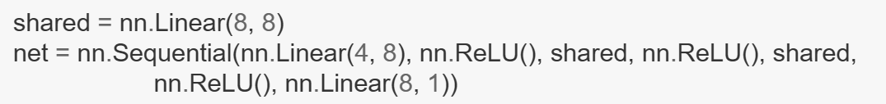
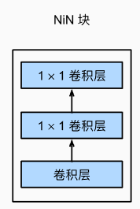
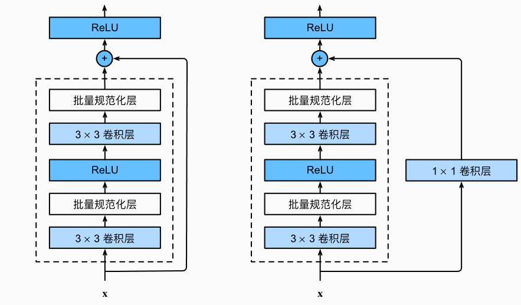

# 李沐《动手学深度学习》复习笔记

## 0. 如何使用这份笔记

### 0.1 三种使用方式

1. **第一次系统学习**：按章节从前往后阅读，并运行对应代码。
2. **阶段复习**：先看每章的“核心结论”和“复习检查”，不会的部分再向上展开。
3. **项目排错**：直接搜索关键词，例如 `过拟合`、`shape`、`padding`、`梯度爆炸`、`Transformer`、`model.eval()`。

### 0.2 笔记标记

- **核心结论**：必须记住的主干知识。
- **直觉理解**：帮助建立画面感，不要求背定义。
- **公式**：理解变量含义和计算流程，不必机械背诵全部推导。
- **工程重点**：写 PyTorch 项目时真正会遇到的问题。
- **易错点**：常见误解或代码错误。
- **复习检查**：看完一章后应能回答的问题。

### 0.3 全课程主线

```text
数据与张量
    ↓
线性代数、微积分、自动微分
    ↓
线性回归与 Softmax 回归
    ↓
多层感知机、正则化、模型选择
    ↓
PyTorch 模型组织、参数管理、保存与 GPU
    ↓
卷积神经网络与现代 CNN
    ↓
计算机视觉任务：分类、检测、分割、迁移学习
    ↓
序列模型、RNN、GRU、LSTM、Seq2Seq
    ↓
注意力、自注意力、Transformer
    ↓
词嵌入、BERT、预训练与微调
    ↓
优化算法、计算性能与完整工程实践
```

---

# 一.深度学习总览

## 1. 机器学习与深度学习到底在做什么

### 1.1 机器学习的基本目标

给定数据，让模型从数据中学习一个映射关系：

$$
\hat{y}=f(x;\theta)
$$

其中：

- <var>x</var>：输入特征；
- <var>y</var>：真实答案；
- <var>ŷ</var>：模型预测；
- <var>θ</var>：模型需要学习的参数；
- <var>f</var>：模型结构。

训练的目标是找到一组参数 <var>θ</var>，使模型在未见过的数据上也能做出较好的预测。

### 1.2 深度学习的本质

深度学习属于机器学习，其核心是使用多层神经网络自动学习特征表示。

```text
传统机器学习：人工设计特征 → 模型学习预测规则
深度学习：原始数据 → 多层网络自动学习特征 → 输出预测
```

“深度”主要表示网络中存在多层非线性变换，而不是单纯表示模型参数多。

### 1.3 一次完整训练发生了什么

```text
1. 从 DataLoader 取一个 batch
2. 将数据送入模型，得到预测
3. 用损失函数比较预测与真实标签
4. 通过反向传播计算每个参数的梯度
5. 优化器根据梯度更新参数
6. 重复多个 batch 和 epoch
7. 在验证集上评估泛化能力
```

标准 PyTorch 训练骨架：

```python
model.train()

for x, y in train_loader:
    x, y = x.to(device), y.to(device)

    optimizer.zero_grad()      # 清除上一轮梯度
    y_hat = model(x)           # 前向传播
    loss = criterion(y_hat, y) # 计算损失
    loss.backward()            # 反向传播
    optimizer.step()           # 更新参数
```

验证阶段：

```python
model.eval()

with torch.no_grad():
    for x, y in val_loader:
        x, y = x.to(device), y.to(device)
        y_hat = model(x)
```

### 1.4 参数、超参数与中间变量

| 类型 | 含义 | 示例 |
|---|---|---|
| 参数 | 训练中由优化器自动学习 | 权重、偏置 |
| 超参数 | 训练前由人设置 | 学习率、batch size、层数、dropout |
| 中间变量 | 前向传播临时产生 | 激活值、特征图、logits |

### 1.5 训练、验证、测试的分工

| 数据集 | 用途 | 是否参与参数更新 |
|---|---|---|
| 训练集 | 学习参数 | 是 |
| 验证集 | 选择模型和超参数 | 否 |
| 测试集 | 最终客观评估 | 否 |

**核心结论**：不能根据测试集反复调参，否则测试集事实上就变成了验证集。

---

# 二.预备知识——张量、数学与自动微分

## 2. 张量与数据操作

### 2.1 张量是什么

张量是 PyTorch 中存储和计算数据的核心结构。

| 维度 | 常见名称 | 示例 shape |
|---|---|---|
| 0 维 | 标量 | `()` |
| 1 维 | 向量 | `(features,)` |
| 2 维 | 矩阵 | `(samples, features)` |
| 3 维 | 三维张量 | `(channels, height, width)` |
| 4 维 | 图像批次 | `(batch, channels, height, width)` |

**注意**：张量的“维度”通常指轴的数量，不等于某一轴的长度。

### 2.2 常用创建方式

```python
import torch

x = torch.arange(12)
x = x.reshape(3, 4)
zeros = torch.zeros(2, 3)
ones = torch.ones(2, 3)
noise = torch.randn(2, 3)
```

### 2.3 shape、numel、reshape

```python
x.shape       # 每一维的大小
x.numel()     # 元素总数
x.reshape(...)# 改变形状，不改变元素总数
```

例如：

```python
x = torch.arange(12)
x.reshape(3, 4)
```

因为 <var>3 × 4 = 12</var>，所以形状合法。

### 2.4 广播机制

当两个张量形状不同但满足广播规则时，PyTorch 会在计算上把较小张量扩展到兼容形状。

```python
A = torch.arange(3).reshape(3, 1)  # (3, 1)
B = torch.arange(2).reshape(1, 2)  # (1, 2)
C = A + B                          # (3, 2)
```

广播从最后一维向前比较：

- 两个维度相同，兼容；
- 其中一个维度为 1，兼容；
- 缺失的前导维度按 1 处理；
- 其他情况不兼容。

**易错点**：广播不会真的复制大量数据，但可能让本来写错的 shape 仍然运行，因此要主动检查张量形状。

### 2.5 索引和切片

```python
x[-1]       # 最后一行
x[1:3]      # 第 1、2 行
x[:, 1]     # 所有行的第 1 列
x[0:2, :]   # 前两行，所有列
```

### 2.6 原地操作与内存

```python
x += y
x[:] = x + y
```

这类操作尽量复用原张量内存。但在自动求导环境下，不恰当的原地修改可能破坏计算图。

### 2.7 NumPy 与 PyTorch 转换

```python
A = x.numpy()
B = torch.from_numpy(A)
```

CPU 上二者可能共享底层内存，修改一方可能影响另一方。

---

## 3. 数据预处理

### 3.1 表格数据基本流程

```text
读取文件
→ 检查缺失值和异常值
→ 数值特征标准化
→ 类别特征编码
→ 划分训练/验证/测试集
→ 转换为张量
```

### 3.2 缺失值处理

常见方法：

- 删除缺失样本或特征；
- 用均值、中位数、众数填充；
- 将“是否缺失”作为额外特征；
- 对类别变量增加一个“未知”类别。

### 3.3 标准化

$$
x'=\frac{x-\mu}{\sigma}
$$

作用：

- 减少不同特征的尺度差异；
- 让优化更稳定；
- 避免大数值特征主导梯度。

**重要**：只在训练集上计算 <var>μ</var> 和 <var>σ</var>，再用同一组统计量变换验证集和测试集，避免数据泄漏。

---

## 4. 深度学习所需的线性代数

### 4.1 标量、向量、矩阵、张量

- 标量：单个数；
- 向量：一列特征；
- 矩阵：多个样本或线性变换；
- 张量：更高维数组。

### 4.2 点积

$$
\mathbf{x}^\top\mathbf{y}=\sum_i x_i y_i
$$

可理解为对应元素相乘后求和。

线性模型：

$$
\hat y=\mathbf{w}^\top\mathbf{x}+b
$$

### 4.3 矩阵乘法

若：

$$
A\in\mathbb{R}^{m\times n},\quad B\in\mathbb{R}^{n\times p}
$$

则：

$$
AB\in\mathbb{R}^{m\times p}
$$

内侧维度必须相同。

在全连接层中：

```text
输入 X: [batch_size, in_features]
权重 W: [in_features, out_features]
输出 XW: [batch_size, out_features]
```

PyTorch 的 `nn.Linear` 内部权重显示为 `[out_features, in_features]`，前向计算等价于：

$$
y=xW^\top+b
$$

### 4.4 降维求和

```python
x.sum()             # 所有元素求和
x.sum(dim=0)        # 沿第 0 轴消失
x.sum(dim=1)        # 沿第 1 轴消失
x.sum(dim=1, keepdim=True) # keepdim=True 表示不会去掉那一维度，而是变成1
```

“沿某个轴求和”表示该轴被聚合，而不是保留该轴上的某一行。

> **dim = 几， 降维求和后消掉的维度就是几**
>
> x.shape -> [5,4]
>
> x.sum(dim = 0) -> [4]
>
> x.sum(dim = 1) -> [5]
>
> 
>
> y.shape -> [2,5,4]
>
> y.sum(dim = 1) -> [2, 4]
>
> y.sum(dim = 2) -> [2, 5]
>
> y.sum(dim = 0) -> [5, 4]
>
> y.sum(dim = [0, 2], keepdim=True) -> [1, 5, 4]

### 4.5 范数 

L1 范数：

$$
\|x\|_1=\sum_i |x_i|
$$

L2 范数：

$$
\|x\|_2=\sqrt{\sum_i x_i^2}
$$

Frobenius 范数用于矩阵：

$$
\|X\|_F=\sqrt{\sum_{i,j}X_{ij}^2}
$$

范数本质上是对“大小”的度量。

---

## 5. 微积分、梯度与链式法则

### 5.1 导数

导数描述函数输出对输入的瞬时变化率。

$$
f'(x)=\lim_{h\to0}\frac{f(x+h)-f(x)}{h}
$$

### 5.2 偏导数与梯度

对于多变量函数：

$$
L=L(w_1,w_2,\dots,w_n)
$$

每个参数都有一个偏导数：

$$
\frac{\partial L}{\partial w_i}
$$

所有**偏导数组成梯度**：

$$
\nabla L=
\begin{bmatrix}
\frac{\partial L}{\partial w_1}\\
\frac{\partial L}{\partial w_2}\\
\vdots
\end{bmatrix}
$$

**核心结论**：梯度不是损失，也不是参数修改量；它描述**损失函数在当前位置增长最快的方向和变化率**。

### 5.3 梯度下降

$$
\theta\leftarrow\theta-\eta\nabla_\theta L
$$

- <var>θ</var>：参数；
- <var>η</var>：学习率；
- <var>∇<sub>θ</sub> L</var>：损失对参数的梯度。

减去梯度，是因为**`梯度指向增长最快方向，负梯度指向局部下降最快方向 - 6.1`**。

### 5.4 链式法则

若：

$$
y=f(u),\quad u=g(x)
$$

则：

$$
\frac{dy}{dx}=\frac{dy}{du}\frac{du}{dx}
$$

深层神经网络由很多**函数嵌套**构成，反向传播就是从损失向前层逐步应用链式法则。

---

## 6. 自动微分与计算图

### 6.1 基本用法

```python
x = torch.arange(4.0)
x.requires_grad_(True)

y = 2 * torch.dot(x, x)
y.backward()

print(x.grad)
```

若：

$$
y=2x^\top x=2\sum_i x_i^2
$$

则：

$$
\frac{\partial y}{\partial x}=4x
$$

### 6.2 计算图

前向传播时，PyTorch 记录张量之间的运算关系，形成动态计算图；调用 `backward()` 时，按照图反向计算梯度。

```text
参数 → 线性层 → 激活函数 → 输出 → 损失
  ↑                               │
  └──────────── 反向传播 ─────────┘
```

> **计算图是一张无环图，自动求导按照方向可以分为正向传播和反向传播。**
>
> **内存复杂度 o(n): 因为要存储正向的所有中间结果（比如b的值）-> 也是存储性能需求的大头**


### 6.3 梯度为什么要清零

PyTorch 默认对梯度进行累加：

```python
loss.backward()
```

相当于把本次梯度加到已有 `.grad` 上。因此每个 batch 通常需要：

```python
optimizer.zero_grad()
```

### 6.4 `detach()` 与 `torch.no_grad()`

```python
y = x.detach()
```

`detach()` 返回与原张量共享数据但脱离当前计算图的张量。

```python
with torch.no_grad():
    ...
```

用于验证和推理，避免记录梯度，减少显存和计算开销。

### 6.5 标量与非标量反向传播

**通常 `loss` 是标量**，因而可以直接：

```python
loss.backward()
```

**若输出不是标量，需要明确传入上游梯度，或者先对输出求和/求均值。**

### 6.6 复习检查

- 张量的维度和 shape 有什么区别？
- 广播机制满足哪些条件？
- 为什么矩阵乘法的内侧维度必须相同？
- 梯度、偏导数和参数更新量分别是什么？
- 为什么每个 batch 都要清空梯度？
- `torch.no_grad()` 与 `model.eval()` 是否是一回事？

---

# 三.线性神经网络

## 7. 线性回归

### 7.1 适用任务

线性回归用于预测连续值，例如房价、销量、温度。

模型：

$$
\hat y=Xw+b
$$

对单个样本：

$$
\hat y=w_1x_1+w_2x_2+\cdots+w_dx_d+b
$$

### 7.2 均方误差

单样本常写为：

$$
l(y,\hat y)=\frac{1}{2}(y-\hat y)^2
$$

数据集平均损失：

$$
L=\frac{1}{n}\sum_{i=1}^{n}l(y_i,\hat y_i)
$$

平方误差的特点：

- 可导；
- 预测越偏离真实值，惩罚越大；
- 对异常值比较敏感。

### 7.3 小批量随机梯度下降

> **在整个训练集上算梯度太贵，随机采样Batch个样本来近似损失**

每次使用一个 batch 估计整体梯度：

$$
\theta\leftarrow\theta-\eta\frac{1}{|B|}\sum_{i\in B}\nabla_\theta l_i
$$

它是全量梯度下降和单样本随机梯度下降之间的折中。

### 7.4 从零实现需要掌握什么

```text
随机初始化参数
→ 手写线性模型
→ 手写平方损失
→ 手写小批量 SGD
→ 多轮训练
```

从零实现的价值是理解流程，而实际工程通常使用框架封装。

### 7.5 简洁实现

```python
model = nn.Linear(in_features, 1)
criterion = nn.MSELoss()
optimizer = torch.optim.SGD(model.parameters(), lr=0.03)
```

### 7.6 线性回归的局限

多个线性层之间如果没有非线性激活，仍然等价于一个线性变换：

$$
W_2(W_1x+b_1)+b_2=W'x+b'
$$

因此“堆叠线性层”本身不会获得更强的非线性表达能力。

---

## 8. Softmax 多分类回归问题

### 8.1 分类模型输出什么

模型先输出每个类别的原始分数：

$$
o=XW+b
$$

这些原始分数称为 **logits**，它们：

- 可以是**任意实数**；
- 不要求相加为 1；
- 不是概率。

### 8.2 Softmax

$$
\hat y_j=\frac{\exp(o_j)}{\sum_k\exp(o_k)}
$$

Softmax 将 logits 转换为概率分布 -> **输出匹配概率**：

- 每个值在 0 到 1 之间 -> 不是负数 -> <var>e^x</var>；
- 所有类别概率之和为 1；
- logits 越大，对应概率通常越大。

> Softmax 不会直接把最大值选出来，而是把所有分数转换为概率， 与argmax相反：
>
> $$
> \operatorname{Softmax}(z_i)
> =
> \frac{e^{z_i}}{\sum_j e^{z_j}}
> $$
>
> 例如：
>
> $$
> [2.0,\ 1.0,\ 0.1]
> \xrightarrow{\mathrm{Softmax}}
> [0.66,\ 0.24,\ 0.10]
> $$
>
> 它仍然让最大的那个类别获得最高概率，但不会立刻把其他类别变成 0，所以叫：
>
> - **Soft：** 柔和地选择，不是非 0 即 1
> - **Max：** 重点突出原始分数最大的类别

> Softmax 在多分类问题中的作用，类似于 Sigmoid 在二分类逻辑回归: 把输出转化为0到1之间的概率，然后用于预测类别和交叉熵损失计算里。

### 8.3 交叉熵损失

若真实类别是 <var>y</var>：

$$
l=-\log \hat y_y
$$

模型给真实类别的概率越大，损失越小；如果真实类别概率接近 0，损失会非常大。

### 8.4 为什么不用平方误差

分类的目标是学习概率分布。交叉熵：

- 与最大似然估计一致；
- 对明显错误且过度自信的预测惩罚强；
- 与 Softmax 结合后梯度形式简单、训练稳定。

### 8.5 `CrossEntropyLoss` 的关键规则

```python
criterion = nn.CrossEntropyLoss()
loss = criterion(logits, labels)
```

输入要求：

```text
logits: [batch_size, num_classes]
labels: [batch_size]，每个元素是类别编号
```

**不要在模型最后手动加 Softmax**。`nn.CrossEntropyLoss()` 内部会以数值稳定的方式完成 `log_softmax + NLLLoss`。

### 8.6 分类预测

```python
pred = logits.argmax(dim=1)
```

`argmax` 只关心最大类别，因此推理时不一定需要显式计算 Softmax。

### 8.7 FashionMNIST

- 训练集：60,000 张；
- 测试集：10,000 张；
- 图像：灰度图，`1 × 28 × 28`；
- 类别数：10。

MLP 输入前通常展平：

```python
x = x.reshape(x.shape[0], -1)  # [batch, 1, 28, 28] → [batch, 784]
```

CNN 通常保留空间结构，不展平后直接卷积。

### 8.8 Accuracy

$$
\text{Accuracy}=\frac{\text{预测正确数量}}{\text{样本总数}}
$$

Accuracy 是评估指标，不参与梯度更新，因为 `argmax` 等离散操作不适合作为可导训练目标。

### 8.9 一个 epoch 的准确率为什么可以很高

一个 epoch 不是只更新一次参数。若训练集有 60,000 个样本，batch size 为 64，则一轮约有：

$$
\lceil60000/64\rceil\approx938
$$

次参数更新。模型虽然从随机参数开始，但在第一轮结束时已经学习了数百次。

### 8.10 复习检查

- logits 与概率有什么区别？
- Softmax 的作用是什么？
- 为什么 `CrossEntropyLoss` 前不应手动 Softmax？
- 交叉熵和 Accuracy 的用途有什么不同？
- 为什么第一轮训练后准确率可以明显高于随机猜测？

---

# 四.多层感知机、泛化与正则化

## 9. 多层感知机 MLP

### 9.1 基本结构

$$
H=\sigma(XW_1+b_1)
$$

$$
O=HW_2+b_2
$$

其中 **隐藏层 <var>H</var>** 使用 **激活函数 <var>σ</var>**。 <var>O</var> 表示输出层。

若是多分类问题，则还有：
$$
Y = Softmax(O)
$$
或者也可写为：
$$
y1, y2,...,yk = Softmax(o1, o2,...ok)
$$


```text
输入层 → 全连接层 → 激活函数 → 隐藏表示 → 输出层
```


### 9.2 为什么必须有非线性激活

没有激活函数时，**多层线性变换可合并成单层线性变换**，模型仍不能表达非线性决策边界。

激活函数让网络具备学习复杂非线性关系的能力。

### 9.3 常用激活函数

#### ReLU

$$
\operatorname{ReLU}(x)=\max(0,x)
$$

优点：

- 计算简单；
- 正区间梯度稳定；
- 缓解 Sigmoid 在大范围内的梯度消失。

缺点：负区间梯度为 0，神经元可能长期不再激活。

#### Sigmoid

$$
\sigma(x)=\frac{1}{1+e^{-x}}
$$

输出范围 <var>(0, 1)</var>，常用于二分类概率或门控结构。

缺点：两端饱和，梯度接近 0；输出不是零中心。

#### Tanh

$$
\tanh(x)=\frac{1-e^{-2x}}{1+e^{-2x}}
$$

输出范围 <var>(−1, 1)</var>，零中心，但仍存在饱和和梯度消失。

### 9.4 PyTorch MLP

```python
model = nn.Sequential(
    nn.Flatten(),
    
    nn.Linear(784, 256),
    nn.ReLU(),
    nn.Dropout(0.2),
    
    nn.Linear(256, 128),
    nn.ReLU(),
    nn.Linear(128, 10),
)
```

这里：

- `nn.Linear` 是全连接层；
- 位于输入与输出之间的全连接层也可称为隐藏层；
- `ReLU` 是激活层；
- `Dropout` 是正则化层；
- 最后一层输出 logits。

---

## 10. 模型选择、欠拟合和过拟合

### 10.1 训练误差与泛化误差

- 训练误差：模型在训练集上的错误；
- 泛化误差：模型在未见数据上的预期错误。

训练的真正目标**不是把训练集背下来，而是降低泛化误差**。

#### 10.1.1 验证集,测试集与 K-则交叉验证

- 训练数据集: 训练模型参数
- 验证数据集: 选择模型超参数
- 非大数据集上通常采用k-则交叉验证 -> **深度学习一般数据集比较大，所以没什么用**


### 10.2 欠拟合

表现：

- 训练集效果差；
- 验证集效果也差。

常见原因：

- 模型太简单；
- 训练时间不足；
- 特征不足；
- 正则化过强；
- 学习率不合适。

### 10.3 过拟合

表现：

- 训练集效果很好；
- 验证集明显较差；
- 训练继续进行时，训练损失下降但验证损失上升。

常见原因：

- 模型容量过大；
- 数据量少；
- 噪声较多；
- 训练时间过长；
- 正则化不足。

### 10.4 模型容量

容量表示模型**拟合复杂函数的能力**，通常受以下因素影响：

- **参数量；**
- 层数和宽度；
- 模型结构；
- **正则化强度 ->（参数的取值范围， 如L2正则化-权重衰减）。**

容量太低容易欠拟合，容量太高而数据不足容易过拟合。


### 10.5 控制过拟合的方法

```text
更多数据
数据增强
减小模型容量
L1/L2 正则化
Dropout
早停
BatchNorm 的间接正则化效果
迁移学习
交叉验证
```

---

## 11. 权重衰减与 L2 正则化

### 11.1 基本思想

在原损失中加入参数大小惩罚：

$$
L'=L+\frac{\lambda}{2}\|w\|_2^2
$$

梯度中会多出：

$$
\lambda w
$$

参数更新近似为：

$$
w\leftarrow(1-\eta\lambda)w-\eta\nabla_wL
$$

因此权重每次更新都会被轻微缩小，故称“权重衰减” - **限制参数值的选择范围来达到控制模型容量的目的**。


### 11.2 直觉

较小、分散的权重通常意味着模型不会过度依赖某一个特征，决策函数更平滑，泛化能力可能更好。

### 11.3 PyTorch

```python
optimizer = torch.optim.SGD(
    model.parameters(),
    lr=0.01,
    weight_decay=1e-4,
)
```

或：

```python
optimizer = torch.optim.AdamW(
    model.parameters(),
    lr=1e-3,
    weight_decay=1e-4,
)
```

### 11.4 L1 与 L2

| 方法 | 惩罚项 | 典型效果 |
|---|---|---|
| L1 | <var>λ∑|w<sub>i</sub>|</var> | 倾向产生稀疏权重，部分权重变为 0 |
| L2 | <var>λ∑ w<sub>i</sub><sup>2</sup></var> | 让权重整体变小但通常不直接变成 0 |

**易错点**：`nn.L1Loss()` 是计算预测值与标签之间的绝对误差，不等于对模型参数做 L1 正则化。

---

## 12. Dropout

### 12.1 训练时发生什么

以**概率 <var>p</var>** 随机将一部分隐藏单元**输出置 0**，**并对保留单元做缩放**：

$$
h'=\frac{m\odot h}{1-p},\quad m_i\sim\operatorname{Bernoulli}(1-p)
$$

这样训练阶段**输出的期望尺度与推理阶段大致一致**。也就是：
$$
h' = h
$$


> dropout 一般会比 L2 权重衰减的效果要好。 
>
> dropout 通常用在全连接层。

### 12.2 每次什么时候随机

Dropout 通常在**每一次前向传播**时重新生成掩码，也就是**不同 batch 甚至同一 batch 的不同训练调用都会不同**，而不是每个 epoch 只随机一次。

### 12.3 直觉

- 防止神经元形成过强的共同适应；
- 迫使网络使用更分散、更稳健的特征；
- 可近似理解为**训练许多共享参数的子网络**并进行集成。

### 12.4 训练与推理差异

```python
model.train()  # Dropout 生效
model.eval()   # Dropout 关闭
```

**易错点**：验证前忘记 `model.eval()` 会使结果不稳定且通常偏差。

---

## 13. 前向传播、反向传播和计算图

### 13.1 前向传播

输入逐层计算得到预测和损失：

```text
X → Z1 → H1 → Z2 → logits → loss
```

### 13.2 反向传播

从损失开始，按照链式法则反向计算每个参数的梯度：

```text
loss → 输出层梯度 → 隐藏层梯度 → 更前层梯度
```

### 13.3 中间激活为何占显存

反向传播需要使用前向传播时的中间结果，因此训练时通常要保存激活值。模型越深、batch 越大、特征图越大，显存占用越高。

### 13.4 梯度消失与梯度爆炸

深层网络中，**链式法则会连续相乘多个局部导数**：


- 大量小于 1 的数相乘，梯度趋近 0；
- 大量大于 1 的数相乘，梯度变得极大。

解决思路：

- 合理初始化；
- ReLU；
- BatchNorm/LayerNorm；
- 残差连接；
- LSTM/GRU 门控；
- 梯度裁剪。


---

## 14. 参数初始化与数值稳定性

### 14.1 为什么不能全部初始化为 0

如果同一层神经元权重完全相同，它们会得到相同梯度并始终学习相同特征，无法打破对称性。

### 14.2 Xavier 初始化

目标是让各层输入输出方差大致稳定。常见形式：

$$
\operatorname{Var}(W)\approx\frac{2}{n_{in}+n_{out}}
$$

适合 Sigmoid、Tanh 等。

### 14.3 Kaiming 初始化

针对 ReLU 的激活特性：

$$
\operatorname{Var}(W)\approx\frac{2}{n_{in}}
$$

PyTorch 许多层已有合理默认初始化，不必每次手动设置，但应理解其目的。

### 14.4 数值稳定技巧

- 使用框架提供的 `CrossEntropyLoss`，不要手动 `exp` 后再求对数；
- 对概率取对数前避免出现精确 0；
- 合理控制学习率；
- 使用归一化和梯度裁剪；
- 检查 NaN/Inf。

---

## 15. 分布偏移

训练集和实际部署数据可能不再来自同一分布。

常见类型：

- 协变量偏移：<var>P(x)</var> 改变；
- 标签偏移：<var>P(y)</var> 改变；
- 概念偏移：<var>P(y ∣ x)</var> 改变。

**工程重点**：验证集要尽量模拟真实使用场景；不能只关注随机划分后的分数。

### 15.1 复习检查

- 为什么两个线性层之间必须加入非线性激活？
- 训练误差低是否代表泛化能力强？
- L1、L2、Dropout 的作用有什么区别？
- Dropout 是每个 epoch 还是每次前向传播随机？
- 为什么不能将所有权重初始化为 0？
- `model.train()` 和 `model.eval()` 会影响哪些层？

---

# 五.PyTorch 深度学习计算

## 16. 层、块与 `nn.Module`

### 16.1 `nn.Module` 是什么

`nn.Module` 是 PyTorch 中所有神经网络层和模型的基础类。它负责：

- 管理可训练参数；
- 组织子模块；
- 定义前向传播；
- 支持设备迁移；
- 支持训练/评估模式切换；
- 支持保存与加载状态。

```python
class MLP(nn.Module):
    def __init__(self, input_size=784, hidden_size=256, num_classes=10):
        super().__init__()
        self.net = nn.Sequential(
            nn.Linear(input_size, hidden_size),
            nn.ReLU(),
            nn.Linear(hidden_size, num_classes),
        )

    def forward(self, x):
        x = torch.flatten(x, start_dim=1)
        return self.net(x)
```

### 16.2 为什么调用 `model(x)` 而不是 `model.forward(x)`

`model(x)` 会先进入 `nn.Module.__call__()`，再间接调用 `forward()`，同时保留钩子、自动混合精度等框架机制。因此正常情况下应写：

```python
y = model(x)
```

而不是直接写：

```python
y = model.forward(x)
```

### 16.3 `nn.Sequential`

适合按顺序串联层：

```python
model = nn.Sequential(
    nn.Linear(784, 256),
    nn.ReLU(),
    nn.Linear(256, 10),
)
```

当模型存在分支、跳跃连接、多输入或多输出时，通常需要自定义 `nn.Module`。

---

## 17. 参数管理

### 17.1 查看参数

参数访问 model.state_dict() ：


访问目标参数model[2].bias.data/.grad：


或者，访问所有参数 model.named_parameters()：

```python
for name, param in model.named_parameters():			# model[0], model[2]
    print(name, param.shape, param.requires_grad)
```

常见属性：

- `param.data`：参数数值；
- `param.grad`：梯度；
- `param.requires_grad`：是否需要梯度。

### 17.2 参数是如何被注册的

将层赋值给 `self.xxx`，PyTorch 会自动把它注册为子模块：

```python
self.fc = nn.Linear(10, 5)
```

如果普通 Python 列表中存放层，参数可能无法注册，应使用：

```python
self.layers = nn.ModuleList([...])
```

字典形式使用：

```python
self.layers = nn.ModuleDict({...})
```

### 17.3 冻结参数

```python
for param in model.backbone.parameters():
    param.requires_grad = False
```

优化器只接收需要训练的参数：

```python
optimizer = torch.optim.AdamW(
    filter(lambda p: p.requires_grad, model.parameters()),
    lr=1e-3,
)
```

### 17.4 参数共享

同一个层对象被多次调用时，使用的是同一组参数，而不是复制参数。如这里的 shared:



---

## 18. 自定义层与模型

### 18.1 无参数层

```python
class CenteredLayer(nn.Module):						# 自定义层与模型一样，都是继承nn.module
    def forward(self, x):
        return x - x.mean()
```

### 18.2 有参数层

```python
class MyLinear(nn.Module):
    def __init__(self, in_features, out_features):
        super().__init__()
        self.weight = nn.Parameter(							# 用nn.Parameter()把参数包起来就行
            torch.randn(in_features, out_features) * 0.01
        )
        self.bias = nn.Parameter(torch.zeros(out_features))

    def forward(self, x):
        return x @ self.weight + self.bias
```

`nn.Parameter` 会被自动注册为可训练参数。

### 18.3 自定义模型的原则

- `__init__()` 中定义结构和参数；
- `forward()` 中定义数据流；
- 不要在 `forward()` 中反复创建需要训练的层；
- 明确每一步输入输出 shape。

---

## 19. 保存与加载

### 19.1 保存张量或字典

```python
torch.save(obj, path)
obj = torch.load(path, map_location=device)
```

`torch.save()` 使用 PyTorch 序列化机制，可保存张量、字典和常见 Python 容器；`Path.write_text()` 只能直接写字符串文本。

### 19.2 推荐保存 `state_dict`

```python
torch.save(model.state_dict(), "model.pth")
```

加载：

```python
model = MyModel(...)
state_dict = torch.load("model.pth", map_location=device)
model.load_state_dict(state_dict)
model.to(device)
model.eval()
```

模型结构必须与参数文件匹配。

### 19.3 保存训练检查点

```python
checkpoint = {
    "epoch": epoch,
    "model_state_dict": model.state_dict(),
    "optimizer_state_dict": optimizer.state_dict(),
    "best_metric": best_metric,
}

torch.save(checkpoint, "checkpoint.pth")
```

恢复训练时不仅要加载模型，也要加载优化器状态和训练轮数。

### 19.4 文件覆盖

若目标路径已存在，`torch.save()` 通常会直接覆盖原文件，因此保存前应设计好：

- `best_model.pth`：验证集表现最好；
- `last_model.pth`：最后一轮；
- `epoch_XX.pth`：阶段检查点。

> 可以使用集成学习来提高准确率.

---

## 20. CPU 与 GPU

### 20.1 设备选择

```python
device = torch.device("cuda" if torch.cuda.is_available() else "cpu")
```

### 20.2 模型和数据必须在同一设备

```python
model = model.to(device)
x = x.to(device)
y = y.to(device)
```

否则会出现 CPU/CUDA 设备不一致错误。

### 20.3 为什么不把整个数据集一次性放到 GPU

- GPU 显存有限；
- 大数据集放不下；
- `DataLoader` 需要按 batch 加载、打乱和并行预处理；
- 只把当前 batch 传到 GPU 更灵活。

### 20.4 `pin_memory` 与 `non_blocking`

```python
DataLoader(..., pin_memory=True)
x = x.to(device, non_blocking=True)
```

当使用 CUDA 时，页锁定内存可提高 CPU 到 GPU 的数据传输效率；`non_blocking=True` 只有在条件满足时才可能异步传输。

### 20.5 训练模式与推理模式

```python
model.train()
model.eval()
```

它们不会自动控制梯度，只会改变某些层的行为，例如 Dropout 和 BatchNorm。

梯度控制由：

```python
with torch.no_grad():
```

负责。

### 20.6 复习检查

- `nn.Module` 的核心职责是什么？
- 为什么层要赋值给 `self.xxx`？
- `ModuleList` 与普通 list 有什么区别？
- 为什么推荐保存 `state_dict()`？
- `model.eval()` 与 `torch.no_grad()` 有什么不同？
- 为什么模型和输入必须位于同一设备？

---

# 六.卷积神经网络基础

## 21. 为什么图像需要卷积

### 21.1 全连接层处理图像的问题

对于一张 `1000 × 1000` 的 RGB 图像，输入特征数为 300 万。若连接到 1000 个隐藏单元，**参数量约为 30 亿，计算和存储成本极高**。

更重要的是，**全连接层会把图像展平，弱化二维空间结构**。

> **卷积层需要更少的参数。**
>
> **全连接层参数开销是非常大的。**

### 21.2 卷积的两个关键归纳偏置

#### 局部性

图像中相邻像素更可能组成有意义的局部模式，例如边缘、纹理。

#### 平移不变性

同一种模式无论出现在图像哪个位置，都可以用同一个卷积核检测。

这带来两个设计：

- 局部连接；
- 权重共享。

因此 CNN 参数远少于全连接网络。

---

## 22. 二维卷积层

### 22.1 卷积核如何扫描

设输入为二维矩阵，卷积核（**一个矩阵）**在输入上从左到右、从上到下滑动。每个位置取一个局部窗口，与卷积核逐元素相乘后求和**(两矩阵做点积）**，得到一个输出值。

```text
局部窗口 × 卷积核
→ 对应元素相乘
→ 求和
→ 加偏置
→ 输出特征图上的一个元素
```

深度学习框架中的“卷积”严格来说常是互相关运算，但不影响参数学习。


### 22.2 输出尺寸

**输入高宽为 <var>H, W</var>，卷积核为 <var>K<sub>h</sub>, K<sub>w</sub></var>，填充为 <var>P<sub>h</sub>, P<sub>w</sub></var>，步幅为 <var>S<sub>h</sub>, S<sub>w</sub></var>，**则：
$$
H_{out}=\left\lfloor\frac{H+2P_h-K_h}{S_h}\right\rfloor+1
$$

$$
W_{out}=\left\lfloor\frac{W+2P_w-K_w}{S_w}\right\rfloor+1
$$

> 加1：公式前半部分算的是：**从初始位置出发，卷积核最多还能向后移动多少次**，**但初始位置本身也会产生一个输出，所以需要加 1**。

>  卷积核大小一般选奇数，pandding设置的好一点。
>
> Q/A:为什么通常用3*3的卷积核呢？3个像素视野很小？
>
> ​	- 卷积神经网络通常有很多层，一层一层深度学下去，最后一层1个特征值已经可以代表全图视野了。

### 22.3 卷积层学习什么

**卷积核参数**不是人工固定的。训练开始时通常随机初始化，反向传播会根据损失自动**调整卷积核**，使其逐步学会检测对任务有用的模式。

浅层常学习边缘和纹理，深层逐渐组合为局部部件和更抽象语义。

学习**不同的卷积核**，可以得到我们想要的数据：


---

## 23. 填充 Padding

### 23.1 为什么不填充会丢失边缘

没有填充时，卷积核必须完全落在图像内部。**边缘像素能参与卷积的次数少于中心像素**，而且每经过一层卷积，**特征图会变小**。

例如输入 `5 × 5`、卷积核 `3 × 3`、步幅 1：

$$
5-3+1=3
$$

输出只有 `3 × 3`。

### 23.2 `padding=1`

对 `3 × 3` 卷积核，在四周补一圈 0：

$$
5+2\times1-3+1=5
$$

输出仍为 `5 × 5`。

补 0 不是为了让卷积核“能扫到原图边缘像素”，**而是为了让卷积核中心能够落在原图边缘附近**，同时控制输出尺寸并提高边缘信息参与计算的机会。

### 23.3 Same Padding

当步幅为 1、卷积核为奇数时，常取：

$$
P=\frac{K-1}{2}
$$

使输入输出高宽相同。

---

## 24. 步幅 Stride

步幅表示卷积核每次**行/列滑动**的距离。

- `stride=1`：逐格移动，保留更多空间信息；
- `stride=2`：每次移动两格，**输出高宽大约减半**。

也就是当输入高度和宽度 n 可以被步幅 s 整除，输出宽高为：
$$
(n_{h} / s_{h})\times (n_{w} / s_{w})
$$


较大步幅可以下采样，降低计算量，但也会损失空间细节。

---

## 25. 多输入和多输出通道

### 25.1 输入通道

RGB 图像有 3 个输入通道。一个输出通道对应的卷积核实际形状为：

```text
[in_channels, kernel_h, kernel_w]
```

**每个卷积核每个输入通道分别卷积，结果相加后得到一个输出通道**。


> **一个卷积层的输出通道可以作为下一卷积层的输入通道，这意味着下一层可以识别并组合上一层学习的不同类型的特征。**
>
> 所以形成了 -> **下层识别纹理，上层组合识别物体。**

### 25.2 输出通道

设置多个卷积核组，就得到多个输出通道。每个输出通道可以学习不同类型的特征。

PyTorch：

```python
nn.Conv2d(
    in_channels=3,
    out_channels=32,
    kernel_size=3,
    padding=1,
)
```

权重 shape：

```text
[out_channels, in_channels, kernel_h, kernel_w]
```

>**输出通道一般设置比上一层的输出多，比如32 -> 64, 表明学到了更多的特征图。**
>
>这也是目前卷积神经网络的主要思想：**通过不断地卷积层将特征图长宽不断减小压缩，然后通道数不断增加，最后达到长宽为1，通道数上千后接入MLP做全连接输出logits，然后用softmax做梯度下降。**
>
>一般地规律是:**高宽减半，然后把通道数提升到原来地两倍。**

### 25.3 参数量

$$
\text{参数量}=C_{out}\times C_{in}\times K_h\times K_w+C_{out}
$$

最后一项为每个输出通道的偏置。

> 这里为什么要乘以cin:   **不同输入通道对应的卷积核参数是不一样的。**
>
> **一个输出通道确实对应一个卷积核，但这个“卷积核”不是一个 Kh × Kw 的二维矩阵，而是一个 Cin × Kh × Kw 的三维卷积核。**
>
> 所以才必须乘 Cin。
>
> 比如输入是 RGB 图片：
> $$
> Cin=3
> $$
> 假设使用一个 3×3 卷积核产生一个输出通道。这个“一个卷积核”实际上长这样：
> $$
> W=[W_{R}, W_{G}, W_{B}]
> $$
> 
>
> 其中：
>
> <var>WR∈R3×3, WG∈R3×3, WB∈R3×3</var>
>
> 也就是说，它实际有：
>
> 3×3×3=27个参数，而不是 9 个。

### 25.4 `1 × 1` 卷积

`1 × 1` 卷积不聚合相邻空间位置，但会对通道进行线性组合。**`1 × 1` 卷积可以等价一个特殊的MLP**

作用：

- **改变通道数；**
- **融合通道信息；**
- **降维或升维；**
- 在每个像素位置应用相同的全连接变换。

> 1*1卷积是一个受欢迎的选择，它**不识别空间模式，只是融合通道**。

> 1*1(ResNet) 和 3-3(VGG)卷积层组合作用区别：
>
> | 卷积  | 空间观察范围  | 是否组合通道 | 主要用途                         |
> | ----- | ------------- | ------------ | -------------------------------- |
> | `1×1` | 当前一个位置  | 是           | 改变通道数、融合通道、降低计算量 |
> | `3×3` | 周围`3*3`区域 | 是           | 提取局部空间特征、融合邻域信息   |


---

## 26. 池化层

### 26.0 输出尺寸

卷积层与池化层的输出高度、宽度都使用：

**输入高宽为 <var>H, W</var>，卷积核为 <var>K<sub>h</sub>, K<sub>w</sub></var>，填充为 <var>P<sub>h</sub>, P<sub>w</sub></var>，步幅为 <var>S<sub>h</sub>, S<sub>w</sub></var>**，则：
$$
H_{out}=\left\lfloor\frac{H+2P_h-K_h}{S_h}\right\rfloor+1
$$

$$
W_{out}=\left\lfloor\frac{W+2P_w-K_w}{S_w}\right\rfloor+1
$$


### 26.1 最大池化

在局部窗口中取最大值：

```python
nn.MaxPool2d(kernel_size=2, stride=2)
```

通常将高宽减半。

### 26.2 平均池化

在局部窗口中取平均值。

```py
nn.AvgPool2d(kernel_size=2, stride=2)
```

### 26.3 池化作用

- 缩小特征图,下采样，减少计算量；
- 扩大后续层的有效感受野；
- **降低对局部小位移的敏感程度 - 缓解卷积层对于位置的高敏感性**；
- 保留显著响应。


**池化层通常没有可训练参数**。

### 26.4 卷积步幅与池化

现代网络也常用 `stride=2` 的卷积代替池化，因为卷积下采样本身可学习。

> 所以现在越来越少用池化层了。

---

## 27. 批量归一化层

### 27.1 基本计算

对一个 mini-batch 中**某个特征/通道**计算均值与方差：

$$
\mu_B=\frac{1}{m}\sum_i x_i
$$

$$
\sigma_B^2=\frac{1}{m}\sum_i(x_i-\mu_B)^2
$$

标准化：

$$
\hat x_i=\frac{x_i-\mu_B}{\sqrt{\sigma_B^2+\epsilon}}
$$

再进行可学习的缩放和平移：

$$
y_i=\gamma\hat x_i+\beta
$$

> 其中**每个通道都有 <var>r</var> 和 <var>B</var> 是可学习的参数。**
>
> - 对于全连接层，作用在特征维。
> - 对于卷积层，作用在通道维。

>作用全连接层的每一个特征的理解:  **针对每一个特征，沿着 batch 这一维，统计这一批样本该特征的均值和方差。**
>
>```text
>                 特征1   特征2   ...  特征128
>样本1              x11    x12          x1,128
>样本2              x21    x22          x2,128
>样本3              x31    x32          x3,128
>...                 ...    ...           ...
>样本N              xN1    xN2          xN,128
>                   ↓      ↓              ↓
>                单独BN   单独BN         单独BN
>```
>
>作用卷积层的每一个通道的理解: **是对“同一个通道”的一批 N 张特征图一起做归一化。**

> 批归一化层通常在**卷积层/全连接层**之后，激活函数之前。
>
> **卷积层后接BatchNorm层时不用加bias**

### 27.2 `BatchNorm2d(num_features=32)`

`num_features=32` 表示输入有 32 个通道。对 CNN 输入 `[N, C, H, W]`，BatchNorm2d 通常为**每个通道分别统计批次与空间位置上的均值和方差**。

### 27.3 作用

- 减小数值尺度差异,稳定特征数值分布, 让中间激活尺度更稳定；
- **允许使用较大学习率**；
- **加速和稳定训练，加速收敛** ；
- 对初始化不那么敏感；
- mini-batch 噪声可能带来轻微正则化效果。

### 27.4 训练和推理不同

训练阶段：使用当前 batch 的均值和方差，并更新运行统计量。

推理阶段：使用训练期间累计的运行均值和方差。

因此必须正确使用：

```python
model.train()
model.eval()
```

### 27.5 BatchNorm 不是简单“把值压到同一区间”

它主要标准化统计分布，再通过可学习的 <var>γ, β</var> 恢复模型所需的尺度和偏移。它不是 Min-Max 归一化，也不保证所有值落在固定区间。

### 27.6 常见顺序

```text
Conv → BatchNorm → ReLU
Linear → BatchNorm → ReLU
```

是否给 BatchNorm 前的层保留偏置通常不重要，因为 BatchNorm 本身有平移参数。

---

# 七.现代卷积神经网络

## 28. CNN 架构演进主线

```text
LeNet：卷积网络基本形态 						-> 基础卷积块
  ↓
AlexNet：深层 CNN 真正在大规模视觉任务上成功	-> 使用连续的卷积层做组合（BatchNorm/Relu不算中断，后层不对channel,尺寸做改变即连续）
  ↓
VGG：重复卷积块，结构规则化					  -> 把连续的卷积层提取成可复用卷积块
  ↓
NiN：1×1 卷积与全局平均池化					-> 使用1 × 1卷积层代替全连接层做变换
  ↓
GoogLeNet：多尺度并行分支					-> 多分支并行，合并后输出
  ↓
ResNet：残差连接解决深层退化				  -> 集百家所长(stage1,2,3)(残差块内部/之间连续卷积层)(残差块复用)(1*1对x变换)(主分支/捷)
  ↓
DenseNet：密集复用全部前层特征
```

---

## 29. LeNet

早期最成功的卷积神经网络，用于MNIST手写数字识别：


经典结构：

```text
输入图像
→ 卷积 + 激活 + 池化
→ 卷积 + 激活 + 池化
→ 展平
→ 全连接层
→ 输出分类 logits
```


示例：

```python
class LeNet(nn.Module):
    def __init__(self):
        super().__init__()
        self.net = nn.Sequential(
            nn.Conv2d(1, 6, kernel_size=5, padding=2),
            nn.Sigmoid(),
            nn.AvgPool2d(kernel_size=2, stride=2),
            
            nn.Conv2d(6, 16, kernel_size=5),
            nn.Sigmoid(),
            nn.AvgPool2d(kernel_size=2, stride=2),
            
            nn.Flatten(),
            
            nn.Linear(16 * 5 * 5, 120),
            nn.Sigmoid(),
            
            nn.Linear(120, 84),
            nn.Sigmoid(),
            
            nn.Linear(84, 10),
        )

    def forward(self, x):
        return self.net(x)
```

### 29.1 CNN 中形状变化的检查方法

```python
x = torch.randn(1, 1, 28, 28)
for layer in model.net:
    x = layer(x)
    print(layer.__class__.__name__, x.shape)
```

这是定位 `Linear` 输入维度错误的最直接办法。

## 30. AlexNet

### 30.1 关键贡献

模型设计：

```python
import torch
from torch import nn
from d2l import torch as d2l

net = nn.Sequential(
    # 这里使用一个11*11的更大窗口来捕捉对象。
    # 同时，步幅为4，以减少输出的高度和宽度。
    # 另外，输出通道的数目远大于LeNet
    nn.Conv2d(1, 96, kernel_size=11, stride=4, padding=1), 
    nn.ReLU(),
    nn.MaxPool2d(kernel_size=3, stride=2),
    
    # 减小卷积窗口，使用填充为2来使得输入与输出的高和宽一致，且增大输出通道数
    nn.Conv2d(96, 256, kernel_size=5, padding=2), 
    nn.ReLU(),
    nn.MaxPool2d(kernel_size=3, stride=2),
    
    # 使用三个连续的卷积层和较小的卷积窗口。
    # 除了最后的卷积层，输出通道的数量进一步增加。
    # 在前两个卷积层之后，汇聚层不用于减少输入的高度和宽度
    nn.Conv2d(256, 384, kernel_size=3, padding=1), 
    nn.ReLU(),
    nn.Conv2d(384, 384, kernel_size=3, padding=1), 
    nn.ReLU(),
    nn.Conv2d(384, 256, kernel_size=3, padding=1), 
    nn.ReLU(),
    nn.MaxPool2d(kernel_size=3, stride=2),
    
    nn.Flatten(),
    
    nn.Linear(6400, 4096), 
    nn.ReLU(),
    nn.Dropout(p=0.5),	# 这里，全连接层的输出数量是LeNet中的好几倍。使用dropout层来减轻过拟合
    
    nn.Linear(4096, 4096), 
    nn.ReLU(),
    nn.Dropout(p=0.5),
    
    nn.Linear(4096, 10))	 # 最后是输出层。由于这里使用Fashion-MNIST，所以用类别数为10，而非论文中的1000
```

```python
x = torch.randn(1, 1, 224, 224)
for layer in net:
    x = layer(x)
    print(layer._class_._name_, x.shape)

Conv2d output shape:         torch.Size([1, 96, 54, 54])		# 由卷积层池化层的输出计算公式算出
ReLU output shape:   torch.Size([1, 96, 54, 54])
MaxPool2d output shape:      torch.Size([1, 96, 26, 26])

Conv2d output shape:         torch.Size([1, 256, 26, 26])
ReLU output shape:   torch.Size([1, 256, 26, 26])
MaxPool2d output shape:      torch.Size([1, 256, 12, 12])

Conv2d output shape:         torch.Size([1, 384, 12, 12])
ReLU output shape:   torch.Size([1, 384, 12, 12])
Conv2d output shape:         torch.Size([1, 384, 12, 12])
ReLU output shape:   torch.Size([1, 384, 12, 12])
Conv2d output shape:         torch.Size([1, 256, 12, 12])
ReLU output shape:   torch.Size([1, 256, 12, 12])
MaxPool2d output shape:      torch.Size([1, 256, 5, 5])

Flatten output shape:        torch.Size([1, 6400])

Linear output shape:         torch.Size([1, 4096])
ReLU output shape:   torch.Size([1, 4096])
Dropout output shape:        torch.Size([1, 4096])

Linear output shape:         torch.Size([1, 4096])
ReLU output shape:   torch.Size([1, 4096])
Dropout output shape:        torch.Size([1, 4096])

Linear output shape:         torch.Size([1, 10])
```

- 更深更宽的卷积网络；
- 使用 ReLU；
- 使用 Dropout；
- 使用数据增强；
- 借助 GPU 训练；
- 在 ImageNet 上显著推动深度 CNN。

### 30.2 与 LeNet 的差别

AlexNet 不只是“更大的 LeNet”，它体现了：

- 数据规模变大；
- 模型容量提高；
- 计算硬件支撑；
- 正则化和训练技巧共同发挥作用。

**核心结论**：算法、数据和计算能力缺一不可。

---

## 31. VGG

### 31.1 VGG 块

VGG 使用**多个 `3 × 3` 卷积加一个池化**组成**可复用卷积块** (其实就是AlexNet的那三个连续卷积层结构）：


一个VGG块的模型结构如下：

```python
def vgg_block(num_convs, in_channels, out_channels):
    layers = []
    for _ in range(num_convs):
        layers.append(nn.Conv2d(in_channels, out_channels,kernel_size=3, padding=1))
        layers.append(nn.ReLU())
        in_channels = out_channels
        
    layers.append(nn.MaxPool2d(kernel_size=2,stride=2))
    return nn.Sequential(*layers)
```

```pyt
vgg_block(num_convs=3,in_channels=64,out_channels=128)
-> nn.Conv2d(64, 128, kernel_size=3, padding=1), nn.Relu()
-> nn.Conv2d(128, 128, kernel_size=3, padding=1), nn.Relu()
-> nn.Conv2d(128, 128, kernel_size=3, padding=1), nn.Relu()
-> nn.MaxPool2d(kernel_size=2,stride=2)
```

### 31.2 为什么连续使用小卷积核

连续两个 `3 × 3` 卷积的感受野接近一个 `5 × 5` 卷积，但：

- 参数通常更少；
- 中间多一次非线性；
- 结构更规则。

### 31.3 VGG 的意义

VGG 强调使用统一的网络块设计深层模型，为后续模块化网络设计奠定基础。

缺点是参数量和计算量较大，尤其全连接层成本高。

---

## 32. NiN

### 32.1 网络中的网络

NiN 在**一层常规卷积层**后加入**2个 `1 × 1` 卷积层**，**相当于对每个像素位置使用小型 MLP**（使用1*1的卷积层替代全连接层），加强通道间的非线性组合。

NiN块：



一个NiN块的模型结构：

```python
def nin_block(in_channels, out_channels, kernel_size, strides, padding):
    return nn.Sequential(
        nn.Conv2d(in_channels, out_channels, kernel_size, strides, padding),
        nn.ReLU(),
        nn.Conv2d(out_channels, out_channels, kernel_size=1), nn.ReLU(),
        nn.Conv2d(out_channels, out_channels, kernel_size=1), nn.ReLU())
```

```python
net = nn.Sequential(
    nin_block(1, 96, kernel_size=11, strides=4, padding=0),
    nn.MaxPool2d(3, stride=2),
    
    nin_block(96, 256, kernel_size=5, strides=1, padding=2),
    nn.MaxPool2d(3, stride=2),
    
    nin_block(256, 384, kernel_size=3, strides=1, padding=1),
    nn.MaxPool2d(3, stride=2),
    
    nn.Dropout(0.5),
    
    # 标签类别数是10
    nin_block(384, 10, kernel_size=3, strides=1, padding=1),
    nn.AdaptiveAvgPool2d((1, 1)),
    
    # 将四维的输出转成二维的输出，其形状为(批量大小,10)
    nn.Flatten())

X = torch.rand(size=(1, 1, 224, 224))

Sequential output shape:     torch.Size([1, 96, 54, 54])
MaxPool2d output shape:      torch.Size([1, 96, 26, 26])
Sequential output shape:     torch.Size([1, 256, 26, 26])
MaxPool2d output shape:      torch.Size([1, 256, 12, 12])
Sequential output shape:     torch.Size([1, 384, 12, 12])
MaxPool2d output shape:      torch.Size([1, 384, 5, 5])
Dropout output shape:        torch.Size([1, 384, 5, 5])
Sequential output shape:     torch.Size([1, 10, 5, 5])
AdaptiveAvgPool2d output shape:      torch.Size([1, 10, 1, 1])
Flatten output shape:        torch.Size([1, 10])
```

### 32.2 全局平均池化

```python
nn.AdaptiveAvgPool2d((1, 1))
```

对**每个通道的整个空间区域求平均**：

```text
[batch, channels, height, width]
→ [batch, channels, 1, 1]
→ [batch, channels]
```

**再展平**，若**最后通道数等于类别数，每个通道可对应一个类别**。即不用全连接层。

优点：

- **大幅减少全连接层参数**；（全连接层参数开销非常大）
- **降低过拟合**；（全连接层参数多->模型复杂->容易过拟合）
- 对空间位置更稳健。

---

## 33. GoogLeNet / Inception


### 33.1 Inception 块


同一输入经过多个并行分支：

- `1 × 1` 卷积；
- `1 × 1 → 3 × 3` 卷积；
- `1 × 1 → 5 × 5` 卷积；
- 池化 → `1 × 1` 卷积。

最后在通道维拼接。


一个Inception块的模型结构：

```python
class Inception(nn.Module):
    # c1--c4是每条路径的输出通道数
    def __init__(self, in_channels, c1, c2, c3, c4, **kwargs):
        super(Inception, self).__init__(**kwargs)
        
        # 线路1，单1x1卷积层
        self.p1_1 = nn.Conv2d(in_channels, c1, kernel_size=1)
        
        # 线路2，1x1卷积层后接3x3卷积层
        self.p2_1 = nn.Conv2d(in_channels, c2[0], kernel_size=1)
        self.p2_2 = nn.Conv2d(c2[0], c2[1], kernel_size=3, padding=1)
        
        # 线路3，1x1卷积层后接5x5卷积层
        self.p3_1 = nn.Conv2d(in_channels, c3[0], kernel_size=1)
        self.p3_2 = nn.Conv2d(c3[0], c3[1], kernel_size=5, padding=2)
        
        # 线路4，3x3最大汇聚层后接1x1卷积层
        self.p4_1 = nn.MaxPool2d(kernel_size=3, stride=1, padding=1)
        self.p4_2 = nn.Conv2d(in_channels, c4, kernel_size=1)

    def forward(self, x):
        p1 = F.relu(self.p1_1(x))
        p2 = F.relu(self.p2_2(F.relu(self.p2_1(x))))
        p3 = F.relu(self.p3_2(F.relu(self.p3_1(x))))
        p4 = F.relu(self.p4_2(self.p4_1(x)))
        
        # 在通道维度上连结输出
        return torch.cat((p1, p2, p3, p4), dim=1)
```

```python
b1 = nn.Sequential(nn.Conv2d(1, 64, kernel_size=7, stride=2, padding=3),
                   nn.ReLU(),
                   nn.MaxPool2d(kernel_size=3, stride=2, padding=1))
b2 = nn.Sequential(nn.Conv2d(64, 64, kernel_size=1),
                   nn.ReLU(),
                   nn.Conv2d(64, 192, kernel_size=3, padding=1),
                   nn.ReLU(),
                   nn.MaxPool2d(kernel_size=3, stride=2, padding=1))
b3 = nn.Sequential(Inception(192, 64, (96, 128), (16, 32), 32),
                   Inception(256, 128, (128, 192), (32, 96), 64),
                   nn.MaxPool2d(kernel_size=3, stride=2, padding=1))
b4 = nn.Sequential(Inception(480, 192, (96, 208), (16, 48), 64),
                   Inception(512, 160, (112, 224), (24, 64), 64),
                   Inception(512, 128, (128, 256), (24, 64), 64),
                   Inception(512, 112, (144, 288), (32, 64), 64),
                   Inception(528, 256, (160, 320), (32, 128), 128),
                   nn.MaxPool2d(kernel_size=3, stride=2, padding=1))
b5 = nn.Sequential(Inception(832, 256, (160, 320), (32, 128), 128),
                   Inception(832, 384, (192, 384), (48, 128), 128),
                   nn.AdaptiveAvgPool2d((1,1)),
                   nn.Flatten())

net = nn.Sequential(b1, b2, b3, b4, b5, nn.Linear(1024, 10))
```


>跟单3*3或 5-5的卷积层相比，Inception块有更少的参数个数和计算复杂度。

### 33.2 核心思想

不同尺度的卷积核适合捕获不同范围的模式。与其人工只选一个尺度，不如让网络并行提取多尺度特征。

`1 × 1` 卷积用于控制通道数，降低大卷积核的计算成本。

---

## 34. ResNet

### 34.1 深层网络的退化问题

理论上，更深的网络至少可以通过新增恒等层保持与浅层相同的效果。但实际训练中，普通深层网络可能训练误差反而更高，这不仅是过拟合，而是优化困难导致的退化。


### 34.2 残差块

普通层学习目标映射 <var>H(x)</var>，残差块改为学习：

$$
F(x)=y-x
$$

输出：

$$
y=F(x)+x
$$

其中 **主分支学习的是 F(x)**， **捷径分支传递的是 x**。**残差块输出 H(x)/y。**

如果最优映射接近恒等映射，只需令 <var>F(x) ≈ 0</var>，比直接学习 <var>H(x) = x</var> 更容易。


其中f(x)就是残差块，其也可是VGG等其他不同组合：



### 34.3 跳跃连接

```text
x ───────────────┐
│                │
Conv → BN → ReLU → Conv → BN
│                │
└──── 相加 ←─────┘
        ↓
      ReLU
```

当输入输出 shape 不一致时，可用 `1 × 1` 卷积调整通道和空间尺寸。

### 34.4 为什么残差连接有效

- 为梯度提供更直接的传播路径；
- 缓解深层网络优化困难；
- 让新增层容易学习“在原表示上修正什么”；
- 支持训练非常深的网络。

> **梯度： 相乘 -> 相加**

残差思想后来广泛用于 Transformer 和大模型。

---

## 35. DenseNet

DenseNet 将每一层输出传给后续所有层：

$$
x_l=H_l([x_0,x_1,\dots,x_{l-1}])
$$

其中方括号表示通道拼接。

### 35.1 与 ResNet 的区别

- ResNet：特征相加；
- DenseNet：特征拼接。

DenseNet 强调特征复用，但通道数会持续增长，需要过渡层控制规模。

---

## 36. 现代 CNN 对比速查

| 网络 | 最重要思想 | 主要解决的问题 |
|---|---|---|
| AlexNet | ReLU、Dropout、数据增强、GPU | 大规模深层 CNN 可训练性 |
| VGG | 重复小卷积块 | 结构规则、易扩展 |
| NiN | `1×1` 卷积、全局平均池化 | 通道非线性与减少全连接参数 |
| GoogLeNet | Inception 多分支 | 多尺度特征与计算效率 |
| BatchNorm | 批量统计标准化 | 训练稳定性和速度 |
| ResNet | 残差连接 | 深层网络退化和梯度传播 |
| DenseNet | 密集拼接 | 特征复用 |

### 36.1 复习检查

- AlexNet 成功为何不仅是模型结构的原因？
- 为什么 VGG 偏好多个 `3 × 3` 卷积？
- `1 × 1` 卷积如何改变通道？
- Inception 为什么需要并行分支？
- BatchNorm 训练和推理时使用的统计量有何不同？
- ResNet 为什么学习残差比直接学习目标映射更容易？
- ResNet 的相加与 DenseNet 的拼接有什么区别？

---

# 八.计算性能与计算机视觉应用

## 37. 深度学习计算性能

### 37.1 训练耗时来自哪里

```text
数据读取与预处理
→ CPU 到 GPU 数据传输
→ 前向传播
→ 反向传播
→ 参数更新
→ 指标统计和日志保存
```

优化前应先定位瓶颈，而不是盲目增大 `num_workers` 或 batch size。

### 37.2 CPU 与 GPU 的特点

- CPU：**少量强核心**，擅长复杂控制逻辑和通用任务；
- GPU：**大量并行计算单元**，擅长规则、密集的矩阵和张量运算。

神经网络中大量计算可以转化为矩阵乘法和卷积，因此适合 GPU 并行。

### 37.3 异步执行

CUDA 操作通常是异步提交的。Python 代码返回不代表 GPU 已完成计算。

精确计时时应同步：

```python
torch.cuda.synchronize()
start = time.time()
...
torch.cuda.synchronize()
elapsed = time.time() - start
```

### 37.4 batch size 的影响

较大 batch：

- GPU 利用率可能更高；
- 梯度估计更稳定；
- 显存占用更大；
- 可能需要调整学习率；
- 不一定泛化更好。

### 37.5 多 GPU 基本思想

数据并行：

```text
复制模型到多张 GPU ->（把模型参数复制到多张GPU上)
→ 将一个 batch 均匀切开，分发到每个GPU上 -> (nn.paraller.scatter(data, devices))
→ 各 GPU 前向和反向 -> （拿到各自计算出的梯度）
→ 聚合梯度	-> （各个GPU将梯度发回给主GPU/CPU,将梯度相加）
→ 同步更新参数 -> （主GPU/CPU梯度下降后，把参数广播回各个GPU）
```

在一个小批量上实现多GPU训练,简洁实现，实际上就是调用这个api：`nn.DataParallel(net, device_ids)`：

```python
def train(net, num_gpus, batch_size, lr):
    train_iter, test_iter = d2l.load_data_fashion_mnist(batch_size)
    devices = [d2l.try_gpu(i) for i in range(num_gpus)]
    def init_weights(m):
        if type(m) in [nn.Linear, nn.Conv2d]:
            nn.init.normal_(m.weight, std=0.01)
    net.apply(init_weights)
    # 在多个GPU上设置模型， 把net 封装成 一个多 GPU 模型包装器
    net = nn.DataParallel(net, device_ids=devices)
    
    trainer = torch.optim.SGD(net.parameters(), lr)
    loss = nn.CrossEntropyLoss()
    timer, num_epochs = d2l.Timer(), 10
    animator = d2l.Animator('epoch', 'test acc', xlim=[1, num_epochs])
    for epoch in range(num_epochs):
        net.train()
        timer.start()
        for X, y in train_iter:
            trainer.zero_grad()
            # DataParallel 会自动切分输入，只需要把完整 batch 放到主 GPU
            X, y = X.to(devices[0]), y.to(devices[0])
            l = loss(net(X), y)
            l.backward()
            trainer.step()
        timer.stop()
        animator.add(epoch + 1, (d2l.evaluate_accuracy_gpu(net, test_iter),))
    print(f'测试精度：{animator.Y[0][-1]:.2f}，{timer.avg():.1f}秒/轮，'
          f'在{str(devices)}')
```


单机多卡推荐使用 `DistributedDataParallel`，而不是把 `DataParallel` 作为首选。

---

## 38. 图像增广

### 38.1 目的

通过保持标签语义不变的随机变换，生成更多训练样本变化，增强模型对位置、尺度、颜色等变化的鲁棒性。**相当于做一个正则**

实际上就是调用这个api: **`torchvision.transforms`**, 然后用 `transforms.Compose([])` 串起来

常见操作：

| 图像增强 | PyTorch 写法             | 作用                               |
| -------- | ------------------------ | ---------------------------------- |
| 随机裁剪 | `RandomCrop()`           | 随机截取图像的一部分               |
| 水平翻转 | `RandomHorizontalFlip()` | 左右翻转                           |
| 缩放     | `Resize()`               | 改变图片尺寸                       |
| 旋转     | `RandomRotation()`       | 随机旋转一定角度                   |
| 颜色抖动 | `ColorJitter()`          | 随机调整亮度、对比度、饱和度、色调 |
| 随机擦除 | `RandomErasing()`        | 随机遮掉一块区域                   |

```python
from torchvision import transforms

train_transform = transforms.Compose([
    # 1. 随机裁剪
    transforms.RandomCrop(size=32, padding=4),

    # 2. 随机水平翻转
    transforms.RandomHorizontalFlip(p=0.5),

    # 3. 缩放
    transforms.Resize((32, 32)),

    # 4. 随机旋转
    transforms.RandomRotation(degrees=15),

    # 5. 颜色抖动
    transforms.ColorJitter(
        brightness=0.2,
        contrast=0.2,
        saturation=0.2,
        hue=0.1
    ),

    # 转成 Tensor
    transforms.ToTensor(),

    # 6. 随机擦除
    transforms.RandomErasing(
        p=0.5,
        scale=(0.02, 0.33),
        ratio=(0.3, 3.3)
    )
])
```


### 38.2 训练与验证的区别

训练集使用随机增强：

```python
train_transform = transforms.Compose([
    transforms.RandomResizedCrop(224),
    transforms.RandomHorizontalFlip(),
    transforms.ToTensor(),
    transforms.Normalize(mean, std),
])
```

验证集只进行确定性预处理：

```python
val_transform = transforms.Compose([
    transforms.Resize(256),
    transforms.CenterCrop(224),
    transforms.ToTensor(),
    transforms.Normalize(mean, std),
])
```

验证集不应使用会导致每次评估结果不同的随机增强。

### 38.3 增强必须符合任务语义

- 自然图像水平翻转通常合理；
- 数字识别中水平翻转可能改变含义；
- 医学影像、文字、方向敏感场景需谨慎。

---

## 39. 迁移学习与微调

### 39.1 基本思想

**迁移学习：**把一个任务/数据集上学到的知识，迁移到另一个任务上使用。

**微调：**拿预训练模型，在新任务的数据上继续训练参数，让它适应新任务。

**迁移学习是大概念，微调是迁移学习的一种常见实现方式。**

一个神经网络一般可以分为两块：

- 特征提取 -> 可以直接用
- Softmax线性分类器 **->**不能直接用****


在大数据集上训练的模型已经学到通用特征，可迁移到新的小数据集。

```text
大规模预训练模型
→ 替换任务输出层
→ 在目标数据上训练
→ 必要时逐步解冻骨干网络
```

**代码实现**

定义和初始化模型：

```python
# 使用在ImageNet数据集上预训练的ResNet-18作为源模型， 指定pretrained=True以自动下载预训练的模型参数
finetune_net = torchvision.models.resnet18(pretrained=True)

# 预训练的源模型实例包含许多特征层和一个输出层fc，以促进对除输出层以外所有层的模型参数进行微调
finetune_net.fc
## Linear(in_features=512, out_features=1000, bias=True)

# 修改fc层
finetune_net.fc = nn.Linear(finetune_net.fc.in_features, 2)
nn.init.xavier_uniform_(finetune_net.fc.weight);
```

微调模型：**fine-tuning（微调）策略**

**微调主要体现在：用较小学习率更新预训练部分，用更大学习率更新新加入的输出层 `fc`**

```python
# 如果param_group=True，输出层中的模型参数将使用十倍的学习率
# 由于模型参数是在ImageNet数据集上预训练的，并且足够好，因此通常只需要较小的学习率即可微调这些参数。
def train_fine_tuning(net, learning_rate, batch_size=128, num_epochs=5,
                      param_group=True):
    train_iter = torch.utils.data.DataLoader(torchvision.datasets.ImageFolder(
        os.path.join(data_dir, 'train'), transform=train_augs),
        batch_size=batch_size, shuffle=True)
    test_iter = torch.utils.data.DataLoader(torchvision.datasets.ImageFolder(
        os.path.join(data_dir, 'test'), transform=test_augs),
        batch_size=batch_size)
    
    devices = d2l.try_all_gpus()
    loss = nn.CrossEntropyLoss(reduction="none")
    
    if param_group:
        # 预训练骨干网络参数
        params_1x = [
            param for name, param in net.named_parameters()
            if name not in ["fc.weight", "fc.bias"]
        ]
        # 优化器-学习率
        trainer = torch.optim.SGD([{'params': params_1x},
                                   {'params': net.fc.parameters(),'lr': learning_rate * 10}],  # fc使用更大的学习率
                                lr=learning_rate, weight_decay=0.001)
    else:
        trainer = torch.optim.SGD(net.parameters(), lr=learning_rate,weight_decay=0.001)
    
    d2l.train_ch13(net, train_iter, test_iter, loss, trainer, num_epochs,
                   devices)
    
# 使用较小的学习率，通过微调预训练获得的模型参数 -特征提取学习率较小，分类器较大
train_fine_tuning(finetune_net, 5e-5)
```


### 39.2 微调策略

#### “冻结”预训练层

冻结骨干，只训练分类头：

```python
for param in net.parameters():
    param.requires_grad = False

net.fc = nn.Linear(net.fc.in_features, 2)

for param in net.fc.parameters():
    param.requires_grad = True

trainer = torch.optim.SGD(
    net.fc.parameters(),
    lr=learning_rate
)
```

适合数据很少或目标任务与预训练任务较相似。

#### 全参数微调（full fine-tuning）

所有参数参与训练，但骨干通常使用更小学习率。->上面的代码

```python
optimizer = torch.optim.SGD([
    {"params": model.backbone.parameters(), "lr": 1e-4},
    {"params": model.head.parameters(), "lr": 1e-3},
])
```

### 39.3 为什么预训练有效

浅层视觉特征如边缘和纹理具有通用性；深层语义特征也可作为良好初始化。相比随机初始化，微调通常：

- 收敛更快；
- 数据需求更少；
- 泛化更好。

---

## 40. 图像分类、目标检测与语义分割


| 任务 | 输出 | 回答的问题 |
|---|---|---|
| 图像分类 | 整张图一个类别 | 图中主要是什么？ |
| 目标检测 | 多个类别与边界框 | 有哪些物体？分别在哪里？ |
| 语义分割 | 每个像素的类别 | 每个像素属于什么区域？ |
| 实例分割 | 每个实例的像素掩码 | 同类不同物体分别在哪里？ |

---

## 41. 边界框与 IoU

### 41.1 边界框表示

常见两种形式：

```text
(x_min, y_min, x_max, y_max)
(center_x, center_y, width, height)
```

必须明确坐标是绝对像素还是相对比例。

### 41.2 IoU

交并比：


$$
\operatorname{IoU}(A,B)=\frac{|A\cap B|}{|A\cup B|}
$$

- 完全重合：1；
- 不相交：0；
- 越大表示框越接近。


IoU 常用于：

- **匹配锚框和真实框；**
- 判断预测是否正确；
- 非极大值抑制。

---

## 42. 锚框

### 42.1 为什么需要锚框

目标检测需要在不同位置、尺度和长宽比上提出候选框。**锚框是在特征图每个位置预设的一组候选框**。 <-> 真实框

### 42.2 训练标签

每个锚框通常需要预测：

- 是否**包含目标**或目标类别；
- **相对真实框**的坐标偏移。

找到最大交并比，即为包含特定目标的锚框，删掉所在行所在列。


因此检测损失一般包含：

$$
L=L_{cls}+\lambda L_{bbox}
$$

### 42.3 非极大值抑制 NMS

**同一个物体可能产生很多重叠预测框**。NMS：

```text
选择置信度最高的框
→ 删除与其 IoU 过高的其他框
→ 在剩余框中继续选择
```

目的是**保留每个目标最有代表性的预测框**。


### 42.4 目标检测完整流程

**训练阶段**

```text
                         图片
                          ↓
                     CNN / Backbone
                          ↓
                       特征图
                          ↓
                      生成 Anchor
                          ↓
           ┌──────────────┴──────────────┐
           ↓                             ↓
      模型预测                      Ground Truth
   类别 + 坐标偏移                       ↓
           │                    Anchor 与 GT 算 IoU
           │                             ↓
           │                     给 Anchor 分配 GT
           │                             ↓
           │                      生成训练标签
           │                    类别 + 坐标偏移
           │                             │
           └──────────────┬──────────────┘
                          ↓
                 Loss = L_class + L_bbox
                          ↓
                     backward()
                          ↓
                       更新模型
```

**推理阶段**

```text
图片
 ↓
CNN
 ↓
特征图
 ↓
Anchor
 ↓
模型预测
 ├─ 类别概率
 └─ 坐标偏移
 ↓
修正 Anchor
 ↓
得到预测框
 ↓
置信度过滤
 ↓
NMS
 ↓
最终框
```


## 43. SSD， YOLO

### 43.1 SSD

SSD(单发多框检测) 是单阶段检测器：一次前向传播同时预测类别和边界框。


核心设计：

- 在多个尺度特征图上生成锚框；
- 高分辨率特征图检测小目标；
- 低分辨率深层特征图检测大目标；
- 同时完成分类和框回归。

优点是速度快，结构直接；难点包括正负样本不平衡和小目标检测。

### 43.2 YOLO


---

## 44. R-CNN 系列

### 44.1 R-CNN

```text
候选区域
→ 每个区域单独送入 CNN	 	 -> 把每个锚框都当成图像分类算法送入cnn检测
→ 分类与边界框回归			-> 预测分类与IOU
```

重复计算多，速度慢。


### 44.2 Fast R-CNN

整张图**先经过 CNN，再从共享特征图中提取每个候选区域（锚框）的特征**，减少重复计算。

### 44.3 Faster R-CNN

增加**区域提议网络 RPN，让候选框也由神经网络生成**，形成端到端两阶段检测框架。

### 44.4 单阶段与两阶段

| 类型 | 代表 | 特点 |
|---|---|---|
| 单阶段 | SSD、YOLO | 速度快，直接密集预测 |
| 两阶段 | Faster R-CNN | 先提候选，再精细分类回归，通常更精确 |

---

## 45. 语义分割与 FCN

### 45.1 语义分割

**语义分割将图片中的每个像素分类到对应的类别。** -> 每个像素一个类别.

输入图像，**输出与图像空间对应的类别图**： 也就是说输出/labels不是一串类别/logits，而是一张原图片大小的对各个class的预测logits，只不过每个像素是类别(0,1,...),然后用颜色做映射。

```text
输入：[N, C, H, W]
输出 logits：[N, num_classes, H, W]  	-> 通道数变成类别数,表示每一个 (h, w) 像素位置，都有 21 个类别的 logits。
标签：[N, H, W]
```

语义分割Images/lables:


应用：背景虚化。路面分割。

语义分割自定义数据集：

```python
# 读取 VOC 语义分割数据 → 过滤太小图片 → 对输入图像归一化 → 每次取样时对原图和标签图同步随机裁剪 → 把彩色标签图转换成类别索引
class VOCSegDataset(torch.utils.data.Dataset):
    """一个用于加载VOC数据集的自定义数据集"""

    def __init__(self, is_train, crop_size, voc_dir):
        # 定义图像归一化操作，为了用ImageNet pre-trained 模型
        self.transform = torchvision.transforms.Normalize(
            mean=[0.485, 0.456, 0.406], std=[0.229, 0.224, 0.225])
        
        # 保存随机裁剪的目标尺寸
        self.crop_size = crop_size
        
        # 读取 VOC 数据集中的原始图像和对应的语义分割标签图
        features, labels = read_voc_images(voc_dir, is_train=is_train)
        
        # 先过滤掉尺寸小于 crop_size 的图像, labels也做同等变换
        self.features = [self.normalize_image(feature)
                         for feature in self.filter(features)]
        self.labels = self.filter(labels)
        
         # 创建 RGB颜色 -> 类别编号 的映射表
        self.colormap2label = voc_colormap2label()
        
        print('read ' + str(len(self.features)) + ' examples')

    def normalize_image(self, img):
        return self.transform(img.float() / 255) # 将图像从整数类型转换为 float，除以 255，把像素值缩放到 [0, 1]

    def filter(self, imgs):
        return [img for img in imgs if (
            img.shape[1] >= self.crop_size[0] and
            img.shape[2] >= self.crop_size[1])]

    def __getitem__(self, idx):
        # 裁剪
        feature, label = voc_rand_crop(self.features[idx], self.labels[idx],
                                       *self.crop_size)
        return (feature, voc_label_indices(label, self.colormap2label))

    def __len__(self):
        return len(self.features)
```

ResNet要怎么改？

### 45.2 全卷积网络 FCN

(fully convolutional network，FCN）将图像分类网络末端的全连接层替换为卷积层，使网络能接受可变尺寸图像并保留空间输出。

```python
pretrained_net = torchvision.models.resnet18(pretrained=True)

net = nn.Sequential(
    # 保留 ResNet 前面的卷积部分
    *list(pretrained_net.children())[:-2],

    # 把 ResNet 输出的 512 个通道
    # 转换成 VOC 的 21 个类别
    nn.Conv2d(512, 21, kernel_size=1),

    # 转置卷积，上采样恢复到原图片大小
    nn.ConvTranspose2d(
        21,
        21,
        kernel_size=64,
        padding=16,
        stride=32
    )
)
```

训练：

```python
device = torch.device("cuda" if torch.cuda.is_available() else "cpu")

net = net.to(device)

criterion = nn.CrossEntropyLoss()		# CrossEntropyLoss 本身就支持语义分割这种输入
optimizer = torch.optim.SGD(
    net.parameters(),
    lr=0.001,
    momentum=0.9,
    weight_decay=1e-4
)

for epoch in range(num_epochs):

    net.train()

    for X, y in train_loader:

        # X: [N, 3, H, W]
        # y: [N, H, W]
        X = X.to(device)
        y = y.to(device)

        # 前向传播
        pred = net(X)

        # pred: [N, 21, H, W]
        # y/labels: [N, H, W]
        # 对每一个像素进行分类并计算交叉熵
        loss = criterion(pred, y)			

        # 梯度清零
        optimizer.zero_grad()

        # 反向传播
        loss.backward()

        # 更新参数
        optimizer.step()

    print(f"epoch {epoch + 1}, loss = {loss.item():.4f}")
```


预测：

```python
def predict(img):
    X = test_iter.dataset.normalize_image(img).unsqueeze(0)
    pred = net(X.to(devices[0])).argmax(dim=1)	# 21个class通道logits里取argmax
    return pred.reshape(pred.shape[1], pred.shape[2])
```


它用转置卷积层来替换CNN最后的全连接层。从而可以实现每个像素的预测。


> 语义分割和目标检测的数据集做数据增强时需要同时对labels做变换。应为labels也带有像素位置信息。

### 45.3 转置卷积

转置卷积是一种可学习上采样操作，用于把低分辨率特征图放大。**转置卷积可以用来增大输入高宽。**

即：

- **卷积一般做下采样，缩小图片的大小**
- **转置卷积一般做上采样，增加图片的大小**

运算方式：输入的每个元素 × 卷积核参数矩阵，依次滑动，然后合并。

**转置卷积可用于语义分割 上采样，还原每个像素的标号**


步幅 stride 为2 ：


它不是普通卷积的严格逆运算，只是其线性变换矩阵的转置形式。

Api写法：

```python
tconv = nn.ConvTranspose2d(1, 1, kernel_size=2, bias=False)
tconv = nn.ConvTranspose2d(20, 10, kernel_size=5, padding=2, stride=3)
```


#### 45.3.1 输出尺寸

$$
H_{out} = (H_{in}-1)\times S - 2P + D\times(K-1) + O + 1
$$

宽度同理：
$$
W_{out} = (W_{in}-1)\times S - 2P + D\times(K-1) + O + 1
$$
其中：  

- <var>H_in</var>、<var>W_in</var>：输入特征图的高度和宽度 

- <var>H_out</var>、<var>W_out</var>：输出特征图的高度和宽度 
- <var>K</var>：卷积核大小，即 `kernel_size` 
- <var>S</var>：步幅，即 `stride` 
- <var>P</var>：填充大小，即 `padding` 
- <var>D</var>：膨胀系数，即 `dilation` 
- <var>O</var>：输出填充，即 `output_padding`

如果是最常见的 `<var>D</var> = 1`、`<var>O</var> = 0`，还可以记一个简化公式：
$$
H_{out} = (H_{in}-1)\times S - 2P + K
$$


#### 45.3.2 为什么称之为转置卷积

对于卷积：
$$
Y = XW
$$
可以对 <var>W </var> 构造一个 <var>V</var>  使得卷积等价于矩阵乘法：
$$
Y' = VX'
$$


转置卷积则等价于：
$$
Y' = V^{\mathrm T}X'
$$

### 45.4 跳跃连接

分割需要：

- 深层语义信息；
- 浅层空间细节。

因此常将不同分辨率层的特征融合，恢复更精细的边界。

---

## 46. 风格迁移

自动将一个图像中的风格应用在另一个图像之上(滤镜），即*风格迁移*: 需要两张图像输入：一张是*内容图像*，另一张是*风格图像*


风格迁移通常固定一个预训练 CNN，用不同层表示：

- 内容特征；
- 风格特征。


优化的变量不是模型参数，而是生成图像本身：

$$
L=\alpha L_{content}+\beta L_{style}+\gamma L_{tv}
$$

风格常用特征之间的 Gram 矩阵表示，用于捕捉通道相关性和纹理统计。

---

## 47. CIFAR-10 项目重点

CIFAR-10：

- 60,000 张彩色图像；
- `3 × 32 × 32`；
- 10 个类别；
- 50,000 训练、10,000 测试。

推荐实验顺序：

```text
普通 CNN
→ CNN + BatchNorm
→ CNN + Dropout
→ CNN + 数据增强
→ ResNet 或迁移学习
```

实验时必须控制变量。例如比较 BatchNorm 时，其他训练配置尽量保持一致。

### 47.1 复习检查

- 为什么训练集与验证集使用不同的数据变换？
- 特征提取和全量微调有什么区别？
- IoU 衡量什么？
- 锚框为什么同时需要分类和位置回归？
- SSD 与 Faster R-CNN 的主要区别是什么？
- 转置卷积是否是普通卷积的逆操作？

---

# 九.序列模型与循环神经网络

## 48. 什么是序列数据

序列中元素的顺序具有意义，例如：

- 文本中的词；
- 语音帧；
- 时间序列；
- 用户行为序列。

与图像主要利用空间局部结构不同，序列模型需要描述**时间或位置依赖**。

### 48.1 自回归建模

预测**当前值**时使用**过去值**：

$$
P(x_t\mid x_{t-1},x_{t-2},\dots)
$$

即：


实际中常使用 **固定窗口tau ** - 马尔科夫模型：
$$
\hat x_t=f(x_{t-\tau},\dots,x_{t-1})
$$

如:

```
过去4个真实值 -> 预测下1个值
```

```python
# 构造训练数据
tau = 4
features = torch.zeros((T - tau, tau))
for i in range(tau):
    features[:, i] = x[i:T - tau + i]
labels = x[tau:].reshape((-1, 1))

batch_size, n_train = 16, 600
train_iter = d2l.load_array((features[:n_train], labels[:n_train]),
                            batch_size, is_train=True)

# 单步预测
onestep_preds = net(features)

# [x0,x1,x2,x3] -> x4
# [x1,x2,x3,x4] -> x5
# [x2,x3,x4,x5] -> x6
```

k-步预测：

```
过去4个真实值 -> 预测第1步 -> 把预测值再作为输入 -> 预测第2步 -> 继续把预测值作为输入 ... -> 一直预测未来64步
```

```python
max_steps = 64	# 最多向未来连续预测 64 个时间步

features = torch.zeros((T - tau - max_steps + 1, tau + max_steps))	# 4个真实历史值 + 64个未来预测值
for i in range(tau):
    features[:, i] = x[i:i + T - tau - max_steps + 1]	# 先把feature前 4 列填上真实数据

for i in range(tau, tau + max_steps):	# 续预测未来 64 步，假如feature[:, i]
    features[:, i] = net(features[:, i - tau:i]).reshape(-1)

steps = (1, 4, 16, 64)	# k步预测
d2l.plot([time[tau + i - 1:T - max_steps + i] for i in steps],	# 让第 i 步预测结果 feature[:, tau+i-1] 画在它真正对应的时间点上
         [features[:, (tau + i - 1)].detach().numpy() for i in steps], 'time',
         'x', legend=[f'{i}-step preds'
                      for i in steps], xlim=[5, 1000], figsize=(6, 3))

# features:
# 真实值                   预测值
# ↓                       ↓

# x0 x1 x2 x3 | x̂4 x̂5 x̂6 x̂7 ... x̂67
# x1 x2 x3 x4 | x̂5 x̂6 x̂7 x̂8 ... x̂68
# x2 x3 x4 x5 | x̂6 x̂7 x̂8 x̂9 ... x̂69
```

即：

```python
                    ┌── 第1步预测
                    ↓
x0  x1  x2  x3  →  x̂4
     │   │   │      │
     └───┴───┴──────┘
             ↓
             net
             ↓
            x̂5      ← 第2步预测

然后：

x2  x3  x̂4  x̂5
        ↓
       net
        ↓
       x̂6           ← 第3步预测

然后：

x3  x̂4  x̂5  x̂6
        ↓
       net
        ↓
       x̂7           ← 第4步预测

...

一直滚动到：

第64步预测
```

k-步预测时，误差会不断累加：


潜变量模型:


---

## 49. 文本预处理

典型流程：

```text
原始文本
→ 清洗
→ 分词/词元化
→ 构建词表
→ 将 token 映射为整数索引
→ 组成序列或 batch
```

### 49.1 token、词表与索引

- token：**词元**，文本的基本单位，可以是字、词或子词；
- vocabulary：token 到整数 ID 的映射；
- `<unk>`：未知词；
- `<pad>`：补齐序列；
- `<bos>`：序列开始；
- `<eos>`：序列结束。

**分词 / tokenization**： 把一整行文本拆成一个个 **token（词元）**

```python
import jieba 	# 中文需要分词，开源lib jieba

def tokenize(lines, token='word', zh=False):  
    """将文本行拆分为单词或字符标记。"""
    if zh:
        return [jieba.lcut(line) for line in lines]
    if token == 'word':
        return [line.split() for line in lines]
    elif token == 'char':
        return [list(line) for line in lines]	# list(line) 会把一个字符串拆成一个个字符。
    else:
        print('错误：未知令牌类型：' + token)

tokens = tokenize(lines)

# 中文
[
    ['我', '正在', '学习', '自然语言', '处理']
]
# token == 'word'
[
    ['hello', 'world'],
    ['I', 'love', 'pytorch']
]
# token == 'char'
[
    ['h', 'e', 'l', 'l', 'o', ' ', 'w', 'o', 'r', 'l', 'd']
]
```

**构建词表 / Vocab**： 根据文本中出现过的 token，建立 token ↔ 整数索引 的双向词表, 以索引来构造tensor

```python
class Vocab:
    """文本词表"""
    def __init__(self, tokens=None, min_freq=0, reserved_tokens=None):
        """
        tokens: 要构建词表的 token二维列表
        min_freq： token 至少出现多少次，才加入词表
        reserved_tokens： 额外预留的一些特殊 token  ['<pad>', '<bos>', '<eos>']
     
         <unk>   unknown，未知词
		<pad>   padding，填充
		<bos>   beginning of sequence，序列开始
		<eos>   end of sequence，序列结束
        """
        if tokens is None:
            tokens = []
        if reserved_tokens is None:
            reserved_tokens = []
            
        # 按出现频率排序
        counter = count_corpus(tokens)
        self._token_freqs = sorted(counter.items(), 
                                   key=lambda x: x[1],	# 根据元组的第二个元素，也就是“频率”排序
                                   reverse=True)	# 降序
        
        # idx_to_token[] 建立：编号 → token, '<unk>'索引为0
        self.idx_to_token = ['<unk>'] + reserved_tokens
        
        # token_to_idx{} 建立：反向映射：token → 编号
        self.token_to_idx = {token: idx for idx, token in enumerate(self.idx_to_token)}
        
        # 把普通 token 加入词表
        for token, freq in self._token_freqs:
            if freq < min_freq:	# 按照频率从高到低遍历, 后面不用看了
                break
            if token not in self.token_to_idx:
                self.idx_to_token.append(token)
                self.token_to_idx[token] = len(self.idx_to_token) - 1

    def __len__(self):
        """
        len(vocab) = 词表中一共有多少个 token
        """
        return len(self.idx_to_token)

    def __getitem__(self, tokens):
        """
        vocab['the']
        """
        if not isinstance(tokens, (list, tuple)):
            return self.token_to_idx.get(tokens, self.unk)	# token → 编号
        
        # 传入的是 list, 相当于 [vocab['the'], vocab['a'], vocab['machine']]  -> [2, 3, 0]
        return [self.__getitem__(token) for token in tokens]

    def to_tokens(self, indices):
        """
        vocab.to_tokens(2)
        """
        if not isinstance(indices, (list, tuple)):
            return self.idx_to_token[indices]	# 编号 → token
        
        return [self.idx_to_token[index] for index in indices]

    @property
    def unk(self):  # 未知词元的索引为0
        return 0

    @property
    def token_freqs(self):
        return self._token_freqs

def count_corpus(tokens): 
    """统计词元的频率"""
    if len(tokens) == 0 or isinstance(tokens[0], list):
        tokens = [token for line in tokens for token in line]	 # 二维 token 列表 → 一维 token 列表
    return collections.Counter(tokens)	# 统计每个 token 出现多少次

# vocab.idx_to_token
[
    '<unk>',     # 0
    '<pad>',     # 1
    'the',       # 2
    'machine'    # 3
]
# vocab.token_to_idx
{
    '<unk>': 0,
    '<pad>': 1,
    'the': 2,
    'machine': 3
}
```

> **训练和测试要用同一个vocab**

### 49.2 词频截断

`min_freq`: 低频词数量多且统计不可靠，可统一映射为 `<unk>`，控制词表规模。

---

## 50. 语言模型

语言模型**估计一个序列的概率**：

$$
P(x_1,x_2,\dots,x_T)
=\prod_{t=1}^{T}P(x_t\mid x_1,\dots,x_{t-1})
$$

训练任务通常是**根据前文预测下一个 token**。

```text
一段 token    → 向后错一位的 token

X                     Y
the cat is            cat is cute
I love machine        love machine learning
```

### 50.1 n-gram

其他词元组合，如二元语法，三元语法：


二元语法，三元语法实现：更能体现出文章的关键词

```python
# 二元语法
#拿出一个 token 和它后面的 token 组成一个 pair token 作为 tokens 输入 Vocab
bigram_tokens = [pair for pair in zip(corpus[:-1], corpus[1:])]
bigram_vocab = d2l.Vocab(bigram_tokens)
bigram_vocab.token_freqs[:10]

# 输出
[(('of', 'the'), 309),
 (('in', 'the'), 169),
 (('i', 'had'), 130),
 (('i', 'was'), 112),
 (('and', 'the'), 109),
 (('the', 'time'), 102),
 (('it', 'was'), 99),
 (('to', 'the'), 85),
 (('as', 'i'), 78),
 (('of', 'a'), 73)]

# 三元语法
trigram_tokens = [
    triple for triple in zip(corpus[:-2], corpus[1:-1], corpus[2:])]
trigram_vocab = d2l.Vocab(trigram_tokens)
trigram_vocab.token_freqs[:10]

# 输出
[(('the', 'time', 'traveller'), 59),
 (('the', 'time', 'machine'), 30),
 (('the', 'medical', 'man'), 24),
 (('it', 'seemed', 'to'), 16),
 (('it', 'was', 'a'), 15),
 (('here', 'and', 'there'), 15),
 (('seemed', 'to', 'me'), 14),
 (('i', 'did', 'not'), 14),
 (('i', 'saw', 'the'), 13),
 (('i', 'began', 'to'), 13)]
```

### 50.2 随机采样与顺序分区

语言模型训练时可从长文本构造多个固定长度子序列：

- 随机采样：相邻 batch 不一定连续；**每个样本都是在原始的长序列上任意捕获的子序列，然后把它后面的做成标签y**

  把一条很长的序列切成很多长度为 `num_steps` 的小片段，再随机打乱这些片段，按 `batch_size` 组成小批量；标签 `Y` 就是输入 `X` 整体向后错一位。

  也就是：给定前面的 token，预测下一个 token。

```python
def seq_data_iter_random(corpus, batch_size, num_steps):
    """使用随机抽样生成一个小批量子序列"""
    corpus = corpus[random.randint(0, num_steps - 1):]	# 随机丢掉开头几个 token，随机偏移让每个 epoch 的子序列边界有所变化。
    num_subseqs = (len(corpus) - 1) // num_steps	# 计算能切成多少条子序列, 减去1，是因为我们需要考虑标签
    initial_indices = list(range(0, num_subseqs * num_steps, num_steps))	#生成每个子序列的起始位置 [0, 4, 8, 12, 16, 20]
    random.shuffle(initial_indices) # 把这些起点随机打乱 [8, 0, 12, 4, 20, 16]

    def data(pos):
        """
        从 pos 开始，取长度为 num_steps 的子序列
        """
        return corpus[pos: pos + num_steps]

    num_batches = num_subseqs // batch_size	# 计算能组成多少个 batch
    
    # 按 batch_size 取起始位置
    for i in range(0, batch_size * num_batches, batch_size):	# range(0, 2*3, 2)
        # 取当前 batch 的起始索引 i=0 -> initial_indices[0:2] -> [8, 0]
        initial_indices_per_batch = initial_indices[i: i + batch_size]	
        
        X = [data(j) for j in initial_indices_per_batch]	# X = [data(8), data(0)]    x.shape=(2,4)
        Y = [data(j + 1) for j in initial_indices_per_batch]	# Y = [data(9), data(1)]    y.shape=(2,4)
        
        yield torch.tensor(X), torch.tensor(Y) # 生成器，类似于dataloader.
  
# 例子：
corpus = [0, 1, 2, 3, 4, 5, 6, 7, 8, 9, 10, 11, 12]
batch_size = 2, num_steps = 4

# 模型希望学习:
输入 X              标签 Y

[0, 1, 2, 3]   ->   [1, 2, 3, 4]

[4, 5, 6, 7]   ->   [5, 6, 7, 8]

[8, 9,10,11]   ->   [9,10,11,12]
```

> k步预测，n-gram, num_steps的区别：
>
> ```text
> n / tau     → 往“过去”看多宽
> num_steps   → 训练时横向展开多长
> k           → 往“未来”预测多远
> ```
>
> 

- 顺序分区：保持批次内序列连续，可复用隐藏状态。

### 50.3 困惑度 Perplexity

衡量一个语言模型的好坏可以用平均交叉熵：
$$
\operatorname{PPL}=\exp\left(\frac{1}{n}\sum_{t=1}^{n}-\log P(x_t\mid x_{<t})\right)
$$

困惑度越低，表示模型对真实序列赋予的概率越高。

直觉上，可理解为模型在每一步平均像是在多少个候选之间犹豫。

---

## 51. RNN

### 51.1 基本公式

$$
H_t=\phi(X_tW_{xh}+H_{t-1}W_{hh}+b_h)
$$

$$
O_t=H_tW_{hq}+b_q
$$


当前隐藏状态 <var>h<sub>t</sub></var> 同时依赖：

- **当前输入 <var>X<sub>t</sub></var>；**
- **上一时刻隐藏状态 <var>H<sub>t−1</sub></var>。**

并用 MLP 参数 W, b 作用,外层套上激活函数 <var>φ</var>，因此 RNN 具有“记忆”。

### 51.2 张量形状

#### 51.2.1 输入

PyTorch RNN 默认常见输入：**RNN 在某一个时间步 \(t\)，拿到的是整个 batch 在这个时间步的数据**

```text
[seq_len, batch_size, input_size]
```

- `seq_len`：序列长度:表示一条序列中有多少个**时间步**。

> 比如一句话：
>
> > ```
> > I love deep learning
> > ```
>
> 如果每个单词作为一个时间步，那么：
>
> ```
> t=1  I
> t=2  love
> t=3  deep
> t=4  learning
> ```
>
> 所以：
>
> ```
> seq_len = 4
> ```
>
> RNN 就会依次处理：
> $$
> x_1 \rightarrow x_2 \rightarrow x_3 \rightarrow x_4
> $$

- `batch_size`：一个 batch 里有多少条序列

> 例如一次送进去 3 句话：
>
> ```
> 句子1：I    love   deep   learning
> 句子2：You  like   machine learning
> 句子3：We   study  neural networks
> ```
>
> 那么：
>
> ```
> batch_size = 3
> ```
>
> 也就是说，**RNN 每个时间步同时处理 3 个样本**。
>
> 可以想成：
>
> ```
>               batch_size = 3
>             ↓        ↓        ↓
> 
> t=1         I       You       We
> t=2        love     like      study
> t=3        deep    machine    neural
> t=4      learning learning   networks
> ↑
> seq_len = 4
> ```

- `input_size`：每个时间步输入特征的维度

> RNN 不能直接处理 `"love"` 这个字符串，所以每个单词一般会先变成一个向量。
>
> 假设：
>
> ```
> "I"     → [0.2, 0.8, 0.1, 0.5, 0.3]
> "love"  → [0.9, 0.1, 0.4, 0.2, 0.7]
> ```
>
> 每个单词使用 **5 个数字**表示，那么：
>
> ```
> input_size = 5
> ```
>
> 实际 NLP 中可能是：
>
> ```
> input_size = 100
> input_size = 300
> input_size = 768
> ```
>
> 也就是 embedding 的维度。

#### 51.2.2 输出

输出通常包括：

- 所有时间步输出；Output
- 最后隐藏状态。h_n

即：

```python
output, h_n = rnn(x)

# 其中
output.shape = [seq_len, batch_size, hidden_size]
h_n.shape    = [num_layers, batch_size, hidden_size]
```

即：

```text
输入：
[4, 3, 5]
 ↑  ↑  ↑
 |  |  每个词5维
 |  3条序列
 4个时间步

       ↓ RNN

输出：
[4, 3, 10]
 ↑  ↑   ↑
 |  |   每个时间步输出10维隐藏状态
 |  3条序列
 4个时间步
```

> 值得一提的是：
>
> 对于单层、单向 RNN：
> $$
> \boxed{
> output=
> [h_t,h_{t+1},h_{t+2},\dots,h_{t+6}]
> }
> $$
> 也就是上面图里这一整排绿色节点
>
> 而：
> $$
> \boxed{ h_n=h_{t+6} }
> $$
> 也就是**最后一个绿色节点**:
> $$
>  \boxed{h_n = output[-1]} 
> $$
> 
>
> 对于**单层、单向 RNN**成立。

如果想得到图里的：[o1, o2, o3, ..., oT]; 则：
$$
h_t
\xrightarrow{W_{ho}}
o_t
$$


```python
linear = nn.Linear(hidden_size, vocab_size)	# vocab_size 表示对词表里每个token的预测分数，所以文本预测本质还是多分类问题

o = linear(output)

#如：
hidden_size = 256
vocab_size = 10000
-> 下一个词是词表中 10000 个词里的哪一个 -> 预测分数 logits
```

### 51.3 隐藏状态的意义

隐藏状态是**截至当前时刻的压缩上下文表示**，不等同于完整保存过去所有输入。

### 51.4 从零实现与简洁实现

#### 从零实现：

一个时间步内计算隐状态和输出:

```python
def rnn(inputs, state, params):
    # inputs的形状：(时间步数量，批量大小，词表大小)
    W_xh, W_hh, b_h, W_hq, b_q = params
    H, = state
    outputs = []
    
    # X的形状：(批量大小，词表大小) -> 一个batch 时刻为0，1，2...
    for X in inputs:
        H = torch.tanh(torch.mm(X, W_xh) + torch.mm(H, W_hh) + b_h)
        Y = torch.mm(H, W_hq) + b_q
        outputs.append(Y)
        
    return torch.cat(outputs, dim=0), (H,)
```

训练：

```python
def train_one_epoch(net, train_iter, loss, updater, device, use_random_iter):
    """训练网络一个迭代周期（定义见第8章）"""
    state, timer = None, d2l.Timer()
    metric = d2l.Accumulator(2)  # 训练损失之和,词元数量
    for X, Y in train_iter:
        if state is None or use_random_iter:
            # 在第一次迭代或使用随机抽样时初始化state
            state = net.begin_state(batch_size=X.shape[0], device=device)
        else:
            if isinstance(net, nn.Module) and not isinstance(state, tuple):
                # state对于nn.GRU是个张量
                state.detach_()
            else:
                # state对于nn.LSTM或对于我们从零开始实现的模型是个张量
                for s in state:
                    s.detach_()
        y = Y.T.reshape(-1)
        X, y = X.to(device), y.to(device)
        y_hat, state = net(X, state)
        l = loss(y_hat, y.long()).mean()	# 因为这是字符/词元表的token预测，本质是一个多分类问题
        if isinstance(updater, torch.optim.Optimizer):
            updater.zero_grad()
            l.backward()
            grad_clipping(net, 1)
            updater.step()
        else:
            l.backward()
            grad_clipping(net, 1)
            # 因为已经调用了mean函数
            updater(batch_size=1)
        metric.add(l * y.numel(), y.numel())
    return math.exp(metric[0] / metric[1]), metric[1] / timer.stop()


def train_ch8(net, train_iter, vocab, lr, num_epochs, device,
              use_random_iter=False):
    """训练模型（定义见第8章）"""
    loss = nn.CrossEntropyLoss()
    animator = d2l.Animator(xlabel='epoch', ylabel='perplexity',
                            legend=['train'], xlim=[10, num_epochs])
    # 初始化
    if isinstance(net, nn.Module):
        updater = torch.optim.SGD(net.parameters(), lr)
    else:
        updater = lambda batch_size: d2l.sgd(net.params, lr, batch_size)
    predict = lambda prefix: predict_ch8(prefix, 50, net, vocab, device)
    # 训练和预测
    for epoch in range(num_epochs):
        ppl, speed = train_epoch_ch8(
            net, train_iter, loss, updater, device, use_random_iter)
        if (epoch + 1) % 10 == 0:
            print(predict('time traveller'))
            animator.add(epoch + 1, [ppl])
    print(f'困惑度 {ppl:.1f}, {speed:.1f} 词元/秒 {str(device)}')
    print(predict('time traveller'))
    print(predict('traveller'))
```

整个 RNN 流程图如下：


张量shape变化 - zh：


张量shape变化 - en：


#### 框架实现：

```python
rnn = nn.RNN(input_size=100, 	# 每个时间步输入的特征维度是 100
             hidden_size=256, 	# 每个时间步 RNN 会产生一个 256 维的隐藏状态
             num_layers=1,		# 只有一层 RNN
            batch_first=True)	# 输入形状是 [batch_size, seq_len, input_size]

batch_size = 32
seq_len = 10
input_size = 100
X = torch.randn(batch_size, seq_len, input_size)  # x.shape (32, 10, 100)

output, h_n = rnn(X)	# output: [32, 10, 256]      h_n:    [1, 32, 256] / [num_layers, batch_size, hidden_size]

fc = nn.Linear(256, 10)
last_hidden = output[:, -1, :] # 只用最后一个时间步 [32,256]
logits = fc(last_hidden) # [32,10]
```


**多层 RNN：** 

```python
                     时间方向 →

              t=1       t=2       t=3       t=4

第3层        h₁³  →     h₂³  →     h₃³  →     h₄³
              ↑          ↑          ↑          ↑
第2层        h₁²  →     h₂²  →     h₃²  →     h₄²
              ↑          ↑          ↑          ↑
第1层        h₁¹  →     h₂¹  →     h₃¹  →     h₄¹
              ↑          ↑          ↑          ↑
输入          x₁         x₂         x₃         x₄
```

这里：

- 上标 \(1,2,3\)：表示**第几层 RNN**
- 下标 \(1,2,3,4\)：表示**第几个时间步**


**时间步seq_len怎么定义?**

在送进 `nn.RNN` 的那一刻，时间步数 `seq_len` 就是由输入张量 `X` 的序列维度决定的
$$
X.shape=[batch\_size,\ seq\_len,\ input\_size]
$$
那么：
$$
\boxed{seq\_len=10}
$$
也就是说 RNN 要循环计算 **10 个时间步**。

---

## 52. 通过时间反向传播 BPTT

RNN 在时间上展开后，相当于共享参数的深层网络：

```text
h0 → h1 → h2 → h3 → ... → hT
      ↑     ↑     ↑
      x1    x2    x3
```

反向传播沿时间链计算，因此会出现：

- 梯度消失：难以学习长期依赖；
- 梯度爆炸：训练不稳定。

### 52.1 梯度裁剪

RNN 训练时要做 **BPTT（Backpropagation Through Time，随时间反向传播）**。因为同一个隐藏状态会不断传下去：
$$
h_t=\phi(W_{hh}h_{t-1}+W_{hx}x_t+b_h)
$$
反向传播时，梯度也会从后面的时间步一路乘回来，里面会反复出现类似：
$$
W_{hh}^T W_{hh}^T W_{hh}^T \cdots
$$
如果这些乘积让梯度越来越大，就会出现 **梯度爆炸（gradient explosion）**

**当梯度因为 RNN 的长链式反向传播变得特别大时，人为给梯度设一个“最大限速”，防止参数一步更新得太猛**

当原梯度范数 **大于阈值<var> θ</var>** 时，经过这种 `clip_grad_norm_` 裁剪后，新的梯度范数通常就会变成**阈值<var> θ</var>**

若梯度整体范数超过阈值 <var>θ</var>：
$$
g\leftarrow\frac{\theta}{\|g\|}g
$$

>例子：
>
>比如本来梯度是：
>$$
>g=
>\begin{bmatrix}
>300\\
>400
>\end{bmatrix}
>$$
>它的范数是：
>$$
>\|g\|=\sqrt{300^2+400^2}=500
>$$
>假设我们规定：
>$$
>\theta=1
>$$
>表示梯度的最大范数只能是 1。
>
>因为：
>$$
>500>1
>$$
>所以把整个梯度按比例缩小：
>$$
>g \leftarrow
>\frac{\theta}{\|g\|}g
>$$
>也就是：
>$$
>g
>\leftarrow
>\frac{1}{500}
>\begin{bmatrix}
>300\\
>400
>\end{bmatrix}
>=
>\begin{bmatrix}
>0.6\\
>0.8
>\end{bmatrix}
>$$
>**梯度剪裁不是把梯度直接砍成某个固定值，而是通常保持梯度方向不变，只把它整体缩小**

PyTorch：

```python
torch.nn.utils.clip_grad_norm_(model.parameters(), max_norm=1.0)
```

位置一般是loss.backward()之后，optim.step()之前：

```python
optimizer.zero_grad()

loss.backward()

# 梯度剪裁
torch.nn.utils.clip_grad_norm_(
    model.parameters(),
    max_norm=1.0
)

optimizer.step()
```

> - **梯度爆炸**：梯度越来越大 → 梯度剪裁非常有效。
>
> - **梯度消失**：梯度越来越小 → 梯度剪裁没用，通常靠 LSTM、GRU、更好的初始化等方法缓解。

### 52.2 隐藏状态截断

连续 batch 复用隐藏状态时，需要阻断上一批计算图：

```python
state = state.detach()
```

否则计算图会跨 batch 不断增长。

### 52.3 复习检查

- 序列数据与普通表格数据的关键区别是什么？
- 语言模型如何分解序列联合概率？
- 困惑度越高还是越低越好？
- RNN 隐藏状态依赖哪些信息？
- BPTT 为什么会产生梯度消失和爆炸？
- 梯度裁剪解决哪一种问题？

---

# 十.现代循环神经网络与 Seq2Seq

## 53. GRU

普通 RNN 难以长期保留信息。GRU 使用门控机制决定：

- 过去信息保留多少；
- 当前输入写入多少。

### 53.1 重置门

$$
R_t=\sigma(X_tW_{xr}+H_{t-1}W_{hr}+b_r)
$$

控制计算候选隐藏状态时使用多少旧状态。

### 53.2 更新门

$$
Z_t=\sigma(X_tW_{xz}+H_{t-1}W_{hz}+b_z)
$$

控制旧状态与新候选状态的混合比例。

### 53.3 候选隐藏状态

$$
\tilde H_t=\tanh(X_tW_{xh}+(R_t\odot H_{t-1})W_{hh}+b_h)
$$

### 53.4 最终隐藏状态

$$
H_t=Z_t\odot H_{t-1}+(1-Z_t)\odot\tilde H_t
$$

更新门接近 1 时，主要保留过去；接近 0 时，主要采用当前候选状态。

### 53.5 直觉

GRU 可以学习“什么时候记住、什么时候忘记”，让信息更容易跨越较长时间传播。

---

## 54. LSTM

LSTM 使用独立的记忆单元 <var>C<sub>t</sub></var>，并由三个门控制。

### 54.1 输入门

决定写入多少新信息：

$$
I_t=\sigma(X_tW_{xi}+H_{t-1}W_{hi}+b_i)
$$

### 54.2 遗忘门

决定保留多少旧记忆：

$$
F_t=\sigma(X_tW_{xf}+H_{t-1}W_{hf}+b_f)
$$

### 54.3 输出门

决定向外暴露多少记忆：

$$
O_t=\sigma(X_tW_{xo}+H_{t-1}W_{ho}+b_o)
$$

### 54.4 候选记忆与记忆更新

$$
\tilde C_t=\tanh(X_tW_{xc}+H_{t-1}W_{hc}+b_c)
$$

$$
C_t=F_t\odot C_{t-1}+I_t\odot\tilde C_t
$$

$$
H_t=O_t\odot\tanh(C_t)
$$

### 54.5 GRU 与 LSTM

| 项目 | GRU | LSTM |
|---|---|---|
| 门数量 | 2 | 3 |
| 独立记忆单元 | 无 | 有 `C_t` |
| 参数量 | 较少 | 较多 |
| 训练速度 | 通常较快 | 通常较慢 |
| 表达能力 | 很强 | 很强，长期依赖建模经典 |

不存在所有任务上绝对更好的选择，需要验证集比较。

---

## 55. 深层与双向 RNN

### 55.1 深层 RNN

将多个循环层堆叠：

```text
时间维：同一层在不同时间步递归
深度维：上一层输出送入下一层
```

PyTorch：

```python
nn.LSTM(
    input_size=embed_dim,
    hidden_size=hidden_size,
    num_layers=2,
    dropout=0.2,
    batch_first=True,
)
```

`dropout` 通常作用于层与层之间，只有 `num_layers > 1` 时才有意义。

### 55.2 双向 RNN

同时从左到右和从右到左编码：

$$
H_t=[\overrightarrow H_t;\overleftarrow H_t]
$$

适用于完整序列已经可见的任务，例如文本分类、序列标注。

不适用于严格自回归生成，因为生成当前 token 时不能看到未来 token。

---

## 56. 编码器—解码器架构

### 56.1 基本分工

- 编码器：把输入序列变成上下文表示；
- 解码器：根据上下文逐步生成输出序列。

```text
输入序列 → Encoder → 上下文表示 → Decoder → 输出序列
```

该架构不限定具体模型，编码器和解码器都可以是 RNN、CNN 或 Transformer。

### 56.2 机器翻译

输入和输出长度可能不同：

```text
I love deep learning
→ 我 喜欢 深度 学习
```

需要加入 `<bos>`、`<eos>` 和 `<pad>`。

---

## 57. Seq2Seq

### 57.1 训练

解码器在时间步 <var>t</var> 预测目标 token <var>y<sub>t</sub></var>。训练时常把真实的上一 token <var>y<sub>t−1</sub></var> 作为输入，称为 teacher forcing。

```text
真实 y_{t-1} → Decoder → 预测 y_t
```

### 57.2 推理

推理时没有真实答案，只能把模型上一步预测作为下一步输入：

```text
预测 ŷ_{t-1} → Decoder → 预测 ŷ_t
```

训练与推理输入分布不同，可能产生暴露偏差。

### 57.3 Masked Loss

不同序列长度需要补 `<pad>`，计算损失时必须忽略补齐位置。

```python
loss = token_loss * valid_mask
loss = loss.sum() / valid_mask.sum()
```

---

## 58. 贪心搜索与束搜索

### 58.1 贪心搜索

每一步选择当前概率最高的 token。

优点：快。缺点：局部最优不保证整个序列概率最高。

### 58.2 束搜索 Beam Search

每一步保留得分最高的 <var>k</var> 个候选序列，再分别扩展。

- `beam_size=1` 退化为贪心搜索；
- beam 越大，搜索更充分但更慢；
- 序列概率连乘偏好短序列，常使用长度惩罚。

### 58.3 复习检查

- GRU 的更新门和重置门分别控制什么？
- LSTM 的遗忘门、输入门、输出门分别做什么？
- 双向 RNN 为什么不适合自回归生成？
- 编码器—解码器是一种具体网络还是通用架构？
- Teacher forcing 在训练和推理时有什么差异？
- 束搜索为什么比贪心搜索更全面？

---

# 十一.注意力机制与 Transformer

## 59. 注意力的核心思想

传统 Seq2Seq 常把整个输入压缩成一个固定长度向量，长序列信息容易丢失。注意力让解码器在每个时间步动态读取输入中最相关的位置。

```text
当前查询 Query
    ↓
与所有 Key 计算相关性
    ↓
Softmax 得到注意力权重
    ↓
对 Value 加权求和
```

### 59.1 Query、Key、Value

- Query：当前想查找什么；
- Key：每条信息用什么特征参与匹配；
- Value：匹配后真正读取的内容。

数据库类比：Query 与 Key 匹配，根据匹配程度读取对应 Value。

### 59.2 一般公式

注意力分数：

$$
s_i=a(q,k_i)
$$

权重：

$$
\alpha_i=\frac{\exp(s_i)}{\sum_j\exp(s_j)}
$$

输出：

$$
o=\sum_i\alpha_i v_i
$$

注意力输出是 Value 的加权和。

---

## 60. 注意力评分函数

### 60.1 加性注意力

$$
a(q,k)=w_v^\top\tanh(W_qq+W_kk)
$$

适用于 Query 和 Key 维度不同的情况，但包含额外参数和计算。

### 60.2 缩放点积注意力

$$
a(q,k)=\frac{q^\top k}{\sqrt d}
$$

矩阵形式：

$$
\operatorname{Attention}(Q,K,V)
=\operatorname{softmax}\left(\frac{QK^\top}{\sqrt{d_k}}\right)V
$$

### 60.3 为什么除以 <var>√(d<sub>k</sub>)</var>

维度较大时，点积绝对值会增大，使 Softmax 过度饱和，梯度变小。缩放用于稳定数值范围。

### 60.4 Masked Softmax

需要屏蔽：

- `<pad>` 位置；
- 解码器中未来位置。

通常把被屏蔽分数设为极小值，再做 Softmax，使其权重接近 0。

---

## 61. Bahdanau 注意力

在 RNN Seq2Seq 中，解码器当前隐藏状态作为 Query，编码器各时间步隐藏状态作为 Key 和 Value。

每个解码时间步都生成不同的上下文向量，不再只依赖编码器最后状态。

这使模型能够在生成不同目标词时关注不同源语言位置。

---

## 62. 多头注意力

### 62.1 公式

每个头使用不同投影：

$$
head_i=\operatorname{Attention}(QW_i^Q,KW_i^K,VW_i^V)
$$

拼接后再投影：

$$
\operatorname{MultiHead}(Q,K,V)
=\operatorname{Concat}(head_1,\dots,head_h)W^O
$$

### 62.2 为什么需要多个头

不同注意力头可以从不同表示子空间学习：

- 近距离依赖；
- 长距离依赖；
- 语法关系；
- 语义关系；
- 不同位置模式。

不能保证每个头都会形成可解释分工，但多头提高了表达能力。

### 62.3 形状

设：

```text
Q: [batch, query_len, d_model]
K: [batch, key_len, d_model]
V: [batch, value_len, d_model]
```

拆成 `num_heads` 后：

```text
[batch, num_heads, seq_len, head_dim]
head_dim = d_model / num_heads
```

因此 `d_model` 通常必须能被头数整除。

---

## 63. 自注意力

当 Query、Key、Value 都来自同一序列时，称为自注意力：

$$
Q=XW^Q,\quad K=XW^K,\quad V=XW^V
$$

每个位置都可以直接与所有位置交互。

### 63.1 与 RNN 对比

| 特性 | RNN | 自注意力 |
|---|---|---|
| 长距离依赖路径 | 随序列长度增长 | 任意位置直接连接 |
| 并行计算 | 时间步难并行 | 训练时高度并行 |
| 顺序信息 | 天然包含 | 需位置编码 |
| 长序列复杂度 | 线性时间递归 | 标准注意力空间/计算约为 <var>O(n<sup>2</sup>)</var> |

---

## 64. 位置编码

自注意力本身对输入顺序不敏感，因此必须加入位置信息。

经典正弦位置编码：

$$
P_{pos,2i}=\sin\left(\frac{pos}{10000^{2i/d}}\right)
$$

$$
P_{pos,2i+1}=\cos\left(\frac{pos}{10000^{2i/d}}\right)
$$

最终输入：

$$
X_{input}=X_{embedding}+P
$$

位置编码可以是固定的，也可以是可学习的。现代大模型还常使用相对位置编码或旋转位置编码，但这超出原课程主线。

---

## 65. Transformer

### 65.1 编码器层

```text
输入
→ 多头自注意力
→ 残差连接 + LayerNorm
→ 位置前馈网络
→ 残差连接 + LayerNorm
```

### 65.2 解码器层

```text
目标序列输入
→ Masked 多头自注意力
→ 残差 + LayerNorm
→ 编码器—解码器注意力
→ 残差 + LayerNorm
→ 前馈网络
→ 残差 + LayerNorm
```

### 65.3 三种注意力

1. 编码器自注意力：输入序列内部相互读取；
2. 解码器掩码自注意力：只能看当前位置及之前；
3. 交叉注意力：解码器 Query 读取编码器 Key/Value。

### 65.4 位置前馈网络 FFN

对每个序列位置独立应用相同 MLP：

$$
\operatorname{FFN}(x)=\operatorname{ReLU}(xW_1+b_1)W_2+b_2
$$

它不混合不同位置，而是在特征维度进行非线性变换。

### 65.5 残差连接

$$
y=x+\operatorname{Sublayer}(x)
$$

要求子层输入输出维度一致。残差连接让信息和梯度更容易跨层传播。

### 65.6 LayerNorm 与 BatchNorm

| 项目 | BatchNorm | LayerNorm |
|---|---|---|
| 主要归一化范围 | 同一特征跨 batch 样本 | 单个样本内部特征 |
| 是否依赖 batch 统计 | 是 | 否 |
| 小 batch 稳定性 | 可能下降 | 通常稳定 |
| 常见场景 | CNN | Transformer、RNN |

序列长度和 batch 组成变化较大时，LayerNorm 更方便。

### 65.7 Encoder-only、Decoder-only、Encoder-Decoder

| 架构 | 代表 | 适合任务 |
|---|---|---|
| Encoder-only | BERT | 理解、分类、标注 |
| Decoder-only | GPT | 自回归生成 |
| Encoder-Decoder | 原始 Transformer、T5 | 翻译、摘要、条件生成 |

D2L 课程重点讲原始 Encoder-Decoder Transformer 和 BERT；GPT 式大语言模型可在此基础上继续学习。

### 65.8 复习检查

- Query、Key、Value 分别表示什么？
- 注意力输出为什么是 Value 的加权和？
- 缩放点积为什么除以 <var>√(d<sub>k</sub>)</var>？
- 多头注意力与单头注意力的差异是什么？
- 自注意力为什么需要位置编码？
- Transformer 解码器为什么必须使用因果掩码？
- FFN 是否负责不同 token 之间的信息交换？
- LayerNorm 与 BatchNorm 的统计范围有何不同？

---

# 十二.词嵌入、BERT 与 NLP 应用

## 66. 词嵌入

### 66.1 One-hot 的问题

词表大小为 <var>V</var> 时，每个词表示为长度 <var>V</var> 的稀疏向量。

问题：

- 维度高；
- 大部分元素为 0；
- 不同词之间默认正交，不能表达语义相似性。

### 66.2 Embedding

词嵌入将 token ID 映射为低维稠密向量：

```python
embedding = nn.Embedding(vocab_size, embed_dim)
```

权重矩阵 shape：

```text
[vocab_size, embed_dim]
```

每个 token ID 相当于查表取出对应行。

---

## 67. Word2Vec

### 67.1 Skip-gram

使用中心词预测上下文词：

$$
P(w_o\mid w_c)
$$

### 67.2 CBOW

使用上下文词预测中心词。

### 67.3 负采样

完整 Softmax 需要对整个大词表计算，成本高。负采样将任务转化为：

- 正样本：真实中心词—上下文词；
- 负样本：随机采样的错误组合。

通过二分类目标降低计算成本。

### 67.4 词向量学到了什么

在相似上下文中出现的词会获得相似向量，可用于：

- 余弦相似度；
- 近邻词检索；
- 词类比。

但 Word2Vec 为每个词生成固定向量，不能根据上下文区分一词多义。

---

## 68. GloVe 与子词嵌入

### 68.1 GloVe

GloVe 利用全局词共现统计学习词向量，强调词向量内积与共现概率之间的关系。

### 68.2 子词表示

把词拆成更小单位，例如字符 n-gram 或 BPE 子词。

优点：

- 缓解未登录词；
- 共享词形信息；
- 控制词表规模；
- 适合形态变化丰富的语言。

现代 Transformer 通常使用子词 tokenizer，而不是纯词级词表。

---

## 69. BERT

### 69.1 核心定位

BERT 是基于 Transformer 编码器的双向预训练语言表示模型。

它不是自回归生成模型，主要用于理解和表征任务。

### 69.2 输入组成

每个位置的输入通常为：

$$
E=E_{token}+E_{segment}+E_{position}
$$

- token embedding；
- segment embedding；
- position embedding。

特殊 token：

- `[CLS]`：常用于整句表示；
- `[SEP]`：分隔句子；
- `[MASK]`：掩码语言模型中的遮盖位置。

### 69.3 MLM

Masked Language Modeling：随机遮盖部分 token，根据双向上下文预测原 token。

与从左到右预测不同，BERT 可以同时利用左右文。

### 69.4 NSP

Next Sentence Prediction：判断第二句是否真实跟随第一句。

它用于训练句间关系，但后续许多模型不再依赖 NSP。课程中应理解其原始设计，不必把它视为现代预训练的唯一标准。

### 69.5 预训练与微调

```text
大规模无标注文本自监督预训练
→ 获得通用语言表示
→ 加入任务头
→ 在少量标注数据上微调
```

预训练学习通用能力，微调把能力适配到具体任务。

---

## 70. NLP 下游任务

### 70.1 序列级任务

整个序列输出一个标签：

- 情感分类；
- 文本主题分类；
- 自然语言推断。

常用 `[CLS]` 表示接分类头。

### 70.2 token 级任务

每个 token 输出一个标签：

- 命名实体识别；
- 词性标注；
- 序列标注。

### 70.3 句对任务

输入两个句子：

```text
[CLS] 句子 A [SEP] 句子 B [SEP]
```

用于：

- 自然语言推断；
- 语义匹配；
- 问答中的句对判断。

---

## 71. TextCNN、RNN 与 BERT 文本分类对比

| 模型 | 主要特征 | 优点 | 局限 |
|---|---|---|---|
| TextCNN | 多尺度一维卷积提取局部 n-gram | 并行、快速、结构简单 | 长距离依赖较弱 |
| RNN/LSTM | 顺序递归编码 | 自然建模顺序 | 并行性差、长序列困难 |
| BERT | 双向 Transformer 预训练 | 表示强、迁移效果好 | 计算和显存开销更大 |

### 71.1 复习检查

- One-hot 为什么不能自然表达词义相似？
- `nn.Embedding` 本质上在做什么？
- Skip-gram 和 CBOW 的预测方向有何不同？
- 静态词向量为什么难处理一词多义？
- BERT 为什么叫双向编码器？
- MLM 和传统自回归语言模型的区别是什么？
- 预训练与微调分别解决什么问题？

---

# 十三.优化算法

## 72. 优化与深度学习

训练神经网络通常是非凸优化：

- 存在鞍点和平坦区域；
- 参数维度极高；
- mini-batch 梯度有噪声；
- 不要求找到数学上的全局最优，只需找到泛化良好的解。

优化目标与最终业务指标不一定相同。例如训练使用交叉熵，但评估可能关注 F1、AUC 或召回率。

---

## 73. 梯度下降家族

### 73.1 批量梯度下降

每次使用全部训练数据计算精确梯度。

优点：稳定。缺点：每次更新成本高。

### 73.2 随机梯度下降

每次使用单个样本。

优点：更新快。缺点：噪声大、硬件利用率低。

### 73.3 小批量 SGD

每次使用一个 batch，是深度学习最常用形式。

优点：

- 梯度噪声适中；
- 可利用矩阵并行；
- 内存可控。

---

## 74. Momentum

### 74.1 公式

$$
v_t=\beta v_{t-1}+g_t
$$

$$
\theta_t=\theta_{t-1}-\eta v_t
$$

### 74.2 直觉

像小球沿山谷滚动：

- 在长期一致方向上积累速度；
- 在梯度来回震荡方向上相互抵消；
- 加快穿越狭长谷地。

PyTorch：

```python
optimizer = torch.optim.SGD(
    model.parameters(),
    lr=0.1,
    momentum=0.9,
)
```

---

## 75. AdaGrad、RMSProp、Adadelta

### 75.1 AdaGrad

累积历史平方梯度：

$$
s_t=s_{t-1}+g_t^2
$$

$$
\theta_t=\theta_{t-1}-\frac{\eta}{\sqrt{s_t}+\epsilon}g_t
$$

频繁出现大梯度的参数学习率会下降，适合稀疏特征；但累计量不断增大，学习率可能过早衰减。

### 75.2 RMSProp

使用平方梯度的指数移动平均：

$$
s_t=\gamma s_{t-1}+(1-\gamma)g_t^2
$$

避免 AdaGrad 分母无限增长。

### 75.3 Adadelta

进一步使用参数更新量的移动平均，减少对全局学习率的依赖。现代实践中使用频率通常低于 Adam/AdamW。

---

## 76. Adam 与 AdamW

### 76.1 Adam

Adam 同时维护：

- 一阶矩：类似 Momentum；
- 二阶矩：类似 RMSProp。

$$
m_t=\beta_1m_{t-1}+(1-\beta_1)g_t
$$

$$
v_t=\beta_2v_{t-1}+(1-\beta_2)g_t^2
$$

进行偏差修正后：

$$
\theta_t=\theta_{t-1}-\eta\frac{\hat m_t}{\sqrt{\hat v_t}+\epsilon}
$$

优点：

- 对初始学习率相对不敏感；
- 收敛快；
- 适合复杂模型和稀疏梯度。

### 76.2 AdamW

AdamW 将权重衰减与自适应梯度更新解耦，通常是 Transformer 和现代深度学习的常用选择。

```python
optimizer = torch.optim.AdamW(
    model.parameters(),
    lr=3e-4,
    weight_decay=1e-2,
)
```

### 76.3 SGD 与 Adam 如何选择

- 快速建立基线、Transformer、微调：常从 AdamW 开始；
- 经典 CNN 训练：SGD + Momentum 可能获得很好泛化；
- 最终以验证集和训练稳定性为准。

---

## 77. 学习率调度

学习率往往是最重要的超参数之一。

### 77.1 常见策略

- Step Decay：固定轮数后下降；
- MultiStep：在指定里程碑下降；
- Cosine Annealing：余弦下降；
- ReduceLROnPlateau：验证指标停滞后下降；
- Warmup：训练初期从小学习率逐渐升高。

### 77.2 Warmup

深层网络或大 batch 训练初期参数和统计量不稳定，直接使用大学习率可能发散。Warmup 先小后大，再进入正常衰减。

### 77.3 调度器调用时机

```python
for epoch in range(num_epochs):
    train_one_epoch(...)
    validate(...)
    scheduler.step()
```

`ReduceLROnPlateau` 需要传入监控指标：

```python
scheduler.step(val_loss)
```

### 77.4 复习检查

- 小批量 SGD 为什么是工程上的折中？
- Momentum 如何减少震荡？
- AdaGrad 为什么可能使学习率过早变小？
- Adam 的一阶矩和二阶矩分别近似什么？
- AdamW 与 Adam 中直接使用 L2 惩罚有什么关键差异？
- Warmup 为什么适合深层模型？

---

# 十四.PyTorch 完整工程模板

## 78. 项目目录建议

```text
project/
├── data/
├── models/
│   ├── __init__.py
│   └── model.py
├── outputs/
│   ├── checkpoints/
│   ├── plots/
│   └── logs/
├── dataset.py
├── train.py
├── evaluate.py
├── utils.py
└── requirements.txt
```

原则：

- 模型定义、数据处理、训练、评估和工具函数分离；
- 输出文件集中存放；
- 路径使用 `pathlib.Path`；
- 超参数统一管理；
- 固定随机种子并记录实验配置。

---

## 79. 随机种子

```python
import random
import numpy as np
import torch


def set_seed(seed: int = 42) -> None:
    random.seed(seed)
    np.random.seed(seed)
    torch.manual_seed(seed)
    torch.cuda.manual_seed_all(seed)
```

随机种子提高可复现性，但 GPU 算法、并行执行和库版本差异仍可能导致微小差异。

若强制确定性算法，速度可能下降。

---

## 80. 通用训练函数

```python
from collections.abc import Iterable
import torch
from torch import nn


def train_one_epoch(
    model: nn.Module,
    data_loader: Iterable,
    criterion: nn.Module,
    optimizer: torch.optim.Optimizer,
    device: torch.device,
) -> tuple[float, float]:
    model.train()

    total_loss = 0.0
    total_correct = 0
    total_samples = 0

    for images, labels in data_loader:
        images = images.to(device, non_blocking=True)
        labels = labels.to(device, non_blocking=True)

        optimizer.zero_grad()
        logits = model(images)
        loss = criterion(logits, labels)
        loss.backward()
        optimizer.step()

        batch_size = labels.size(0)
        total_loss += loss.item() * batch_size
        total_correct += (logits.argmax(dim=1) == labels).sum().item()
        total_samples += batch_size

    avg_loss = total_loss / total_samples
    accuracy = total_correct / total_samples
    return avg_loss, accuracy
```

### 80.1 为什么 `loss.item() * batch_size`

很多损失函数默认返回当前 batch 的平均损失。若最后一个 batch 样本数更少，直接平均各 batch loss 会产生权重偏差。

正确做法是：

```text
每个 batch 平均损失 × batch 样本数
→ 累加总损失
→ 除以总样本数
```

---

## 81. 通用验证函数

```python
@torch.no_grad()
def evaluate(
    model: nn.Module,
    data_loader: Iterable,
    criterion: nn.Module,
    device: torch.device,
) -> tuple[float, float]:
    model.eval()

    total_loss = 0.0
    total_correct = 0
    total_samples = 0

    for images, labels in data_loader:
        images = images.to(device, non_blocking=True)
        labels = labels.to(device, non_blocking=True)

        logits = model(images)
        loss = criterion(logits, labels)

        batch_size = labels.size(0)
        total_loss += loss.item() * batch_size
        total_correct += (logits.argmax(dim=1) == labels).sum().item()
        total_samples += batch_size

    return total_loss / total_samples, total_correct / total_samples
```

`@torch.no_grad()` 与 `with torch.no_grad()` 作用相同，适合整个函数都不需要梯度的场景。

---

## 82. 保存最佳模型

```python
from pathlib import Path
import torch


def save_checkpoint(
    model,
    optimizer,
    epoch: int,
    metric: float,
    path: Path,
) -> None:
    path = Path(path)
    path.parent.mkdir(parents=True, exist_ok=True)

    torch.save(
        {
            "epoch": epoch,
            "metric": metric,
            "model_state_dict": model.state_dict(),
            "optimizer_state_dict": optimizer.state_dict(),
        },
        path,
    )
```

训练主循环：

```python
best_val_acc = 0.0

for epoch in range(1, num_epochs + 1):
    train_loss, train_acc = train_one_epoch(...)
    val_loss, val_acc = evaluate(...)

    if val_acc > best_val_acc:
        best_val_acc = val_acc
        save_checkpoint(
            model,
            optimizer,
            epoch,
            val_acc,
            checkpoint_path,
        )
```

### 82.1 选择保存指标

- 分类均衡：Accuracy；
- 类别不均衡：F1、Recall、ROC-AUC 等；
- 回归：MAE、RMSE；
- 检测：mAP；
- 分割：mIoU、Dice。

保存指标应与任务真实目标一致。

---

## 83. 推理流程

```python
model = MyModel(...).to(device)
checkpoint = torch.load(checkpoint_path, map_location=device)
model.load_state_dict(checkpoint["model_state_dict"])
model.eval()

with torch.no_grad():
    logits = model(images.to(device))
    probabilities = torch.softmax(logits, dim=1)
    predictions = probabilities.argmax(dim=1)
```

推理必须复用训练时相同的：

- 输入尺寸；
- 标准化均值和方差；
- tokenizer/词表；
- 类别 ID 映射；
- 模型结构。

---

# 十五.形状与公式速查

## 84. 常见张量形状

| 场景 | 常见 shape |
|---|---|
| 表格 batch | `[B, F]` |
| 灰度图 batch | `[B, 1, H, W]` |
| RGB 图 batch | `[B, 3, H, W]` |
| 分类 logits | `[B, C]` |
| 分类标签 | `[B]` |
| 序列 token ID | `[B, T]` |
| 序列 embedding | `[B, T, D]` |
| RNN 默认输入 | `[T, B, D]` |
| RNN `batch_first` | `[B, T, D]` |
| 分割 logits | `[B, C, H, W]` |
| 分割标签 | `[B, H, W]` |
| 多头注意力 | `[B, heads, T, head_dim]` |

符号：

- `B`：batch size；
- `F`：特征数；
- `C`：类别数或通道数，按上下文判断；
- `H/W`：高和宽；
- `T`：序列长度；
- `D`：表示维度。

---

## 85. 关键公式速查

### 85.1 线性模型

$$
\hat y=Xw+b
$$

### 85.2 MSE

$$
L=\frac{1}{n}\sum_i(y_i-\hat y_i)^2
$$

### 85.3 Softmax

$$
p_i=\frac{e^{o_i}}{\sum_j e^{o_j}}
$$

### 85.4 交叉熵

$$
L=-\log p_y
$$

### 85.5 梯度下降

$$
\theta\leftarrow\theta-\eta\nabla_\theta L
$$

### 85.6 ReLU

$$
\operatorname{ReLU}(x)=\max(0,x)
$$

### 85.7 Sigmoid

$$
\sigma(x)=\frac{1}{1+e^{-x}}
$$

### 85.8 L2 正则

$$
L'=L+\frac{\lambda}{2}\|w\|_2^2
$$

### 85.9 卷积输出尺寸

$$
H_{out}=\left\lfloor\frac{H+2P-K}{S}\right\rfloor+1
$$

### 85.10 IoU

$$
\operatorname{IoU}=\frac{\text{交集面积}}{\text{并集面积}}
$$

### 85.11 RNN

$$
H_t=\phi(X_tW_{xh}+H_{t-1}W_{hh}+b_h)
$$

### 85.12 注意力

$$
\operatorname{Attention}(Q,K,V)
=\operatorname{softmax}\left(\frac{QK^\top}{\sqrt{d_k}}\right)V
$$

### 85.13 残差连接

$$
y=F(x)+x
$$

### 85.14 BatchNorm

$$
y=\gamma\frac{x-\mu_B}{\sqrt{\sigma_B^2+\epsilon}}+\beta
$$

---

# 十六.模型与方法选型速查

## 86. 按数据类型选择模型

| 数据/任务 | 首选基线 | 进阶方向 |
|---|---|---|
| 表格回归 | 线性回归、MLP | 树模型、深度表格模型 |
| 表格分类 | 逻辑回归、MLP | 集成树、深度模型 |
| 小型图像分类 | CNN | ResNet、数据增强 |
| 大型图像分类 | 预训练 ResNet/ViT | 微调、更强增强 |
| 目标检测 | SSD/YOLO 基线 | Faster R-CNN、多尺度检测 |
| 语义分割 | FCN | U-Net、DeepLab 等 |
| 时间序列 | 线性/MLP/RNN | LSTM、Transformer |
| 文本分类 | TextCNN/LSTM | BERT 微调 |
| 文本生成 | Seq2Seq | Transformer Decoder / LLM |
| 机器翻译 | Seq2Seq + Attention | Transformer |

### 86.1 基线原则

先建立简单、可信、可复现的基线，再增加复杂结构。复杂模型表现差时，应先排查数据、标签、损失和评估流程，而不是继续堆层。

---

## 87. 正则化方法选择

| 方法 | 主要作用 | 常见位置 |
|---|---|---|
| Weight Decay | 限制参数过大 | 优化器 |
| Dropout | 随机屏蔽隐藏单元 | MLP、分类头、Transformer |
| 数据增强 | 增加输入变化 | 图像、语音、文本 |
| Early Stopping | 防止训练过久 | 训练控制 |
| BatchNorm | 稳定训练，附带弱正则效果 | CNN |
| 减小模型 | 降低容量 | 网络设计 |
| 更多数据 | 从根本上提升泛化 | 数据层面 |

不能把所有正则化同时开到很强。正则化过度会导致欠拟合。

---

## 88. 优化器选择

| 场景 | 常用起点 |
|---|---|
| MLP/CNN 快速基线 | AdamW `lr≈1e-3` |
| 经典 CNN 充分训练 | SGD + Momentum `lr≈0.1`，配调度 |
| Transformer | AdamW + Warmup |
| 微调预训练模型 | AdamW，小学习率如 `1e-5~5e-5` |

以上只是常用起点，不是固定答案。实际学习率受 batch size、模型、归一化和任务影响。

---

# 十七.常见问题与排错清单

## 89. Loss 不下降

按顺序检查：

1. 标签是否正确、类别编号是否从 0 开始；
2. 模型输出和标签 shape 是否匹配；
3. 分类任务是否误加 Softmax 后再使用 `CrossEntropyLoss`；
4. 是否调用 `optimizer.zero_grad()`、`loss.backward()`、`optimizer.step()`；
5. 参数 `requires_grad` 是否为 True；
6. 学习率是否过大或过小；
7. 数据是否正确归一化；
8. 是否在训练阶段误用了 `model.eval()`；
9. 损失中是否出现 NaN/Inf；
10. 先尝试让模型过拟合一个极小数据子集。

### 89.1 小数据过拟合测试

取几十个样本反复训练。一个容量足够的模型应该能接近完全拟合。

若小数据也拟合不了，往往是实现、数据或损失存在问题，而不是泛化问题。

---

## 90. 训练准确率高，验证准确率低

这是典型过拟合信号。可尝试：

- 检查训练/验证预处理是否一致且合理；
- 增加数据增强；
- 使用 weight decay 或 Dropout；
- 减小模型；
- 早停；
- 增加数据；
- 检查训练集与验证集分布是否一致；
- 排查数据泄漏和重复样本。

---

## 91. 训练和验证都很差

可能欠拟合或没有正确训练：

- 增加模型容量；
- 训练更多 epoch；
- 减弱正则化；
- 调整学习率；
- 检查特征和标签；
- 检查损失函数是否适合任务。

---

## 92. CUDA 显存不足

优先尝试：

- 减小 batch size；
- 减小输入分辨率或序列长度；
- 使用混合精度；
- 梯度累积；
- 冻结部分模型；
- 梯度检查点；
- 减小模型宽度/深度；
- 验证阶段使用 `no_grad()`。

不要把 `torch.cuda.empty_cache()` 当作根本解决方案。它只能释放缓存中当前未占用的显存，不能释放仍被张量引用的显存。

---

## 93. 结果无法复现

检查：

- Python、NumPy、PyTorch 随机种子；
- DataLoader worker 随机性；
- CUDA 非确定性算子；
- 数据划分是否固定；
- 软件和驱动版本；
- 是否保存完整超参数；
- 数据增强本身是否随机。

---

## 94. shape 错误

处理方法：

```python
print("input:", x.shape)
x = layer1(x)
print("after layer1:", x.shape)
```

特别检查：

- `Linear` 的 `in_features`；
- `Conv2d` 的输入是否为 `[B,C,H,W]`；
- RNN 是否设置 `batch_first`；
- `CrossEntropyLoss` 标签是否为 `[B]` 或分割任务的 `[B,H,W]`；
- `permute` 后是否需要 `contiguous()`；
- `view` 是否错误地混合了 batch 维。

---

## 95. BatchNorm 或 Dropout 导致验证不稳定

验证前确认：

```python
model.eval()
```

训练前确认：

```python
model.train()
```

推理还需：

```python
with torch.no_grad():
```

三者职责不同，不能互相替代。

---

# 十八.视频课程—教材快速映射

## 96. 整体映射

| 视频编号 | 视频主题 | 对应教材 |
|---|---|---|
| 00–03 | 预告、课程安排、深度学习介绍、安装 | 前言、安装、第 1 章 |
| 04–07 | 数据操作、预处理、线性代数、自动求导 | 第 2 章 |
| 08–09 | 线性回归、基础优化、Softmax | 第 3 章 |
| 10–15 | MLP、模型选择、正则化、数值稳定、房价 | 第 4 章 |
| 16–18 | PyTorch 神经网络、GPU、竞赛总结 | 第 5 章 |
| 19–23 | 卷积、填充、通道、池化、LeNet | 第 6 章 |
| 24–30 | AlexNet、VGG、NiN、GoogLeNet、BN、ResNet | 第 7 章 |
| 31–35 | 硬件、多 GPU、分布式训练 | 第 12 章 |
| 36–50 | 增广、微调、分类竞赛、检测、分割、风格迁移 | 第 13 章 |
| 51–55 | 序列、文本、语言模型、RNN | 第 8 章 |
| 56–63 | GRU、LSTM、深层/双向 RNN、Seq2Seq、束搜索 | 第 9 章 |
| 64–68 | 注意力、评分函数、自注意力、Transformer | 第 10 章 |
| 69–70 | BERT 预训练与微调 | 第 14–15 章 |
| 71 | 目标检测竞赛总结 | 第 13 章综合实践 |
| 72 | 优化算法 | 第 11 章 |
| 73 | 课程总结与进阶学习 | 全书总结 |

## 97. 视频主题细目

```text
00 预告
01 课程安排
02 深度学习介绍
03 安装
04 数据操作和数据预处理
05 线性代数
06 矩阵计算
07 链式法则和自动求导
08 线性回归 + 基础优化算法
09 Softmax 回归
10 多层感知机
11 模型选择、过拟合和欠拟合
12 权重衰减
13 Dropout
14 数值稳定性
15 Kaggle 房价预测
16 PyTorch 神经网络基础
17 使用和购买 GPU
18 房价竞赛总结
19 卷积层
20 填充和步幅
21 多输入多输出通道
22 池化层
23 LeNet
24 AlexNet
25 VGG
26 NiN
27 GoogLeNet
28 BatchNorm
29 ResNet
30 第二部分竞赛
31 CPU 和 GPU
32 深度学习硬件
33 单机多卡并行
34 多 GPU 训练实现
35 分布式训练
36 数据增强
37 微调
38 树叶分类竞赛结果
39–40 Kaggle 图像分类实战
41 目标检测和数据集
42 锚框
43 树叶分类竞赛技术总结
44 目标检测算法
45 SSD 实现
46 语义分割和数据集
47 转置卷积
48 FCN
49 风格迁移
50 课程竞赛
51 序列模型
52 文本预处理
53 语言模型
54 循环神经网络
55 RNN 实现
56 GRU
57 LSTM
58 深层循环神经网络
59 双向循环神经网络
60 机器翻译数据集
61 编码器—解码器架构
62 Seq2Seq
63 束搜索
64 注意力机制
65 注意力分数
66 使用注意力的 Seq2Seq
67 自注意力
68 Transformer
69 BERT 预训练
70 BERT 微调
71 目标检测竞赛总结
72 优化算法
73 课程总结和进阶学习
```

---

# 十九.结合当前学习进度的复习路线

## 98. 你已经完成或基本覆盖的部分

根据当前学习进度，已经接触：

- PyTorch 张量和设备；
- 自动微分与梯度；
- `nn.Module`；
- Dataset、DataLoader；
- MLP 与 FashionMNIST；
- 完整训练和验证循环；
- Dropout、权重衰减；
- BatchNorm；
- CNN、卷积、池化；
- 模型保存和加载。

这些大致对应教材第 2～6 章和第 7 章的一部分。

## 99. 当前最优先路线

### 阶段 A：巩固现代 CNN

重点：

```text
AlexNet → VGG → NiN → GoogLeNet → BatchNorm → ResNet
```

不必背所有网络每层参数，重点回答：

- 它解决了上一代模型的什么问题？
- 核心模块是什么？
- 输入输出 shape 如何变化？
- 为什么能更深或更高效？

### 阶段 B：完成 CIFAR-10 对比实验

建议保持统一配置，对比：

1. 普通 CNN；
2. CNN + BatchNorm；
3. CNN + Dropout；
4. CNN + 数据增强；
5. ResNet 基线。

记录：

- 参数量；
- 训练时间；
- 最佳验证准确率；
- 训练/验证损失曲线；
- 是否过拟合；
- 每项改动带来的影响。

### 阶段 C：进入序列模型

```text
序列建模
→ 文本预处理
→ 语言模型
→ RNN
→ GRU/LSTM
→ Seq2Seq
```

### 阶段 D：重点突破 Transformer

```text
注意力直觉
→ Query/Key/Value
→ 缩放点积注意力
→ 多头注意力
→ 自注意力
→ 位置编码
→ Transformer
→ BERT
```

对未来学习 LLM 而言，最关键的是：

- token 与 embedding；
- 自回归语言模型；
- 注意力掩码；
- 多头注意力；
- 残差连接与 LayerNorm；
- 预训练与微调。

---

# 二十.最终核心总结

## 100. 用一句话理解各核心模型

| 模型/方法 | 一句话理解 |
|---|---|
| 线性回归 | 用线性组合预测连续值 |
| Softmax 回归 | 用多个线性分数表示多分类概率 |
| MLP | 在线性层之间加入非线性，学习复杂映射 |
| CNN | 用局部连接和权重共享提取空间特征 |
| BatchNorm | 稳定中间激活的统计尺度，改善训练 |
| ResNet | 让网络学习对原表示的残差修正 |
| RNN | 用隐藏状态携带历史信息 |
| GRU/LSTM | 用门控制记忆的保留、写入和输出 |
| Seq2Seq | 编码输入序列，再逐步解码输出序列 |
| Attention | 根据当前 Query 动态加权读取 Value |
| Transformer | 用自注意力并行建模序列关系 |
| Word2Vec | 从上下文共现学习静态词向量 |
| BERT | 用双向 Transformer 编码器做自监督预训练 |
| 迁移学习 | 复用预训练知识解决新任务 |
| 正则化 | 限制模型过度拟合训练数据 |
| 优化器 | 根据梯度决定参数如何更新 |

## 101. 深度学习真正需要掌握的五层能力

### 第一层：能说清概念

知道模型、参数、损失、梯度、优化器、泛化分别是什么。

### 第二层：能跟踪形状

任何网络都能写出每一层输入输出 shape。

### 第三层：能写完整训练流程

能够独立完成数据、模型、训练、验证、保存和推理。

### 第四层：能解释结构为什么有效

不是只会调用 `nn.Conv2d`、`nn.LSTM`、`Transformer`，而是知道它们解决了什么问题。

### 第五层：能设计并分析实验

控制变量，建立基线，通过曲线、指标和错误样本判断改进是否真实有效。

## 102. 最值得长期记住的十条原则

1. 深度学习训练的核心闭环是：前向传播、损失、反向传播、参数更新。
2. 梯度描述损失对参数的变化率，优化器才负责真正修改参数。
3. 训练集表现不等于泛化能力，验证集才用于模型选择。
4. 多层线性变换仍是线性变换，非线性激活是神经网络表达能力的关键。
5. 正则化不是让模型学不会，而是限制它用不稳健的方式记忆训练数据。
6. CNN 的核心不是“卷积核扫描”，而是局部性和权重共享。
7. 网络变深后，优化问题比表达能力问题更突出，残差连接因此重要。
8. RNN 用递归保存历史，注意力则允许直接读取任意位置。
9. Transformer 的核心组合是自注意力、位置编码、前馈网络、残差连接和 LayerNorm。
10. 复杂模型之前先保证数据、标签、损失、shape、指标和基线全部正确。

---

# 参考资源

- 李沐老师《动手学深度学习》第二版 Bilibili 视频课程：`https://www.bilibili.com/video/BV1if4y147hS/`
- 《动手学深度学习》中文在线教材：`https://zh.d2l.ai/`
- 课程安排与课件索引：`https://courses.d2l.ai/zh-v2/`
- 中文开源代码仓库：`https://github.com/d2l-ai/d2l-zh`

> 建议：视频负责建立直觉，教材负责补充公式、图示和代码；每学完一个模型，至少完成一次 shape 推导、一次独立实现或改写、一次实验对比。
